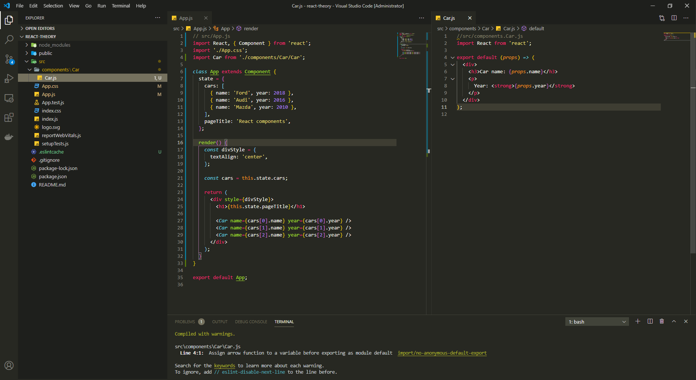
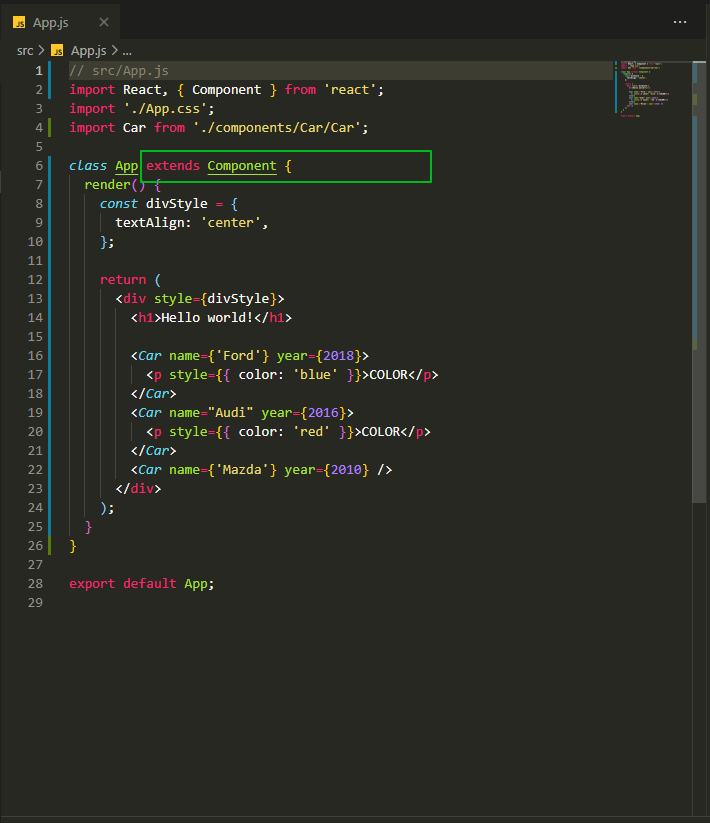
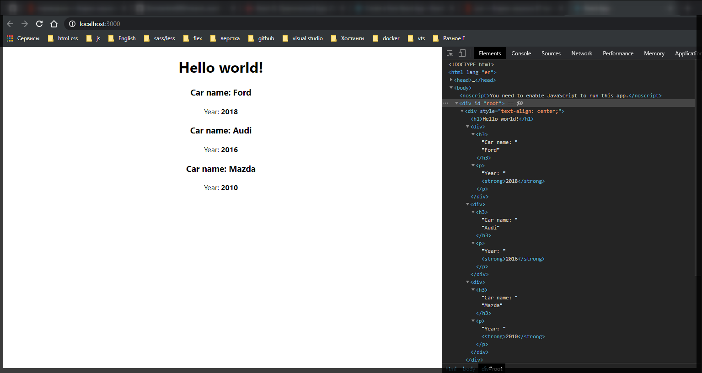
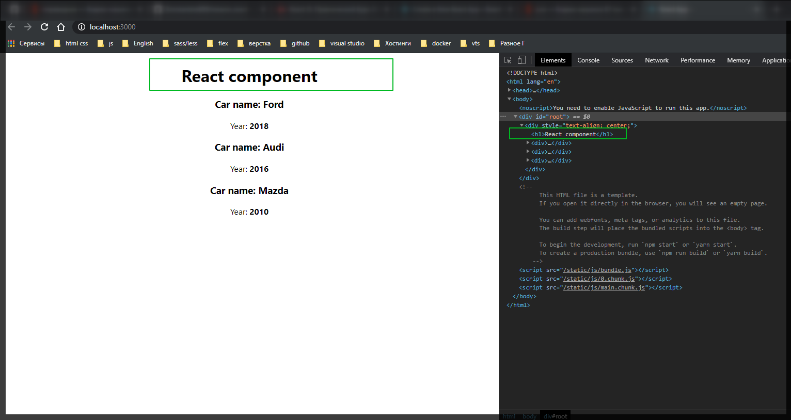

# Создание State

Код и структура прокта из прошлого блока.

```jsx
// src/App.js
import React, { Component } from 'react';
import './App.css';
import Car from './components/Car/Car';

class App extends Component {
  render() {
    const divStyle = {
      textAlign: 'center',
    };

    return (
      <div style={divStyle}>
        <h1>Hello world!</h1>

        <Car name={'Ford'} year={2018}>
          <p style={{ color: 'blue' }}>COLOR</p>
        </Car>
        <Car name="Audi" year={2016}>
          <p style={{ color: 'red' }}>COLOR</p>
        </Car>
        <Car name={'Mazda'} year={2010} />
      </div>
    );
  }
}

export default App;
```

```jsx
//src/components.Car.js
import React from 'react';

export default (props) => (
  <div>
    <h3>Сar name: {props.name}</h3>
    <p>
      Year: <strong>{props.year}</strong>
    </p>
    {props.children}
  </div>
);
```



Начнем с описанияфайла **App.js**. У нас уже есть три компонента которые описывают структуру машин. Как видите у нас здесь есть некоторое дублирование кода. На самом деле это не совсем правильный подход когда мы передаем данные прямо внутри рендера.

По хорошему нужно создать некоторую константу которая будет содержать данные которые будут относится к машинам. И после этого мы сможем к ним обращаться и выводить их уже через данную костанту.

И как раз таки в **React** для таких случаев есть специальное свойство. Причем оно присутствует только в компонентах которые наследуются только от react **Component**



Свойство это называется **state**.

Есть разные методы задания **state**. Пока разберем самый простой. И на уровне обычного метода, например мектода **render** я могу создать **state**. Это обычный **JS** объект который описывает то состояние в котором сейчас находится компонент. И здесь мы можем как раз таки хранить те данные которые описывают состояние и после этого их отрисовывать.

В **state** указываю ключ, который может быть представлен ввиде массива.

```jsx
// src/App.js
import React, { Component } from 'react';
import './App.css';
import Car from './components/Car/Car';

class App extends Component {
  state = {
    cars: [{}],
  };

  render() {
    const divStyle = {
      textAlign: 'center',
    };

    return (
      <div style={divStyle}>
        <h1>Hello world!</h1>

        <Car name={'Ford'} year={2018}>
          <p style={{ color: 'blue' }}>COLOR</p>
        </Car>
        <Car name="Audi" year={2016}>
          <p style={{ color: 'red' }}>COLOR</p>
        </Car>
        <Car name={'Mazda'} year={2010} />
      </div>
    );
  }
}

export default App;
```

Теперь в каждом элементе данного массива, мы будем описывать его как объект. Определяю свойство **name** и **year**, и переношу данные.

```jsx
// src/App.js
import React, { Component } from 'react';
import './App.css';
import Car from './components/Car/Car';

class App extends Component {
  state = {
    cars: [
      { name: 'Ford', year: 2018 },
      { name: 'Audi', year: 2016 },
      { name: 'Mazda', year: 2010 },
    ],
  };

  render() {
    const divStyle = {
      textAlign: 'center',
    };

    return (
      <div style={divStyle}>
        <h1>Hello world!</h1>

        <Car name={'Ford'} year={2018}>
          <p style={{ color: 'blue' }}>COLOR</p>
        </Car>
        <Car name="Audi" year={2016}>
          <p style={{ color: 'red' }}>COLOR</p>
        </Car>
        <Car name={'Mazda'} year={2010} />
      </div>
    );
  }
}

export default App;
```

Теперь у меня есть состояние соотоящее из трех машин.

Теперь как мы можем воспользоваться данным **state** для того что бы отрисовать данные.

В методе render я могу обратится к **state** через **this.state.cars** и заношу это все в отдельную переменную **const cars = this.state.cars**. Таким образом мы будем напрямую обращаться к **state**.

Теперь для того что бы вывести весь массив машин в компоненте **\<Car/>** в атрибуте **name={cars[0].name}** т.е. обращаюськ индексу и вывожу его имя. Тоже самое делаю и для года.

```jsx
// src/App.js
import React, { Component } from 'react';
import './App.css';
import Car from './components/Car/Car';

class App extends Component {
  state = {
    cars: [
      { name: 'Ford', year: 2018 },
      { name: 'Audi', year: 2016 },
      { name: 'Mazda', year: 2010 },
    ],
  };

  render() {
    const divStyle = {
      textAlign: 'center',
    };

    const cars = this.state.cars;

    return (
      <div style={divStyle}>
        <h1>Hello world!</h1>

        <Car name={cars[0].name} year={cars[0].year} />
        <Car name={cars[1].name} year={cars[1].year} />
        <Car name={cars[2].name} year={cars[2].year} />
      </div>
    );
  }
}

export default App;
```

Теперь мы передаем значения из state.



Заведем еще одно состояние **pageTitle: ''** Он юудет отвечать за заголовок который выводится в теге **h1**. **pageTitle: 'React component'**.

Теперь что бы заменить статический вывод на состояние из **state** так же через фигурные скобки ображаюсь к **this.state.pageTitle**.

```jsx
// src/App.js
import React, { Component } from 'react';
import './App.css';
import Car from './components/Car/Car';

class App extends Component {
  state = {
    cars: [
      { name: 'Ford', year: 2018 },
      { name: 'Audi', year: 2016 },
      { name: 'Mazda', year: 2010 },
    ],
    pageTitle: 'React component',
  };

  render() {
    const divStyle = {
      textAlign: 'center',
    };

    const cars = this.state.cars;

    return (
      <div style={divStyle}>
        <h1>{this.state.pageTitle}</h1>

        <Car name={cars[0].name} year={cars[0].year} />
        <Car name={cars[1].name} year={cars[1].year} />
        <Car name={cars[2].name} year={cars[2].year} />
      </div>
    );
  }
}

export default App;
```


