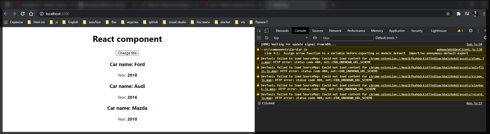
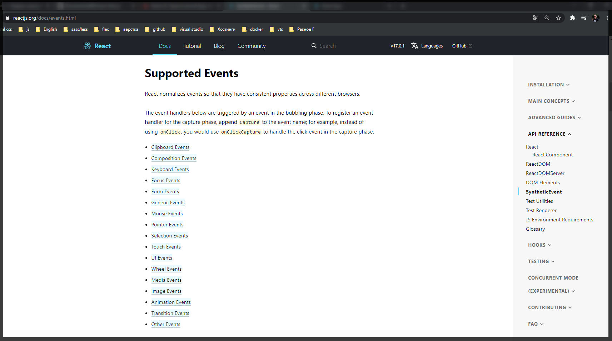
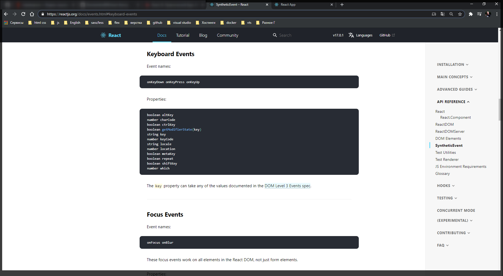
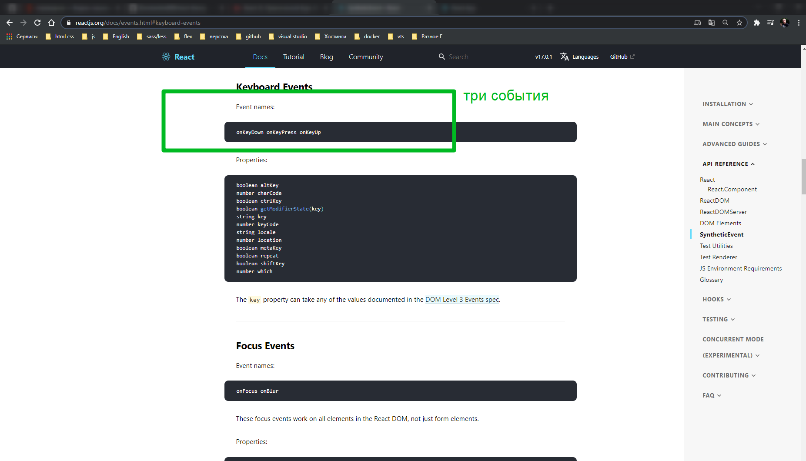
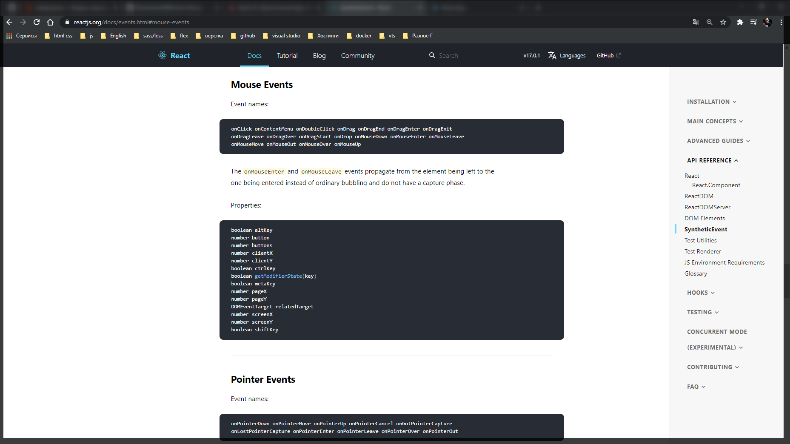

# Добавление событий

Теперь когда мы с вами перенесли все наши состояния в объект **state** мы с вами попробуем с ним что либо сделать. У нас как раз таки есть **pageTitle: 'React component'** который представляет из себя простую строку.

Давайте реализуем следующую задачу. Допустим при клике на которую мы будем изменять название нашей страницы.

```jsx
// src/App.js
import React, { Component } from 'react';
import './App.css';
import Car from './components/Car/Car';

class App extends Component {
  state = {
    cars: [
      { name: 'Ford', year: 2018 },
      { name: 'Audi', year: 2016 },
      { name: 'Mazda', year: 2010 },
    ],
    pageTitle: 'React component',
  };

  render() {
    const divStyle = {
      textAlign: 'center',
    };

    const cars = this.state.cars;

    return (
      <div style={divStyle}>
        <h1>{this.state.pageTitle}</h1>

        <button>Change title</button>

        <Car name={cars[0].name} year={cars[0].year} />
        <Car name={cars[1].name} year={cars[1].year} />
        <Car name={cars[2].name} year={cars[2].year} />
      </div>
    );
  }
}

export default App;
```

Задача сводится к следующему. Нужно поставить прослушку события на данную кнопку и изменить состояние.

Для этого использую атрибут js **onclick**. Но в **React** все это пишется в **camelcase** т.е. **onClick**. Именно таким образом добавляется прослушка события в **JSX**.

```jsx
// src/App.js
import React, { Component } from 'react';
import './App.css';
import Car from './components/Car/Car';

class App extends Component {
  state = {
    cars: [
      { name: 'Ford', year: 2018 },
      { name: 'Audi', year: 2016 },
      { name: 'Mazda', year: 2010 },
    ],
    pageTitle: 'React component',
  };

  render() {
    const divStyle = {
      textAlign: 'center',
    };

    const cars = this.state.cars;

    return (
      <div style={divStyle}>
        <h1>{this.state.pageTitle}</h1>

        <button onClick={}>Change title</button>

        <Car name={cars[0].name} year={cars[0].year} />
        <Car name={cars[1].name} year={cars[1].year} />
        <Car name={cars[2].name} year={cars[2].year} />
      </div>
    );
  }
}

export default App;
```

Теперь поговори о значении которое мы должны передать в данный атрибут. Мы должны передать некоторый reference до той функции которая должна будет быть выполнена в том случае если мы совершим событие которе мы здесь описали.

Создаю такую функцию. Выше матода **render** пишу.

Методы которые выполняются при определенных событиях как-то через слово **handle** которое обрабатывает определенное событие. Называю метод **changeTitleHandler(){}**.

В React компоненте мы можем создавать методы по разному.

```jsx
changeTitleHandler(){}
```

```jsx
changeTitleHandler: function(){}
```

можем создавать методы как стрелочную функцию и т.д.

Мы создадим стрелочную функцию.

```js
changeTitleHandler = () => {
  console.log('Clicked');
};
```

И теперь для того что бы передать в атрибут **reference** до функции. Через **this**. обращаюсь до той функции которую я хочу выполнить.
И что очень важно здесь при вызове функции нельзя писать круглые скобки, потому что в этом случае метод будет вызван сразуже. Нам же здесь нужно просто указать указатель на эту функцию которая выполнится в тот момент когда будет происходить событие.

```jsx
// src/App.js
import React, { Component } from 'react';
import './App.css';
import Car from './components/Car/Car';

class App extends Component {
  state = {
    cars: [
      { name: 'Ford', year: 2018 },
      { name: 'Audi', year: 2016 },
      { name: 'Mazda', year: 2010 },
    ],
    pageTitle: 'React component',
  };

  changeTitleHandler = () => {
    console.log('Clicked');
  };

  render() {
    const divStyle = {
      textAlign: 'center',
    };

    const cars = this.state.cars;

    return (
      <div style={divStyle}>
        <h1>{this.state.pageTitle}</h1>

        <button onClick={this.changeTitleHandler}>Change title</button>

        <Car name={cars[0].name} year={cars[0].year} />
        <Car name={cars[1].name} year={cars[1].year} />
        <Car name={cars[2].name} year={cars[2].year} />
      </div>
    );
  }
}

export default App;
```



Но наша задача сводится к тому что бы конкретно изменить состояние. Про это поговорим позже.
Посмотрим какие события мы можем использовать и какие название атрибутов мы можем использовать в **React**.

В документации официального сайта перехожу в **API REFERENCE** и здесь есть поле **SyntheticEvent**. Здесь мы можем посмотреть описание того как работают различные события.

[https://reactjs.org/docs/events.html](https://reactjs.org/docs/events.html)



Здесь мы можем увидеть список всех event которые потдерживаются в **JSX**. т.е. например если меня интересуют события клавиатуры [https://reactjs.org/docs/events.html#keyboard-events](https://reactjs.org/docs/events.html#keyboard-events)



Мы можем посмотреть название событий и то как они записываются. |Если нам нужно прослушать события нажатия на кнопку то мы можем использовать 3-три эти события.



Так же можем увидить список всех событий потдерживаемые от мышки. [https://reactjs.org/docs/events.html#mouse-events](https://reactjs.org/docs/events.html#mouse-events)


