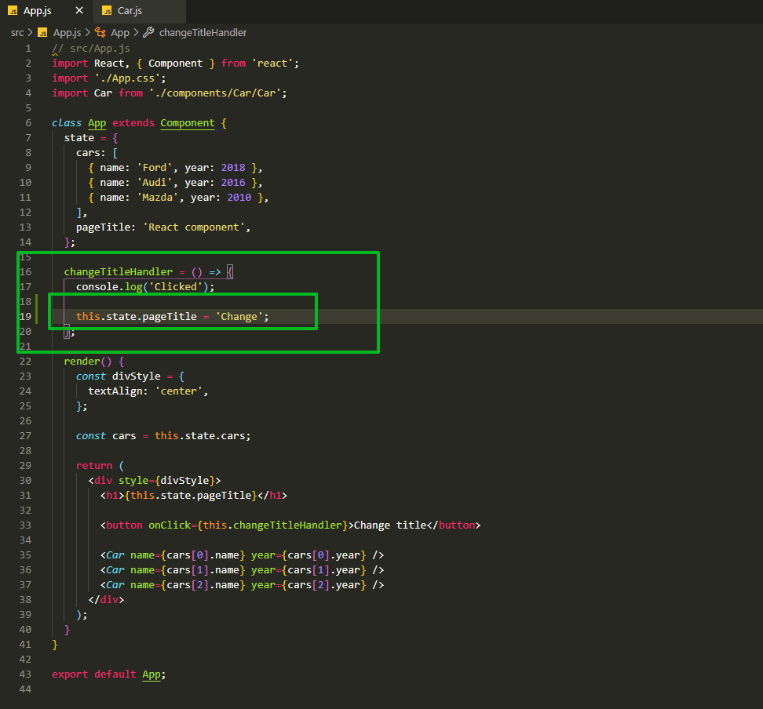
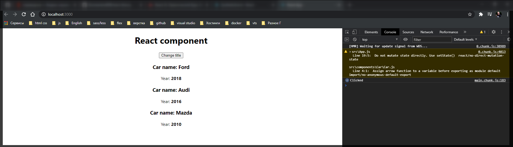
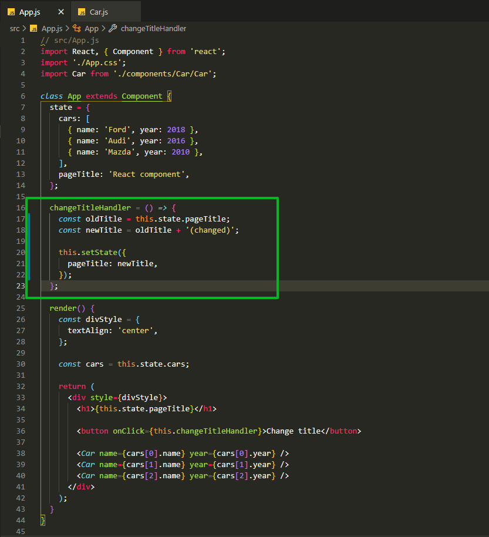
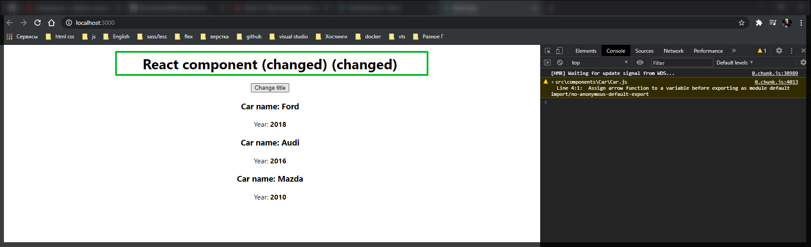
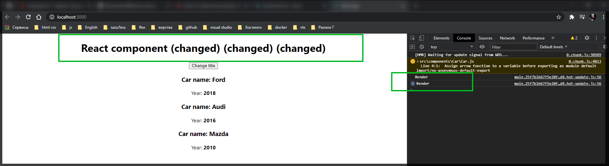

# Изменение состояния

Попробуем изменить **h1** страницы. Если вы думаете что если написать так.



Даже выдает предупреждение



При клике метод срабатывает однако заголовок не меняется. Так делать нельзя. **React** очень оптимизированная библиотека. И поэтому мы должны указывать **React** о том что мы что-то меняем для того что бы он мог через разные методы пропустить это состояние и отрисовать его на странице.

Учитывая то что мы наследуемся от специального компонента импортируемого из **React**. Это означает что нам доступны некотоые методы после наследования. И один из таких методов отвечает за наследование компонентов. Метод называется **setState()**. К нему мы можем обратиться через ключевое слово **this**.

Посути мы должны передать в этот метод новое состояние, которое мы изменили. Например мы хотим изменить только **pageTitle**, поэтому мы в **setState()** передаем обычный объект с новым состоянием. Здесь мы описываем только то состояние которое хотим изменить.

Для того что бы все прошло без ошибок лучше получить старое состояние, сохранить его в константу.

После меняю значение констаты и присваюваю в новую константу. После чего вывожу новое значение в **setState**.



```js
// src/App.js
import React, { Component } from 'react';
import './App.css';
import Car from './components/Car/Car';

class App extends Component {
  state = {
    cars: [
      { name: 'Ford', year: 2018 },
      { name: 'Audi', year: 2016 },
      { name: 'Mazda', year: 2010 },
    ],
    pageTitle: 'React component',
  };

  changeTitleHandler = () => {
    const oldTitle = this.state.pageTitle;
    const newTitle = oldTitle + ' (changed)';

    this.setState({
      pageTitle: newTitle,
    });
  };

  render() {
    const divStyle = {
      textAlign: 'center',
    };

    const cars = this.state.cars;

    return (
      <div style={divStyle}>
        <h1>{this.state.pageTitle}</h1>

        <button onClick={this.changeTitleHandler}>Change title</button>

        <Car name={cars[0].name} year={cars[0].year} />
        <Car name={cars[1].name} year={cars[1].year} />
        <Car name={cars[2].name} year={cars[2].year} />
      </div>
    );
  }
}

export default App;
```



Каждый раз при клике на кнопку добавляется новое состояние.

Поговорим как это работает. Когда мы заходим в метод **changeTitleHandler** мы в первых двух срочках формируем новое состояние, в **oldTitle** и **newTitle**. После чего мы обращаемся к методу **setState()** который принимает **JS** объект где мы указываем какое поле в состоянии нам нужно изменить.

После чего он заново вызывает метод **render**. И мы в этом можем убедится если напишем **console.log('Render')**

```js
// src/App.js
import React, { Component } from 'react';
import './App.css';
import Car from './components/Car/Car';

class App extends Component {
  state = {
    cars: [
      { name: 'Ford', year: 2018 },
      { name: 'Audi', year: 2016 },
      { name: 'Mazda', year: 2010 },
    ],
    pageTitle: 'React component',
  };

  changeTitleHandler = () => {
    const oldTitle = this.state.pageTitle;
    const newTitle = oldTitle + ' (changed)';

    this.setState({
      pageTitle: newTitle,
    });
  };

  render() {
    console.log('Render');
    const divStyle = {
      textAlign: 'center',
    };

    const cars = this.state.cars;

    return (
      <div style={divStyle}>
        <h1>{this.state.pageTitle}</h1>

        <button onClick={this.changeTitleHandler}>Change title</button>

        <Car name={cars[0].name} year={cars[0].year} />
        <Car name={cars[1].name} year={cars[1].year} />
        <Car name={cars[2].name} year={cars[2].year} />
      </div>
    );
  }
}

export default App;
```



При повторном обращении к методу **render** он обращается к нашему заголовку **<h1>{this.state.pageTitle}</h1>**, видит что произошло изменение в **pageTitle** и отрисовывает его.
