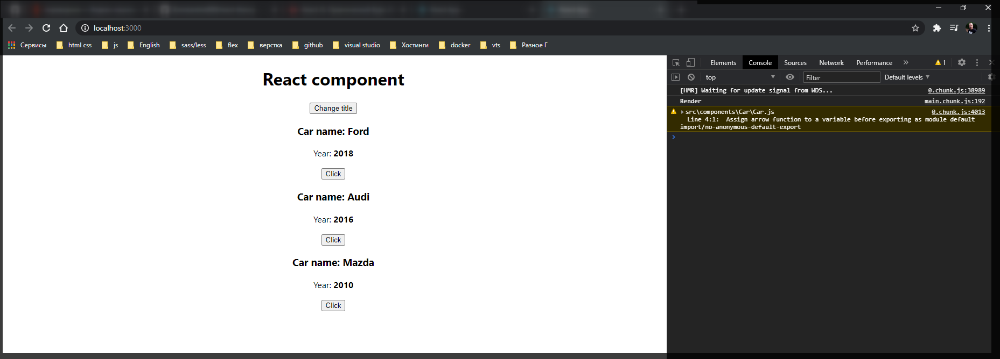
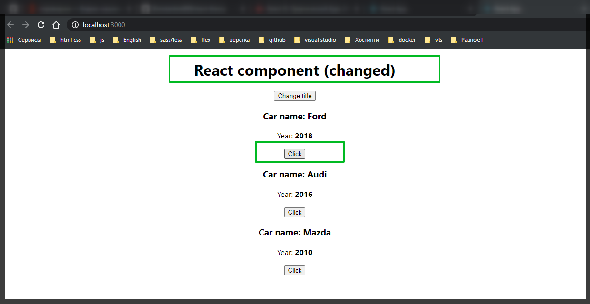
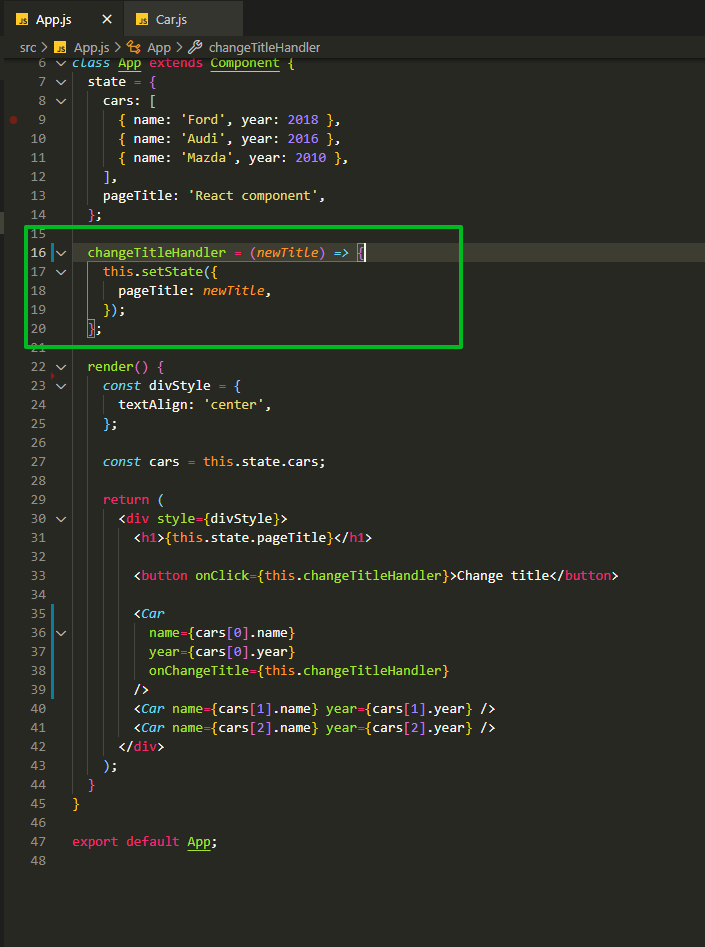
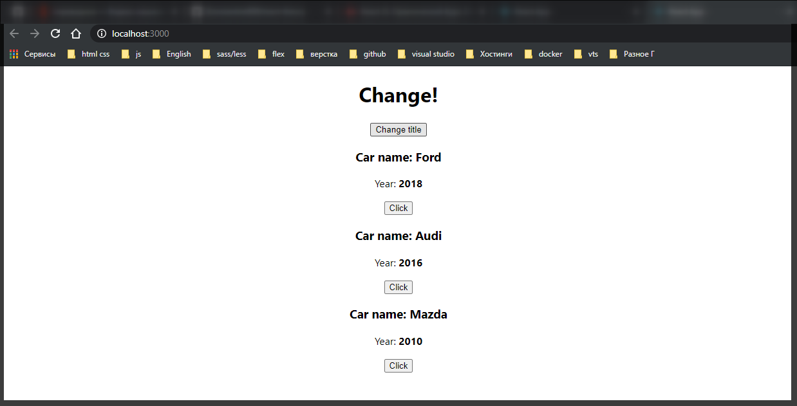
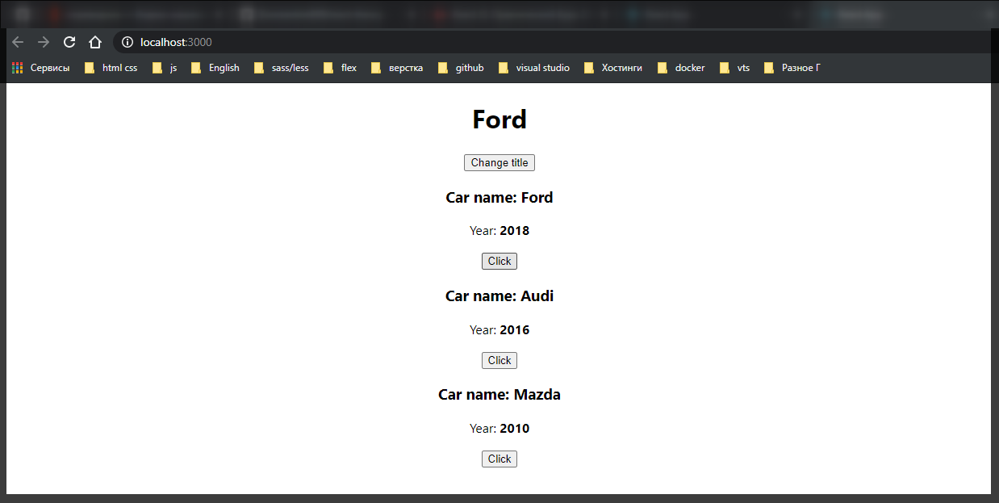
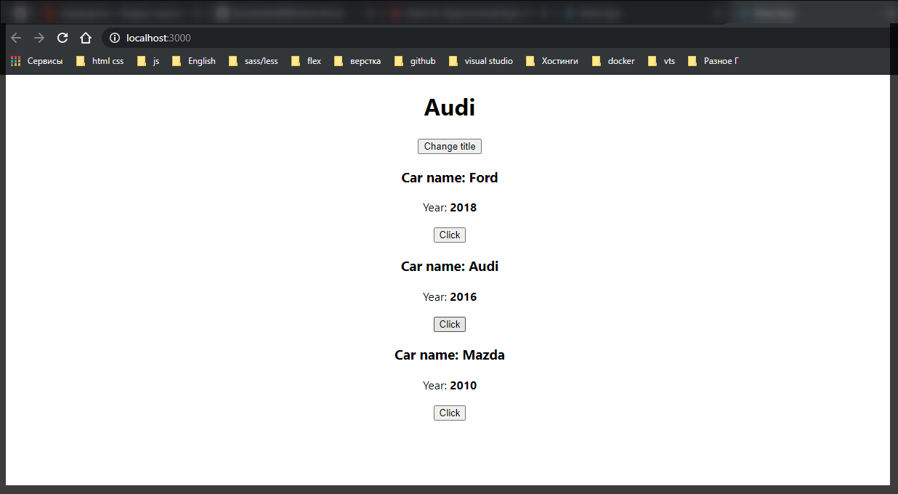
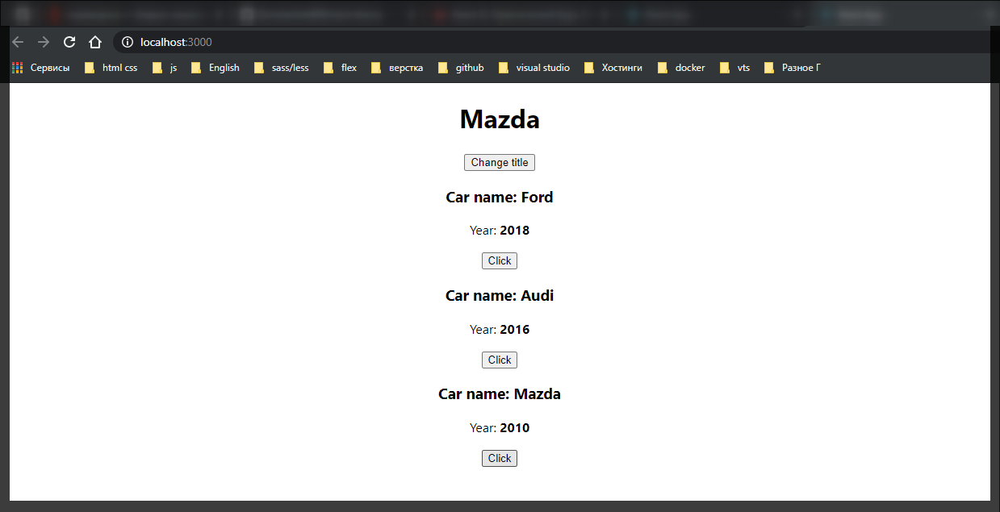

# Передача параметров в функцию.

Поговорим о том как мы можем еще обрабатывать внутри React.

Для этого преобразуем наш код а именно компонент машин. Добавим в него еще одну кнопку.

```jsx
//src/components.Car.js
import React from 'react';

export default (props) => (
  <div>
    <h3>Сar name: {props.name}</h3>
    <p>
      Year: <strong>{props.year}</strong>
    </p>
    <button>Click</button>
  </div>
);
```

Теперь в **App.js** реализуем следующую задачу. Мы видим что у нас теперь у каждого компонента есть своя кнопка **click** но которая пока ни как не работает.



Реализуем следующую задачу. Допустим мы так же хотим менять заголовок при нажатии на кнопку **Click**.

Здесь возникает вопрос. Как нам это реализовать если кнопка находится в другом компоненте. При этом состояние у нас списывается в родительском компоненте.

Как раз таки на данной задаче разберем как мы можем по разному передавать различные методы **React** компонента.

Разберемся с первой задачей. Как нам передавать различные события внутрь компонента. Если с обычными нативными **html** элементами нам все понятно т.е. мы просто вешаем какие-то события которые есть в **JSX**. То с обычными компонентами это не сработает. Потому что это какие-то кастомные компоненты и у них соответственно есть совершенно другая модель данных которая есть у обычных элементов. И поэтому в качестве какого-то параметра мы можем передавать обычны функции. Причем называть эту функции мы можем как угодно.

Например в компонент **Car** мы можем передать функцию например **onChangeTitle={}** т.е. название события может быть какое угодно. И например мы хотим передать функцию **onChangeTitle={this.changeTitleHandler}**.

```jsx
// src/App.js
import React, { Component } from 'react';
import './App.css';
import Car from './components/Car/Car';

class App extends Component {
  state = {
    cars: [
      { name: 'Ford', year: 2018 },
      { name: 'Audi', year: 2016 },
      { name: 'Mazda', year: 2010 },
    ],
    pageTitle: 'React component',
  };

  changeTitleHandler = () => {
    const oldTitle = this.state.pageTitle;
    const newTitle = oldTitle + ' (changed)';

    this.setState({
      pageTitle: newTitle,
    });
  };

  render() {
    const divStyle = {
      textAlign: 'center',
    };

    const cars = this.state.cars;

    return (
      <div style={divStyle}>
        <h1>{this.state.pageTitle}</h1>

        <button onClick={this.changeTitleHandler}>Change title</button>

        <Car
          name={cars[0].name}
          year={cars[0].year}
          onChangeTitle={this.changeTitleHandler}
        />
        <Car name={cars[1].name} year={cars[1].year} />
        <Car name={cars[2].name} year={cars[2].year} />
      </div>
    );
  }
}

export default App;
```

Теперь нам нужно понять как нам нужно обратиться к данному событию внутри компонента. На самом деле все просто. Мы можем просто скопировать название данного события и далее внутри компонента **Car** просто обратиться к тому элементу по которому мы хотим нажать. В событии **onClick** обращаемся по **reference** к данной функции которую передаем через **props**.

```jsx
//src/components.Car.js
import React from 'react';

export default (props) => (
  <div>
    <h3>Сar name: {props.name}</h3>
    <p>
      Year: <strong>{props.year}</strong>
    </p>
    <button onClick={props.onChangeTitle}>Click</button>
  </div>
);
```

Что здесь будет происходить? Теперь при клике на кнопку внутри компонента мы получаем нужную ссылку на нужную функцию которую необходимо вызвать. После этого React понимает что данная функция является той функцией которую мы описывали внутри **App** компонента.



Получаем тот же результат.

Теперь попробуем реализовать более комплексную задачу.Сейчас мы с вами данный заголовок меняем зарезервированным словом, не получая ни какие параметры формируем новый заголовок.

Допустим мы хотим понять откуда мы сделали клик и именно его ставить как новый **pageTitle**. Поэтому в функции **changeTitleHandler** первым параметром я буду принимать некоторый **newTitle**. Всю конструкцию по сохранению старого и формированию нового **state** я удаляю.



```jsx
// src/App.js
import React, { Component } from 'react';
import './App.css';
import Car from './components/Car/Car';

class App extends Component {
  state = {
    cars: [
      { name: 'Ford', year: 2018 },
      { name: 'Audi', year: 2016 },
      { name: 'Mazda', year: 2010 },
    ],
    pageTitle: 'React component',
  };

  changeTitleHandler = (newTitle) => {
    this.setState({
      pageTitle: newTitle,
    });
  };

  render() {
    const divStyle = {
      textAlign: 'center',
    };

    const cars = this.state.cars;

    return (
      <div style={divStyle}>
        <h1>{this.state.pageTitle}</h1>

        <button onClick={this.changeTitleHandler}>Change title</button>

        <Car
          name={cars[0].name}
          year={cars[0].year}
          onChangeTitle={this.changeTitleHandler}
        />
        <Car name={cars[1].name} year={cars[1].year} />
        <Car name={cars[2].name} year={cars[2].year} />
      </div>
    );
  }
}

export default App;
```

Теперь стоит задача каким-то образом передавать параметр внутрь данного метода **newTitle**.

Как раз таки на этом примере мы посмотрим как можно передавать различные параметры.

Во-первых разберемся с кнопкой **Change title**. В **JS** есть специальный метод у функции который называется **bind()**. И первый параметр в данную функцию мы принимаем тот контекст с которым должна быть вызвана данная функция. В нашем случае контекстом будет являтся ключевое слово **this**, то ключевое слово где хранится наша функция. Метод **bind** в свою очередь будет просто возвращать новую функцию но не вызывать ее. И поэтому на выходе мы получим какую-то функцию которую при клике мы можем вызвать. После контекста **this**,через запятую мы можем перечислять определенный набор параметров которые мы хотим передать в функцию т.е. например сообщение **'Changed!'**.

И тоже самое я могу сделать с машинами. Например вывести их название. Просто понять откуда был сделан клик.

```jsx
// src/App.js
import React, { Component } from 'react';
import './App.css';
import Car from './components/Car/Car';

class App extends Component {
  state = {
    cars: [
      { name: 'Ford', year: 2018 },
      { name: 'Audi', year: 2016 },
      { name: 'Mazda', year: 2010 },
    ],
    pageTitle: 'React component',
  };

  changeTitleHandler = (newTitle) => {
    this.setState({
      pageTitle: newTitle,
    });
  };

  render() {
    const divStyle = {
      textAlign: 'center',
    };

    const cars = this.state.cars;

    return (
      <div style={divStyle}>
        <h1>{this.state.pageTitle}</h1>

        <button onClick={this.changeTitleHandler.bind(this, 'Change!')}>
          Change title
        </button>

        <Car
          name={cars[0].name}
          year={cars[0].year}
          onChangeTitle={this.changeTitleHandler.bind(this, cars[0].name)}
        />
        <Car
          name={cars[1].name}
          year={cars[1].year}
          onChangeTitle={this.changeTitleHandler.bind(this, cars[1].name)}
        />
        <Car
          name={cars[2].name}
          year={cars[2].year}
          onChangeTitle={this.changeTitleHandler.bind(this, cars[2].name)}
        />
      </div>
    );
  }
}

export default App;
```









Это был первый способ когда мы можем передавать какие-то параметры в функцию.

Теперь разберем следующее. Допустим мы для второй машины добавим параметр **onChangeTitle={}**. И что мы можем сделать сдесь если не использовать ключевое слово **bind**. В качестве параметра мы должны передать ссылку на функцию но не передавать ее. Именно по этому мы можем воспользоваться конструкцией JS, просто передать сюда функцию которая будет вызывать другую функцию.

Мы можем определить стрельчную функцию и дальше вызвать нужный метод, например **this.changeTitleHandler()** и теперь в качестве параметра данной функции, где мы уже ее вызываем спомощью круглых скобок, мы будем просто обращаться к какому-то параметру т.е. мы будем просто передавать что-то в данную функцию. Допустим мы будем передавать название нашей машины. Ставлю это на 2-ю и 3-ю машину.

```jsx
// src/App.js
import React, { Component } from 'react';
import './App.css';
import Car from './components/Car/Car';

class App extends Component {
  state = {
    cars: [
      { name: 'Ford', year: 2018 },
      { name: 'Audi', year: 2016 },
      { name: 'Mazda', year: 2010 },
    ],
    pageTitle: 'React component',
  };

  changeTitleHandler = (newTitle) => {
    this.setState({
      pageTitle: newTitle,
    });
  };

  render() {
    const divStyle = {
      textAlign: 'center',
    };

    const cars = this.state.cars;

    return (
      <div style={divStyle}>
        <h1>{this.state.pageTitle}</h1>

        <button onClick={this.changeTitleHandler.bind(this, 'Change!')}>
          Change title
        </button>

        <Car
          name={cars[0].name}
          year={cars[0].year}
          onChangeTitle={this.changeTitleHandler.bind(this, cars[0].name)}
        />
        <Car
          name={cars[1].name}
          year={cars[1].year}
          onChangeTitle={() => this.changeTitleHandler(cars[1].name)}
        />
        <Car
          name={cars[2].name}
          year={cars[2].year}
          onChangeTitle={() => this.changeTitleHandler(cars[2].name)}
        />
      </div>
    );
  }
}

export default App;
```

Все кликабельно.

Единственно стоит оговориться что первый метод с использованием ключевого слова **bind** он более правильный потому что он занимает меньше ресурсов у браузера. Каждый раз когда у нас вызыватеся метод render он будет формировать новую функцию внутри которой так же лежит функция(это я сейчас про второй метод). На маленьких проектах это не сильно заметно. Если будет много вызовов стрелочных функций в которых будет происходить вызов других функций это заметно отразится на призводительности приложения.
