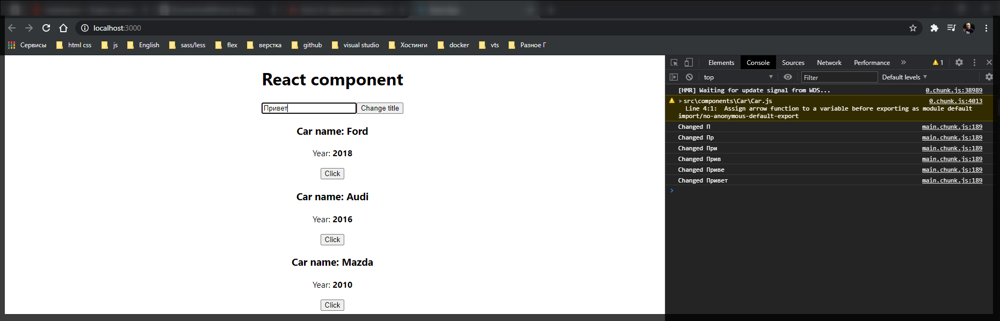

# Обработка input

Допустим у нас под заголовком будет элемен **input**. И здесь я хочу реализовать следующую логику. Я буду вписывать какое-то состояние в input и соответственно менять заголовок.

Для того что бы прослушать то что происходит в input мы можем добавить различные события. По-этому для того что бы прослушать изменение какого-либо **input** в **JSX** есть специальный атрибут который называется **onChange={}**. И сюда мы допустим будем передавать **reference** до определенного события.

Создаю это событие **handleInput = () =>{}**. И здесь я хочу изменять состояние. И пока вывожу в консоль.

И в кнопке передаю **reference** на данную функцию которую не вызываю.

```js
// src/App.js
import React, { Component } from 'react';
import './App.css';
import Car from './components/Car/Car';

class App extends Component {
  state = {
    cars: [
      { name: 'Ford', year: 2018 },
      { name: 'Audi', year: 2016 },
      { name: 'Mazda', year: 2010 },
    ],
    pageTitle: 'React component',
  };

  changeTitleHandler = (newTitle) => {
    this.setState({
      pageTitle: newTitle,
    });
  };

  handleInput = () => {
    console.log('Changed');
  };

  render() {
    const divStyle = {
      textAlign: 'center',
    };

    const cars = this.state.cars;

    return (
      <div style={divStyle}>
        <h1>{this.state.pageTitle}</h1>

        <input onChange={this.handleInput}></input>

        <button onClick={this.changeTitleHandler.bind(this, 'Change!')}>
          Change title
        </button>

        <Car
          name={cars[0].name}
          year={cars[0].year}
          onChangeTitle={this.changeTitleHandler.bind(this, cars[0].name)}
        />
        <Car
          name={cars[1].name}
          year={cars[1].year}
          onChangeTitle={() => this.changeTitleHandler(cars[1].name)}
        />
        <Car
          name={cars[2].name}
          year={cars[2].year}
          onChangeTitle={() => this.changeTitleHandler(cars[2].name)}
        />
      </div>
    );
  }
}

export default App;
```


Теперь нам каким-то образом нам нужно получить то, что у нас находится в данном **input** и заменить заголовок.

Здесь все очень просто. React нам автоматически в данный метод **handleInput**, который мы передаем как **reference**, **\<input onChange={this.handleInput}></input>**, передает событие **event**, нативное событие event которе есть в **JS**. И теперь что бы получить состояние которое находится в **input**, при выводе в консоль вторым параметром передаю **event.target**, **target** отвечает за сам **input**, и далее у любого **input** есть поле **value** т.е. **event.target.value** где и храниться текущее его состояние.

```js
// src/App.js
import React, { Component } from 'react';
import './App.css';
import Car from './components/Car/Car';

class App extends Component {
  state = {
    cars: [
      { name: 'Ford', year: 2018 },
      { name: 'Audi', year: 2016 },
      { name: 'Mazda', year: 2010 },
    ],
    pageTitle: 'React component',
  };

  changeTitleHandler = (newTitle) => {
    this.setState({
      pageTitle: newTitle,
    });
  };

  handleInput = (event) => {
    console.log('Changed', event.target.value);
  };

  render() {
    const divStyle = {
      textAlign: 'center',
    };

    const cars = this.state.cars;

    return (
      <div style={divStyle}>
        <h1>{this.state.pageTitle}</h1>

        <input onChange={this.handleInput}></input>

        <button onClick={this.changeTitleHandler.bind(this, 'Change!')}>
          Change title
        </button>

        <Car
          name={cars[0].name}
          year={cars[0].year}
          onChangeTitle={this.changeTitleHandler.bind(this, cars[0].name)}
        />
        <Car
          name={cars[1].name}
          year={cars[1].year}
          onChangeTitle={() => this.changeTitleHandler(cars[1].name)}
        />
        <Car
          name={cars[2].name}
          year={cars[2].year}
          onChangeTitle={() => this.changeTitleHandler(cars[2].name)}
        />
      </div>
    );
  }
}

export default App;
```



Далее в **handleInput** меняю состояние

```js
// src/App.js
import React, { Component } from 'react';
import './App.css';
import Car from './components/Car/Car';

class App extends Component {
  state = {
    cars: [
      { name: 'Ford', year: 2018 },
      { name: 'Audi', year: 2016 },
      { name: 'Mazda', year: 2010 },
    ],
    pageTitle: 'React component',
  };

  changeTitleHandler = (newTitle) => {
    this.setState({
      pageTitle: newTitle,
    });
  };

  handleInput = (event) => {
    this.setState({
      pageTitle: event.target.value,
    });
  };

  render() {
    const divStyle = {
      textAlign: 'center',
    };

    const cars = this.state.cars;

    return (
      <div style={divStyle}>
        <h1>{this.state.pageTitle}</h1>

        <input onChange={this.handleInput}></input>

        <button onClick={this.changeTitleHandler.bind(this, 'Change!')}>
          Change title
        </button>

        <Car
          name={cars[0].name}
          year={cars[0].year}
          onChangeTitle={this.changeTitleHandler.bind(this, cars[0].name)}
        />
        <Car
          name={cars[1].name}
          year={cars[1].year}
          onChangeTitle={() => this.changeTitleHandler(cars[1].name)}
        />
        <Car
          name={cars[2].name}
          year={cars[2].year}
          onChangeTitle={() => this.changeTitleHandler(cars[2].name)}
        />
      </div>
    );
  }
}

export default App;
```


