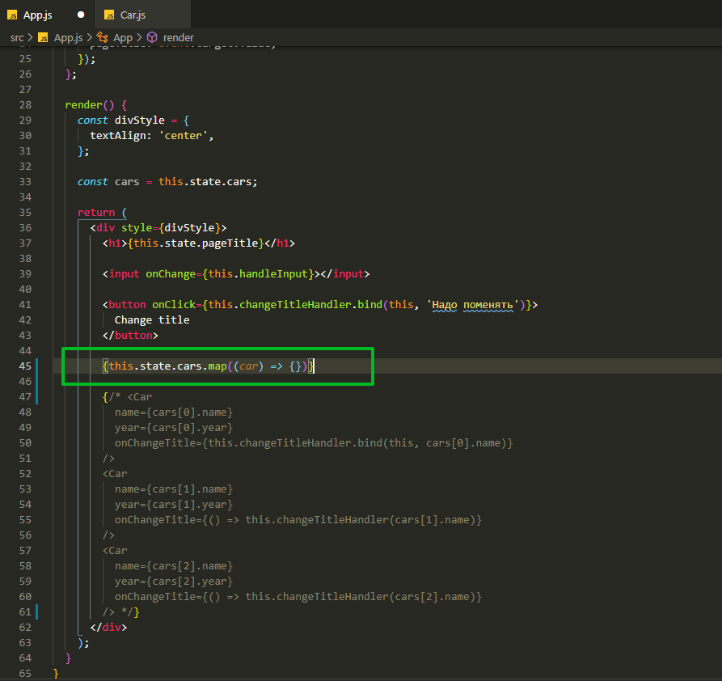
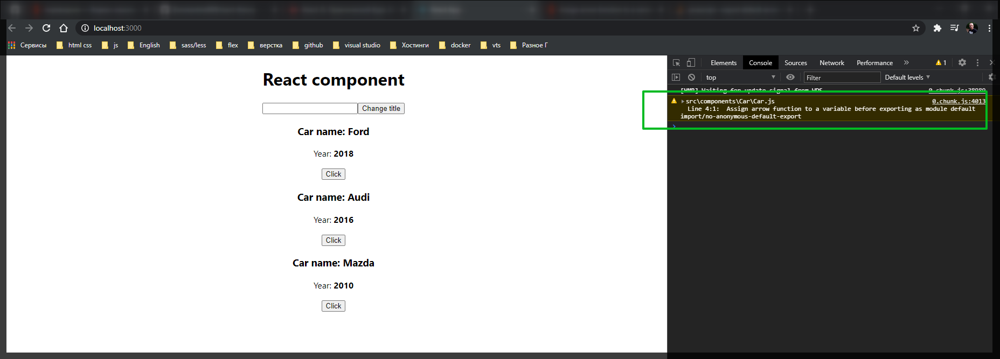

# Работа со списком.

В нашем проекте есть массив машин с параметами для каждой из машин. И сейчас мы работаем довольно просто. Мы выводи отдельно каждый компонент. И это совсем не правильный подход так как у нас могут быть тысячи элементов. И по этому в React есть специальное свойство с помощью которого мы можем выводить список различных элементов.

Закоментируем все элементы машин. И разберем как мы можем вывести список всех этих элементов сохранив функционал. Так же удаляю константу **const cars = this.state.cars;** больше она не понадобится.

```js
// src/App.js
import React, { Component } from 'react';
import './App.css';
import Car from './components/Car/Car';

class App extends Component {
  state = {
    cars: [
      { name: 'Ford', year: 2018 },
      { name: 'Audi', year: 2016 },
      { name: 'Mazda', year: 2010 },
    ],
    pageTitle: 'React component',
  };

  changeTitleHandler = (newTitle) => {
    this.setState({
      pageTitle: newTitle,
    });
  };

  handleInput = (event) => {
    this.setState({
      pageTitle: event.target.value,
    });
  };

  render() {
    const divStyle = {
      textAlign: 'center',
    };

    return (
      <div style={divStyle}>
        <h1>{this.state.pageTitle}</h1>

        <input onChange={this.handleInput}></input>

        <button onClick={this.changeTitleHandler.bind(this, 'Надо поменять')}>
          Change title
        </button>

        {/* <Car
          name={cars[0].name}
          year={cars[0].year}
          onChangeTitle={this.changeTitleHandler.bind(this, cars[0].name)}
        />
        <Car
          name={cars[1].name}
          year={cars[1].year}
          onChangeTitle={() => this.changeTitleHandler(cars[1].name)}
        />
        <Car
          name={cars[2].name}
          year={cars[2].year}
          onChangeTitle={() => this.changeTitleHandler(cars[2].name)}
        /> */}
      </div>
    );
  }
}

export default App;
```

Ставлю фигурные скобки, с помощью которых я могу работать с **JS**. Теперь в цикле я могу вывести список всех машин и сохранив их параметры.

Список всех машин хранится в **state**. Поэтому я могу обратится к полю и к массиву машин **this.state.cars**. И теперь важный момент, если вы например знаете какой-нибудь **framework** **Angular** или **View**, то там для того что бы выводить списки мы используем различные директивы **gfor** или **v-for**. Так вот в **React** нет подобных директив. В **React** мы работаем только с **JS** по этому у нас есть только методы которые есть в **JS**. У нас есть массив **cars** и у каждого из массивов в **JS** есть всой определенный набор параметров которые мы можем использовать. Например **map()**. Данный метод позволяет проитерировать каждый элемент данного массива и вернуть на выходе какой-то результирующий массив. В качестве параметров в функцию map мы должны передать некоторую функцию, которая будет являтся функцией итератором, будет обрабатывать каждый из элементов массива. Передаю стрелочную функцию где на каждой итерации я буду принимать некоторый параметр **car**.



```js
// src/App.js
import React, { Component } from 'react';
import './App.css';
import Car from './components/Car/Car';

class App extends Component {
  state = {
    cars: [
      { name: 'Ford', year: 2018 },
      { name: 'Audi', year: 2016 },
      { name: 'Mazda', year: 2010 },
    ],
    pageTitle: 'React component',
  };

  changeTitleHandler = (newTitle) => {
    this.setState({
      pageTitle: newTitle,
    });
  };

  handleInput = (event) => {
    this.setState({
      pageTitle: event.target.value,
    });
  };

  render() {
    const divStyle = {
      textAlign: 'center',
    };

    const cars = this.state.cars;

    return (
      <div style={divStyle}>
        <h1>{this.state.pageTitle}</h1>

        <input onChange={this.handleInput}></input>

        <button onClick={this.changeTitleHandler.bind(this, 'Надо поменять')}>
          Change title
        </button>

        {this.state.cars.map((car) => {})}

        {/* <Car
          name={cars[0].name}
          year={cars[0].year}
          onChangeTitle={this.changeTitleHandler.bind(this, cars[0].name)}
        />
        <Car
          name={cars[1].name}
          year={cars[1].year}
          onChangeTitle={() => this.changeTitleHandler(cars[1].name)}
        />
        <Car
          name={cars[2].name}
          year={cars[2].year}
          onChangeTitle={() => this.changeTitleHandler(cars[2].name)}
        /> */}
      </div>
    );
  }
}

export default App;
```

В данной функции указываю **return()** в котором я могу вернуть некий **JSX**. И указываю что на каждой итерации я хочу преобразовать объекты массива **cars** в компонет **Car**. Далее необходимо каждому из компонентов передать параметры **name={}** указываю массив и поле из которого нужно вывести данные **name={car.name}**, тоже самое с годом. В функцию **onChangeTitle={}** в нее передаю **callback** стрелочную функцию с параметром **this.changeTitleHandler()** в который передаю имя текущей машины т.е. **car.name**.

```js
// src/App.js
import React, { Component } from 'react';
import './App.css';
import Car from './components/Car/Car';

class App extends Component {
  state = {
    cars: [
      { name: 'Ford', year: 2018 },
      { name: 'Audi', year: 2016 },
      { name: 'Mazda', year: 2010 },
    ],
    pageTitle: 'React component',
  };

  changeTitleHandler = (newTitle) => {
    this.setState({
      pageTitle: newTitle,
    });
  };

  handleInput = (event) => {
    this.setState({
      pageTitle: event.target.value,
    });
  };

  render() {
    const divStyle = {
      textAlign: 'center',
    };

    const cars = this.state.cars;

    return (
      <div style={divStyle}>
        <h1>{this.state.pageTitle}</h1>

        <input onChange={this.handleInput}></input>

        <button onClick={this.changeTitleHandler.bind(this, 'Надо поменять')}>
          Change title
        </button>

        {this.state.cars.map((car) => {
          return (
            <Car
              name={car.name}
              year={car.year}
              onChangeTitle={() => this.changeTitleHandler(car.name)}
            />
          );
        })}

        {/* <Car
          name={cars[0].name}
          year={cars[0].year}
          onChangeTitle={this.changeTitleHandler.bind(this, cars[0].name)}
        />
        <Car
          name={cars[1].name}
          year={cars[1].year}
          onChangeTitle={() => this.changeTitleHandler(cars[1].name)}
        />
        <Car
          name={cars[2].name}
          year={cars[2].year}
          onChangeTitle={() => this.changeTitleHandler(cars[2].name)}
        /> */}
      </div>
    );
  }
}

export default App;
```

В предупреждении сказано что каждый ребенок должен иметь специальное свойство **key** и имеется ссылка на данный параметр. [https://reactjs.org/docs/lists-and-keys.html#keys](https://reactjs.org/docs/lists-and-keys.html#keys).

Когда мы делаем итерацию, то в итоге получаем список одинаковых элементов в **DOM** дереве. **React** сделан таким образом что он оптимизирует работу с **DOM** деревом. Любая работа с **DOM** в **JS** является самой затратной и по-этому все **frameworks** как раз так и служат для того что бы оптимизировать работу с **DOM** деревом.

В **JSX** есть специальный атрибут который мы должны определять для элементов списка. Мы его передаем на тот элемент который итерируется, на корневой. В Метод map вторым параметром указываю **index** т.е. здесь будет хранится информация о том какой текущий индекс выводится в массиве и в качестве параметра **key={index}** передаю **index**.

```js
// src/App.js
import React, { Component } from 'react';
import './App.css';
import Car from './components/Car/Car';

class App extends Component {
  state = {
    cars: [
      { name: 'Ford', year: 2018 },
      { name: 'Audi', year: 2016 },
      { name: 'Mazda', year: 2010 },
    ],
    pageTitle: 'React component',
  };

  changeTitleHandler = (newTitle) => {
    this.setState({
      pageTitle: newTitle,
    });
  };

  handleInput = (event) => {
    this.setState({
      pageTitle: event.target.value,
    });
  };

  render() {
    const divStyle = {
      textAlign: 'center',
    };

    const cars = this.state.cars;

    return (
      <div style={divStyle}>
        <h1>{this.state.pageTitle}</h1>

        <input onChange={this.handleInput}></input>

        <button onClick={this.changeTitleHandler.bind(this, 'Надо поменять')}>
          Change title
        </button>

        {this.state.cars.map((car, index) => {
          return (
            <Car
              key={index}
              name={car.name}
              year={car.year}
              onChangeTitle={() => this.changeTitleHandler(car.name)}
            />
          );
        })}
      </div>
    );
  }
}

export default App;
```



```js
// src/App.js
import React, { Component } from 'react';
import './App.css';
import Car from './components/Car/Car';

class App extends Component {
  state = {
    cars: [
      { name: 'Ford', year: 2018 },
      { name: 'Audi', year: 2016 },
      { name: 'Mazda', year: 2010 },
    ],
    pageTitle: 'React component',
  };

  changeTitleHandler = (newTitle) => {
    this.setState({
      pageTitle: newTitle,
    });
  };

  handleInput = (event) => {
    this.setState({
      pageTitle: event.target.value,
    });
  };

  render() {
    const divStyle = {
      textAlign: 'center',
    };

    return (
      <div style={divStyle}>
        <h1>{this.state.pageTitle}</h1>

        <input onChange={this.handleInput}></input>

        <button onClick={this.changeTitleHandler.bind(this, 'Надо поменять')}>
          Change title
        </button>

        {this.state.cars.map((car, index) => {
          return (
            <Car
              key={index}
              name={car.name}
              year={car.year}
              onChangeTitle={() => this.changeTitleHandler(car.name)}
            />
          );
        })}
      </div>
    );
  }
}

export default App;
```

Почему-то в **Car.js** стрелочная функция работает только с круглыми скобками а не с фигурными.

```js
//src/components.Car.js
import React from 'react';

export default (props) => (
  <div>
    <h3>Сar name: {props.name}</h3>
    <p>
      Year: <strong>{props.year}</strong>
    </p>
    <button onClick={props.onChangeTitle}>Click</button>
  </div>
);
```
