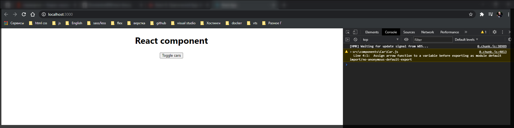
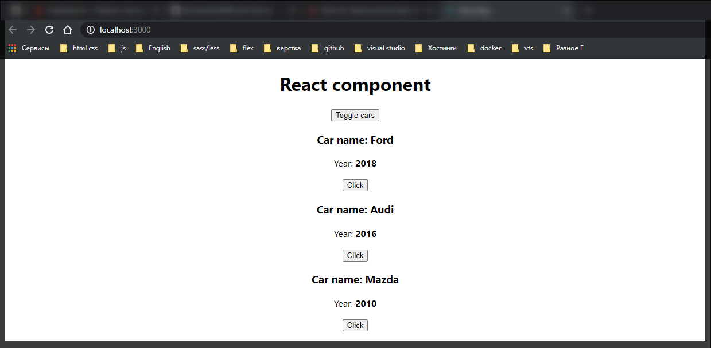

# Работа с условными опрераторами.

Давайте разберем еще одну особенность которую нужно понимать при работе с **React** компонентами. А конкретно это вывод каких-то элементов по условию.

Немного видоизменим наше приложение для того что бы рассмотреть даннуж возможность. Удаляю **input** а текже метод **handleInput**.

В поле **state** создаю новое поле **showCars: false**.

```js
// src/App.js
import React, { Component } from 'react';
import './App.css';
import Car from './components/Car/Car';

class App extends Component {
  state = {
    cars: [
      { name: 'Ford', year: 2018 },
      { name: 'Audi', year: 2016 },
      { name: 'Mazda', year: 2010 },
    ],
    pageTitle: 'React component',
    showCars: false,
  };

  changeTitleHandler = (newTitle) => {
    this.setState({
      pageTitle: newTitle,
    });
  };

  render() {
    const divStyle = {
      textAlign: 'center',
    };

    return (
      <div style={divStyle}>
        <h1>{this.state.pageTitle}</h1>

        <button onClick={this.changeTitleHandler.bind(this, 'Надо поменять')}>
          Change title
        </button>

        {this.state.cars.map((car, index) => {
          return (
            <Car
              key={index}
              name={car.name}
              year={car.year}
              onChangeTitle={() => this.changeTitleHandler(car.name)}
            />
          );
        })}
      </div>
    );
  }
}

export default App;
```

Что мы хотим реализовать? Если состояние **showCars:** будет находится в значение **false**, то в таком случае мы не будем показывать список машин. При этом если мы будем менять данное значение в **true**, то в таком случае мы будем показывать список всех машин. Для этого создаю кнопку которая будет менять состояние данного поля. Изменяю существующую.

```js
<button onClick={this.toggleCarsHandler}>Toggle cars</button>
```

переписываю метод и тем самым показываю еще один вариант реализации

```js
changeTitleHandler = (pageTitle) => {
  this.setState({ pageTitle });
};
```

И теперь реализую метод **toggleCarsHandler**. Данный метод ничего не будет получать. И в данном методе я буду делать инверсию **state**.тем самым мы будем постоянно менять значение **true** на **false** и обратно.

```js
// src/App.js
import React, { Component } from 'react';
import './App.css';
import Car from './components/Car/Car';

class App extends Component {
  state = {
    cars: [
      { name: 'Ford', year: 2018 },
      { name: 'Audi', year: 2016 },
      { name: 'Mazda', year: 2010 },
    ],
    pageTitle: 'React component',
    showCars: false,
  };

  changeTitleHandler = (pageTitle) => {
    this.setState({ pageTitle });
  };

  toggleCarsHandler = () => {
    this.setState({
      showCars: !this.state.showCars,
    });
  };

  render() {
    const divStyle = {
      textAlign: 'center',
    };

    return (
      <div style={divStyle}>
        <h1>{this.state.pageTitle}</h1>

        <button onClick={this.toggleCarsHandler}>Toggle cars</button>

        {this.state.cars.map((car, index) => {
          return (
            <Car
              key={index}
              name={car.name}
              year={car.year}
              onChangeTitle={() => this.changeTitleHandler(car.name)}
            />
          );
        })}
      </div>
    );
  }
}

export default App;
```

Смотрим далее. У нас есть место где мы выводим динамичиский список. И у нас есть две возможности как мы можем скрывать или показывать определенные кострукции.

Первый вариант. Мы можем это сделать прямо **inline** внутри **JSX**. У нас есть открывающий блок **{}** который явно указывает **react** о том что мы здесь пишем **JS**. И здесь мы можем воспользоваться тернарной операцией. Почему тернарный оператор? Да потому что конструкция **if else**, **for** запрещены в **react**.

Поэтому вверху вывода списка обращаюсь к **this.state.showCars ?** и далее указываю список, т.е. это есть **true**, а в место **else** пишу **:** и передаю **null**.

```js
// src/App.js
import React, { Component } from 'react';
import './App.css';
import Car from './components/Car/Car';

class App extends Component {
  state = {
    cars: [
      { name: 'Ford', year: 2018 },
      { name: 'Audi', year: 2016 },
      { name: 'Mazda', year: 2010 },
    ],
    pageTitle: 'React component',
    showCars: false,
  };

  changeTitleHandler = (pageTitle) => {
    this.setState({ pageTitle });
  };

  toggleCarsHandler = () => {
    this.setState({
      showCars: !this.state.showCars,
    });
  };

  render() {
    const divStyle = {
      textAlign: 'center',
    };

    return (
      <div style={divStyle}>
        <h1>{this.state.pageTitle}</h1>

        <button onClick={this.toggleCarsHandler}>Toggle cars</button>

        {this.state.showCars
          ? this.state.cars.map((car, index) => {
              return (
                <Car
                  key={index}
                  name={car.name}
                  year={car.year}
                  onChangeTitle={() => this.changeTitleHandler(car.name)}
                />
              );
            })
          : null}
      </div>
    );
  }
}

export default App;
```



Т.к. по умолчанию стоит **false** то списка машин не видно. Но как только происходит событие клика.



Есть так же второй метод. Т.к. мы с вами работаем внутри **JS**. То мы с вами можем пользоваться операторами **if else** и прочими т.е. если это все находится вне **JSX** т.е. вне оператора **return** и круглых скобочек.

Здесь мы можем так же создать некоторую переменную

```js
let cars = null;

if (this.state.showCars) {
  // переопределяю переменную на то что я пытаюсь вытащить в данном случае это генерация списка
  cars = this.state.cars.map((car, index) => {
    return (
      <Car
        key={index}
        name={car.name}
        year={car.year}
        onChangeTitle={() => this.changeTitleHandler(car.name)}
      />
    );
  });
}
```

А в **JSX** в фигурных скобках просто вывожу переменную **{cars}**.

```js
// src/App.js
import React, { Component } from 'react';
import './App.css';
import Car from './components/Car/Car';

class App extends Component {
  state = {
    cars: [
      { name: 'Ford', year: 2018 },
      { name: 'Audi', year: 2016 },
      { name: 'Mazda', year: 2010 },
    ],
    pageTitle: 'React component',
    showCars: false,
  };

  changeTitleHandler = (pageTitle) => {
    this.setState({ pageTitle });
  };

  toggleCarsHandler = () => {
    this.setState({
      showCars: !this.state.showCars,
    });
  };

  render() {
    const divStyle = {
      textAlign: 'center',
    };

    let cars = null;

    if (this.state.showCars) {
      // переопределяю переменную на то что я пытаюсь вытащить в данном случае это генерация списка
      cars = this.state.cars.map((car, index) => {
        return (
          <Car
            key={index}
            name={car.name}
            year={car.year}
            onChangeTitle={() => this.changeTitleHandler(car.name)}
          />
        );
      });
    }

    return (
      <div style={divStyle}>
        <h1>{this.state.pageTitle}</h1>

        <button onClick={this.toggleCarsHandler}>Toggle cars</button>

        {cars}
      </div>
    );
  }
}

export default App;
```

Все успешно компилируется и выводится.
