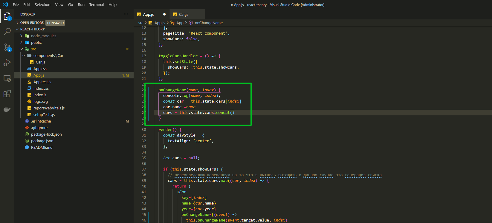

# Динамические списки.

Реализуем две задачи. Первая заменим кнопку **Click** на **input** Куда мы будем вписывать новое имя для каждой из машин. Мы будем изменять состояние для каждой из машин внутри нее.

Второе. Мы реализуем удаление определенного элемента из списка.

Переходим в компонент **Car.js**. Задаю некоторые стили и в методе **onChange** передаю ссылку на метод который создам **onChangeName**

```jsx
//src/components.Car.js
import React from 'react';

export default (props) => (
  <div style={{ border: '1px solid #ccc', marginBottom: '10px' }}>
    <h3>Сar name: {props.name}</h3>
    <p>
      Year: <strong>{props.year}</strong>
    </p>
    <input type="text" onChange={props.onChangeName} />
    {/* <button onClick={props.onChangeTitle}>Click</button> */}
  </div>
);
```

Теперь в компоненте **App.js** и в место **onChangeTitle** передаю **onChangeName** и вызываю этот же метод.

Теперь метод **changeTitleHandler** не работает и мы можем вместо него написать метод **onChangeName**.


```jsx
// src/App.js
import React, { Component } from 'react';
import './App.css';
import Car from './components/Car/Car';

class App extends Component {
  state = {
    cars: [
      { name: 'Ford', year: 2018 },
      { name: 'Audi', year: 2016 },
      { name: 'Mazda', year: 2010 },
    ],
    pageTitle: 'React component',
    showCars: false,
  };

  toggleCarsHandler = () => {
    this.setState({
      showCars: !this.state.showCars,
    });
  };

  onChangeName = () => {};

  render() {
    const divStyle = {
      textAlign: 'center',
    };

    let cars = null;

    if (this.state.showCars) {
      // переопределяю переменную на то что я пытаюсь вытащить в данном случае это генерация списка
      cars = this.state.cars.map((car, index) => {
        return (
          <Car
            key={index}
            name={car.name}
            year={car.year}
            onChangeName={() => this.onChangeName(car.name)}
          />
        );
      });
    }

    return (
      <div style={divStyle}>
        <h1>{this.state.pageTitle}</h1>

        <button onClick={this.toggleCarsHandler}>Toggle cars</button>

        {cars}
      </div>
    );
  }
}

export default App;
```

Кстати разберем как еще работать с обычными функциями **onChangeName() {}**. Это мы говорим про работу **React**.

Во-первых мы хотим изменить определенные элементы внутри массива **cars** а конкретно его название. Потому что у нас **state** находится в нашем корневом элементе. А компонет **Car** у нас является функциональным он ничего не должен делать. Он должен лишь отрисовывать определенные элементы.

Весь **state** и название машины должны хранится в корневом элементе. Это основное правило **React**.

По этому в **onChangeName = () => {};** мы должны именно индентифицировать какой именно элемент машины мы изменили. Мы можем это сейчас сделать если не менять сейчас **state** и не добавлять определенный **id** к каждой из машин, то мы можем просто воспользоваться **index**. Т.е. допустим в атрибуте **onChangeName** компонента **Car**, в данную функцию **callback** будем принимать некоторый **event** и первым параметром в вызываемом свойстве передаю **event.target.value**, а вторым параметром передаю **index** который берется из метода **map** который сортирует массив.


```jsx
// src/App.js
import React, { Component } from 'react';
import './App.css';
import Car from './components/Car/Car';

class App extends Component {
  state = {
    cars: [
      { name: 'Ford', year: 2018 },
      { name: 'Audi', year: 2016 },
      { name: 'Mazda', year: 2010 },
    ],
    pageTitle: 'React component',
    showCars: false,
  };

  toggleCarsHandler = () => {
    this.setState({
      showCars: !this.state.showCars,
    });
  };

  onChangeName() {}

  render() {
    const divStyle = {
      textAlign: 'center',
    };

    let cars = null;

    if (this.state.showCars) {
      // переопределяю переменную на то что я пытаюсь вытащить в данном случае это генерация списка
      cars = this.state.cars.map((car, index) => {
        return (
          <Car
            key={index}
            name={car.name}
            year={car.year}
            onChangeName={(event) =>
              this.onChangeName(event.target.value, index)
            }
          />
        );
      });
    }

    return (
      <div style={divStyle}>
        <h1>{this.state.pageTitle}</h1>

        <button onClick={this.toggleCarsHandler}>Toggle cars</button>

        {cars}
      </div>
    );
  }
}

export default App;
```

Теперь откуда здесь будет браться поле **event**. Данный объект event будет автоматически передаваться когда у нас будет вызываться метод когда у нас будет вызываться **onChange**.


```jsx
//src/components.Car.js
import React from 'react';

export default (props) => (
  <div style={{ border: '1px solid #ccc', marginBottom: '10px' }}>
    <h3>Сar name: {props.name}</h3>
    <p>
      Year: <strong>{props.year}</strong>
    </p>
    <input type="text" onChange={props.onChangeName} />
    {/* <button onClick={props.onChangeTitle}>Click</button> */}
  </div>
);
```

И в метод **onChangeName** мы будем передавать уже готовое решение **event.target.value** которое у нас лежит в **input** и соответственно передавать **index** по которому нам нужно будет найти определенный элемент.

Поэтому при создании метода **onChangeName** мы будем первым параметром принимать некоторый name, вторым переданный **index**. И пока выведе данные значения в консоль.


```jsx
// src/App.js
import React, { Component } from 'react';
import './App.css';
import Car from './components/Car/Car';

class App extends Component {
  state = {
    cars: [
      { name: 'Ford', year: 2018 },
      { name: 'Audi', year: 2016 },
      { name: 'Mazda', year: 2010 },
    ],
    pageTitle: 'React component',
    showCars: false,
  };

  toggleCarsHandler = () => {
    this.setState({
      showCars: !this.state.showCars,
    });
  };

  onChangeName(name, index) {
    console.log(name, index);
  }

  render() {
    const divStyle = {
      textAlign: 'center',
    };

    let cars = null;

    if (this.state.showCars) {
      // переопределяю переменную на то что я пытаюсь вытащить в данном случае это генерация списка
      cars = this.state.cars.map((car, index) => {
        return (
          <Car
            key={index}
            name={car.name}
            year={car.year}
            onChangeName={(event) =>
              this.onChangeName(event.target.value, index)
            }
          />
        );
      });
    }

    return (
      <div style={divStyle}>
        <h1>{this.state.pageTitle}</h1>

        <button onClick={this.toggleCarsHandler}>Toggle cars</button>

        {cars}
      </div>
    );
  }
}

export default App;
```


И мы видим что мы получаем те параметры которые нам необходимы т.е. нулевой **index** плюс нужного состояния данного **input**.

Теперь как-то попробуем изменить состояние нужной нам машины. Для этого в методе **onChangeName** создаю переменную **car** которая у нас будет определяться из состояния **this.state.cars[index]** т.е. мы нашли нужную нам машину которую мы хотим изменить. Далее мы делаем следующее **car.name=name** т.е. мы перезаписываем значение новым именем. После получения новой машины нам нужно изменить нужную машину в массива **cars**. Мы уже знаем что напрямую мы не можем менять состояние **state**. По этому делаю дубликат данного массива и изменяю его.
Есть два основных способа изменения массива. Первый самый простой. Мы можем создать переменную **cars = this.state.cars.concat()** в которую мы можем склонировать массив при помощи обращения к массиву и вызова метода **concat** без параметров. Таким образом мы получим склонированный новый массив который в последствии мы можем изменить.



```jsx
// src/App.js
import React, { Component } from 'react';
import './App.css';
import Car from './components/Car/Car';

class App extends Component {
  state = {
    cars: [
      { name: 'Ford', year: 2018 },
      { name: 'Audi', year: 2016 },
      { name: 'Mazda', year: 2010 },
    ],
    pageTitle: 'React component',
    showCars: false,
  };

  toggleCarsHandler = () => {
    this.setState({
      showCars: !this.state.showCars,
    });
  };

  onChangeName(name, index) {
    console.log(name, index);
    const car = this.state.cars[index];
    car.name = name;
    cars = this.state.cars.concat();
  }

  render() {
    const divStyle = {
      textAlign: 'center',
    };

    let cars = null;

    if (this.state.showCars) {
      // переопределяю переменную на то что я пытаюсь вытащить в данном случае это генерация списка
      cars = this.state.cars.map((car, index) => {
        return (
          <Car
            key={index}
            name={car.name}
            year={car.year}
            onChangeName={(event) =>
              this.onChangeName(event.target.value, index)
            }
          />
        );
      });
    }

    return (
      <div style={divStyle}>
        <h1>{this.state.pageTitle}</h1>

        <button onClick={this.toggleCarsHandler}>Toggle cars</button>

        {cars}
      </div>
    );
  }
}

export default App;
```

Или же мы можем воспользоваться более современным параметром. Мы можем создать новый массив **cars = [...this.state.cars.concat]** куда с помощью **spreed** оператора, который мы указываем перед массивом который хотим развернуть. Мы получается разворачиваем все элементы данного массива внутри нового массива. И соответственно мы получаем новый массив **cars**.
Далее я обращаюсь к новому массиву **cars[index] = car** обращаюсь по **index** и говорю что он будет равняться новой машине. Котору я здесь определил **car.name =name**.

После чего я также должен изменить состояние **state**. Обращаюсь к **this.setState({})** и так как я изменяю массив указываю **cars:cars**. И если у нас совпадает ключ и значение то я могу просто указать **cars**.


```jsx
// src/App.js
import React, { Component } from 'react';
import './App.css';
import Car from './components/Car/Car';

class App extends Component {
  state = {
    cars: [
      { name: 'Ford', year: 2018 },
      { name: 'Audi', year: 2016 },
      { name: 'Mazda', year: 2010 },
    ],
    pageTitle: 'React component',
    showCars: false,
  };

  toggleCarsHandler = () => {
    this.setState({
      showCars: !this.state.showCars,
    });
  };

  onChangeName(name, index) {
    console.log(name, index);
    const car = this.state.cars[index];
    car.name = name;
    const cars = [...this.state.cars];
    cars[index] = car;
    this.setState({ cars });
  }

  render() {
    const divStyle = {
      textAlign: 'center',
    };

    let cars = null;

    if (this.state.showCars) {
      // переопределяю переменную на то что я пытаюсь вытащить в данном случае это генерация списка
      cars = this.state.cars.map((car, index) => {
        return (
          <Car
            key={index}
            name={car.name}
            year={car.year}
            onChangeName={(event) =>
              this.onChangeName(event.target.value, index)
            }
          />
        );
      });
    }

    return (
      <div style={divStyle}>
        <h1>{this.state.pageTitle}</h1>

        <button onClick={this.toggleCarsHandler}>Toggle cars</button>

        {cars}
      </div>
    );
  }
}

export default App;
```


Здесь есть одна проблема. По умолчанию в **input** у нас нет ни какого значения по этому название машины определяется не корректно.

В компоненте **Car** прописываю значение по умолчанию. и как параметр в **value** передаю **props.name**.

```jsx
//src/components.Car.js
import React from 'react';

export default (props) => (
  <div style={{ border: '1px solid #ccc', marginBottom: '10px' }}>
    <h3>Сar name: {props.name}</h3>
    <p>
      Year: <strong>{props.year}</strong>
    </p>
    <input type="text" onChange={props.onChangeName} value={props.name} />
    {/* <button onClick={props.onChangeTitle}>Click</button> */}
  </div>
);
```


<br>
<br>
<br>

Теперь реализуем следующую задачу. Например я хочу удалить определенный элемент из нашего массива. У нас у каждого компонента будет кнопка **delete** при нажатии на которую будет удаляться определенный элемент.

```jsx
//src/components.Car.js
import React from 'react';

export default (props) => (
  <div
    style={{ border: '1px solid #ccc', marginBottom: '10px', padding: '10px' }}
  >
    <h3>Сar name: {props.name}</h3>
    <p>
      Year: <strong>{props.year}</strong>
    </p>
    <input type="text" onChange={props.onChangeName} value={props.name} />
    <button onClick={props.onDelete}>Delete</button>
  </div>
);
```

Теперь в **App.js** я должен передать метод **onDelete**. Для этого я возвращаюсь к методу **map** где вывожу состояние всех машин и передаю метод **onDelete**


```jsx
// src/App.js
import React, { Component } from 'react';
import './App.css';
import Car from './components/Car/Car';

class App extends Component {
  state = {
    cars: [
      { name: 'Ford', year: 2018 },
      { name: 'Audi', year: 2016 },
      { name: 'Mazda', year: 2010 },
    ],
    pageTitle: 'React component',
    showCars: false,
  };

  toggleCarsHandler = () => {
    this.setState({
      showCars: !this.state.showCars,
    });
  };

  onChangeName(name, index) {
    console.log(name, index);
    const car = this.state.cars[index];
    car.name = name;
    const cars = [...this.state.cars];
    cars[index] = car;
    this.setState({ cars });
  }

  render() {
    const divStyle = {
      textAlign: 'center',
    };

    let cars = null;

    if (this.state.showCars) {
      // переопределяю переменную на то что я пытаюсь вытащить в данном случае это генерация списка
      cars = this.state.cars.map((car, index) => {
        return (
          <Car
            key={index}
            name={car.name}
            year={car.year}
            onDelete={}
            onChangeName={(event) =>
              this.onChangeName(event.target.value, index)
            }
          />
        );
      });
    }

    return (
      <div style={divStyle}>
        <h1>{this.state.pageTitle}</h1>

        <button onClick={this.toggleCarsHandler}>Toggle cars</button>

        {cars}
      </div>
    );
  }
}

export default App;
```

Здесь воспользуюсь другой конструкцией, уже не буду передавать сюда функцию. Я сюда буду передавать функцию **this.deleteHandler.bind(this)** т.е. с помощью **bind** буду связывать текущий контекст и буду передавать index той машины которую нужно удалить.


```jsx
// src/App.js
import React, { Component } from 'react';
import './App.css';
import Car from './components/Car/Car';

class App extends Component {
  state = {
    cars: [
      { name: 'Ford', year: 2018 },
      { name: 'Audi', year: 2016 },
      { name: 'Mazda', year: 2010 },
    ],
    pageTitle: 'React component',
    showCars: false,
  };

  toggleCarsHandler = () => {
    this.setState({
      showCars: !this.state.showCars,
    });
  };

  onChangeName(name, index) {
    console.log(name, index);
    const car = this.state.cars[index];
    car.name = name;
    const cars = [...this.state.cars];
    cars[index] = car;
    this.setState({ cars });
  }

  render() {
    const divStyle = {
      textAlign: 'center',
    };

    let cars = null;

    if (this.state.showCars) {
      // переопределяю переменную на то что я пытаюсь вытащить в данном случае это генерация списка
      cars = this.state.cars.map((car, index) => {
        return (
          <Car
            key={index}
            name={car.name}
            year={car.year}
            onDelete={this.deleteHandler.bind(this, index)}
            onChangeName={(event) =>
              this.onChangeName(event.target.value, index)
            }
          />
        );
      });
    }

    return (
      <div style={divStyle}>
        <h1>{this.state.pageTitle}</h1>

        <button onClick={this.toggleCarsHandler}>Toggle cars</button>

        {cars}
      </div>
    );
  }
}

export default App;
```

Здесь есть еще один момент. Для пояснения создаю метод **deleteHandler(){}** и мы создадим его как обычную функцию.

Получу мы здесь не создали например стрелочную функцию? Здесь есть одна особенность. Если мы будем использовать стрелочную функцию, то такая функция не создает свой собственный контекст. При создании обычных функций они создают свой собственный контекст внутри. По-этому для того что бы грамотно обрабатывались определенные методы нам необходимо либо пользоваться такой конструкцией


мы здесь обращаемся внутри стрелочной функции, поэтому она не создает своего контекста как к ключевому слову **this**. Либо с помощью **bind** мы должны связать этот контекст, и все так же должно работать т.к. мы передаем определенный **reference**.

Теперь метод **deleteHandler** принимает **index**. Далее создаю переменную cars которая будет принимать текущий **state** и с помощью метода **concat** который будет создавать новую копию массива **const cars = this.state.cars.concat();**
Дальше нужно удалить определеныый элемент. Для этого обращаюсь к массиву cars вызываю метод **splice()** первым параметром указываю **index** с какого элемента нам нужно удалять элементы, и вторым параметром указываю количество элементов которые нужно удалить.

Теперь я могу обратиться к **this.setState({ cars });** и переопределить массив **cars** т.е. уже с удаленным элементом.


