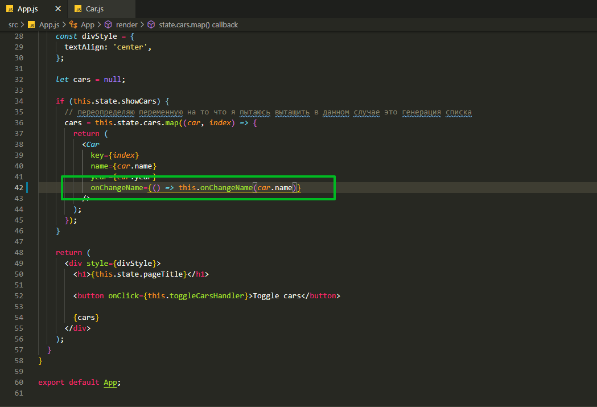

# Динамические списки.

Реализуем две задачи. Первая заменим кнопку Click на input Куда мы будем вписывать новое имя для каждой из машин. М/ы будем изменять состояние для каждой из машин внутри нее.

Второе. Мы реализуем удаление определенного элемента из списка.

Переходим в компонент Car.js. Задаю некотоые стили и в методе onChange передаю ссылку на метод который создам onChangeName

```jsx
//src/components.Car.js
import React from 'react';

export default (props) => (
  <div style={{ border: '1px solid #ccc', marginBottom: '10px' }}>
    <h3>Сar name: {props.name}</h3>
    <p>
      Year: <strong>{props.year}</strong>
    </p>
    <input type="text" onChange={props.onChangeName} />
    {/* <button onClick={props.onChangeTitle}>Click</button> */}
  </div>
);
```

Теперь в компоненте App.js и в место onChangeTitle передаю onChangeName и вызываю этот же метод.

Теперь метод changeTitleHandler не работает и мы можем вместо него написать метод onChangeName.



```js
// src/App.js
import React, { Component } from 'react';
import './App.css';
import Car from './components/Car/Car';

class App extends Component {
  state = {
    cars: [
      { name: 'Ford', year: 2018 },
      { name: 'Audi', year: 2016 },
      { name: 'Mazda', year: 2010 },
    ],
    pageTitle: 'React component',
    showCars: false,
  };

  toggleCarsHandler = () => {
    this.setState({
      showCars: !this.state.showCars,
    });
  };

  onChangeName = () => {};

  render() {
    const divStyle = {
      textAlign: 'center',
    };

    let cars = null;

    if (this.state.showCars) {
      // переопределяю переменную на то что я пытаюсь вытащить в данном случае это генерация списка
      cars = this.state.cars.map((car, index) => {
        return (
          <Car
            key={index}
            name={car.name}
            year={car.year}
            onChangeName={() => this.onChangeName(car.name)}
          />
        );
      });
    }

    return (
      <div style={divStyle}>
        <h1>{this.state.pageTitle}</h1>

        <button onClick={this.toggleCarsHandler}>Toggle cars</button>

        {cars}
      </div>
    );
  }
}

export default App;
```

Кстати разберем как еще работать с обычными функциями onChangeName() {}. Это мы говорим про работу React.

Во-первых мы хотим изменить определенные элементы внутри массива cars а конкретно его название. Потому что у нас state находится в нашем корневом элементе. А компонет Car у нас является функциональным он ничего не должен делать. Он должен лишь отрисовывать определенные элементы.

Весь state и название машины должны хранится в корневом элементе. Это основное правило React.

Закончил на 3:38
