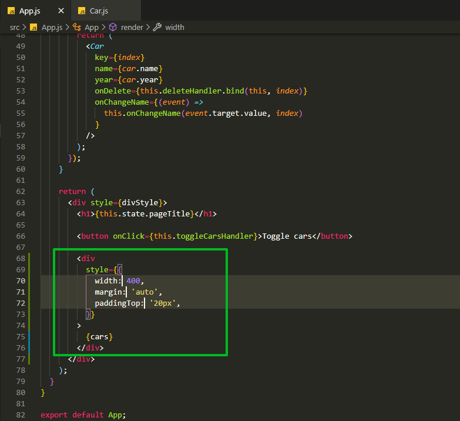
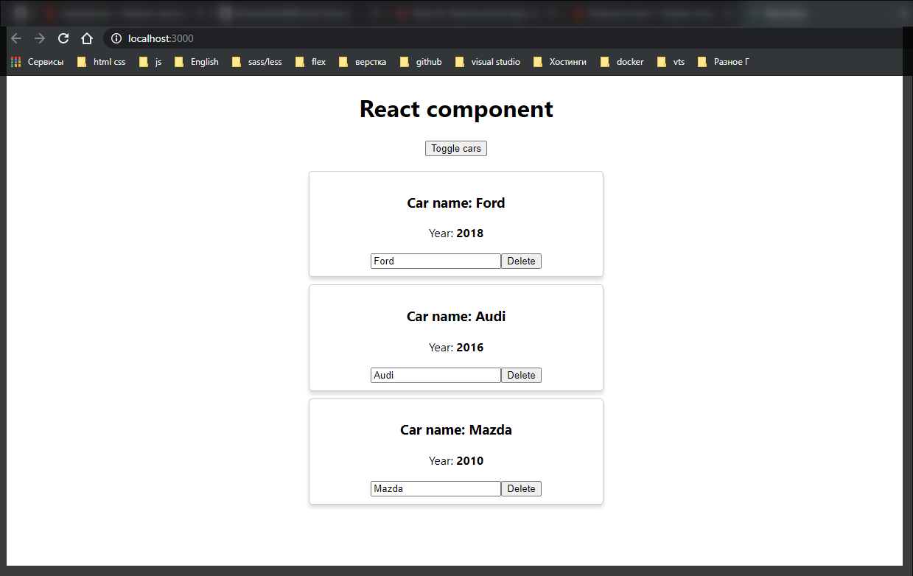

# inline-стили

Это первый с пособ с помощью которого мы можем стилизовать компоненты. Прописываю атрибут style и далее в нем указываю JS объект. Через двойные фигурные скобки не создаю объект а сразу передаю конфигурацию стилей.



```jsx
// src/App.js
import React, { Component } from 'react';
import './App.css';
import Car from './components/Car/Car';

class App extends Component {
  state = {
    cars: [
      { name: 'Ford', year: 2018 },
      { name: 'Audi', year: 2016 },
      { name: 'Mazda', year: 2010 },
    ],
    pageTitle: 'React component',
    showCars: false,
  };

  toggleCarsHandler = () => {
    this.setState({
      showCars: !this.state.showCars,
    });
  };

  onChangeName(name, index) {
    console.log(name, index);
    const car = this.state.cars[index];
    car.name = name;
    const cars = [...this.state.cars];
    cars[index] = car;
    this.setState({ cars });
  }

  deleteHandler(index) {
    const cars = this.state.cars.concat();
    cars.splice(index, 1);
    this.setState({ cars });
  }

  render() {
    const divStyle = {
      textAlign: 'center',
    };

    let cars = null;

    if (this.state.showCars) {
      // переопределяю переменную на то что я пытаюсь вытащить в данном случае это генерация списка
      cars = this.state.cars.map((car, index) => {
        return (
          <Car
            key={index}
            name={car.name}
            year={car.year}
            onDelete={this.deleteHandler.bind(this, index)}
            onChangeName={(event) =>
              this.onChangeName(event.target.value, index)
            }
          />
        );
      });
    }

    return (
      <div style={divStyle}>
        <h1>{this.state.pageTitle}</h1>

        <button onClick={this.toggleCarsHandler}>Toggle cars</button>

        <div
          style={{
            width: 400,
            margin: 'auto',
            paddingTop: '20px',
          }}
        >
          {cars}
        </div>
      </div>
    );
  }
}

export default App;
```

```jsx
//src/components.Car.js
import React from 'react';

export default (props) => (
  <div
    style={{
      border: '1px solid #ccc',
      marginBottom: '10px',
      padding: '10px',
      boxShadow: '0  4px  5px 0 rgba(0, 0, 0, .14)',
      borderRadius: '5px',
    }}
  >
    <h3>Сar name: {props.name}</h3>
    <p>
      Year: <strong>{props.year}</strong>
    </p>
    <input type="text" onChange={props.onChangeName} value={props.name} />
    <button onClick={props.onDelete}>Delete</button>
  </div>
);
```


