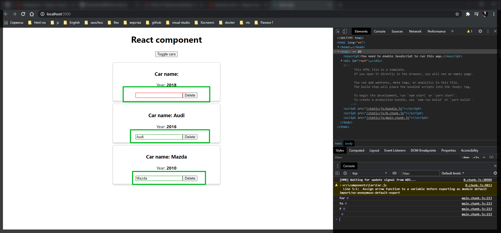
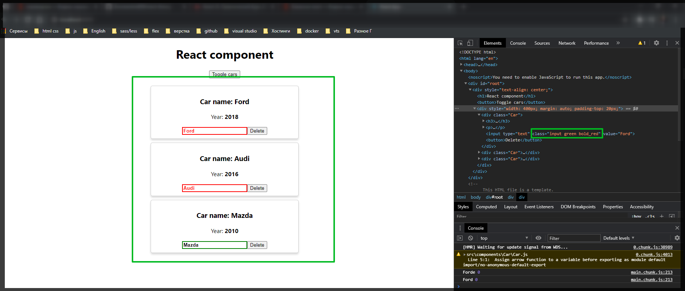

# Динамические классы

В компоненте **Car** рассмотрим это на примере **input**.

В **input** нам поступает некоторая строка т.е. некоторое свойсто где содержится название машины.

```jsx
//src/components.Car.js
import React from 'react';
import './Car.css';

export default (props) => (
  <div className="Car">
    <h3>Сar name: {props.name}</h3>
    <p>
      Year: <strong>{props.year}</strong>
    </p>
    <input type="text" onChange={props.onChangeName} value={props.name} />
    <button onClick={props.onDelete}>Delete</button>
  </div>
);
```

Реализуем следующую задачу. Допустим если у нас что-то будет находится в данной строке, то тогда мы будем задавать зеленую границу данному **input**.
Если же ничего в данной строке не будет, то мы будем менять данный цвет на красный. Грубо говоря сделаем такую валидацию.

И так для начало нужно сделать некоторую манипуляцию. У нас есть компонент который возвращает некоторый **JSX** код пока что без самой тела функции. Добавим тело. Для создания и возвращения использую **return**.

```jsx
//src/components.Car.js
import React from 'react';
import './Car.css';

export default (props) => {
  return (
    <div className="Car">
      <h3>Сar name: {props.name}</h3>
      <p>
        Year: <strong>{props.year}</strong>
      </p>
      <input type="text" onChange={props.onChangeName} value={props.name} />
      <button onClick={props.onDelete}>Delete</button>
    </div>
  );
};
```

Теперь до return я могу что-то делать.

Теперь давайте подумаем как мы можем создавать и изменять динамически классы на элементе. Учитывая что react пропагандирует подход что все есть **JS** и мы можем все делать все с помощью **JS**. Для этого на самом деле подойдет самая обычная сущность в **JS** массивы. Массивы могут в себе содержать различное количество элементов однотипных и соответственно мы можем туда добавлять н-ное количество классов через различные условия и потом добавлять их на элемент.

Поэтому создаю переменную **inputClasses = []** и по умалчанию это будет пустой массив.

Теперь сделаем некоторе форматирование на **input** что бы им было удобнее манипулировать.

Но для начало создам эти стили.

```css
.Car {
  border: 1px solid #ccc;
  margin-bottom: 10px;
  padding: 10px;
  box-shadow: 0 4px 5px 0 rgba(0, 0, 0, 0.14);
  border-radius: 5px;
}

.input {
}
.input.green {
  border: 1px solid green;
}

.input.red {
  border: 1px solid red;
}
```

Теперь смотрите. По умолчанию у нас есть некоторый класс **input** который характерен для всех input потому что через него задаются остальные классы. Поэтому по умолчанию в массив **inputClasses = ['input']** задаю класс **input** причем без точки а просто название класса.

Теперь делаем проверку.

```jsx
//src/components.Car.js
import React from 'react';
import './Car.css';

export default (props) => {
  const inputClasses = ['input'];

  if (props.name !== '') {
    inputClasses.push('green');
  } else {
    inputClasses.push('red');
  }

  return (
    <div className="Car">
      <h3>Сar name: {props.name}</h3>
      <p>
        Year: <strong>{props.year}</strong>
      </p>
      <input type="text" onChange={props.onChangeName} value={props.name} />
      <button onClick={props.onDelete}>Delete</button>
    </div>
  );
};
```

Теперь у нас есть массив состоящий как минимум из двух элементов. И теперь каким-то образом их нужно передать компоненту **input**. Для этого у нас есть свойство **className**, но однако в него мы должны передавать именно строку для того что бы в последующем правильно инвертировать в обычные атрибуты. И массивы данный параметр **className** не понимает. Поэтому сюда передаю массив и передаю его в строку. Массивы превращаются в строку путем вызова метода **join()** и данный метод соеденит каким-то символом все элементы. Передаем пробел и соответственно все эти классы пойдут через пробел.

```jsx
///src/components.Car.js
import React from 'react';
import './Car.css';

export default (props) => {
  const inputClasses = ['input'];

  if (props.name !== '') {
    inputClasses.push('green');
  } else {
    inputClasses.push('red');
  }

  return (
    <div className="Car">
      <h3>Сar name: {props.name}</h3>
      <p>
        Year: <strong>{props.year}</strong>
      </p>
      <input
        type="text"
        onChange={props.onChangeName}
        value={props.name}
        className={inputClasses.join(' ')}
      />
      <button onClick={props.onDelete}>Delete</button>
    </div>
  );
};
```

```css
/* Car.css */
.Car {
  border: 1px solid #ccc;
  margin-bottom: 10px;
  padding: 10px;
  box-shadow: 0 4px 5px 0 rgba(0, 0, 0, 0.14);
  border-radius: 5px;
}

.input {
}

.input:active,
.input:focus {
  outline: none;
}

.input.green {
  border: 1px solid green;
}

.input.red {
  border: 1px solid red;
}
```



Теперь давайте сделаем следующее. Если введем в данный **input** более 4-х символов, то мы тоже будем как -то изменять данный **input**.

Для этого создаю новый класс **bold**.

```css
/* Car.css */
.Car {
  border: 1px solid #ccc;
  margin-bottom: 10px;
  padding: 10px;
  box-shadow: 0 4px 5px 0 rgba(0, 0, 0, 0.14);
  border-radius: 5px;
}

.input {
}

.input:active,
.input:focus {
  outline: none;
}

.input.green {
  border: 1px solid green;
}

.input.red {
  border: 1px solid red;
}

.input.bold {
  border: 2px solid green;
  font-weight: bold;
}
```

Теперь нам так же как-то нужно добавить данный класс.

Мы так же в компоненте пишем условие.

```jsx
//src/components.Car.js
import React from 'react';
import './Car.css';

export default (props) => {
  const inputClasses = ['input'];

  if (props.name !== '') {
    inputClasses.push('green');
  } else {
    inputClasses.push('red');
  }

  if (props.name.length > 4) {
    inputClasses.push('bold');
  } else {
    inputClasses.push('bold_red'); // это я уже добавляю свой класс он вообще else не использует
  }

  return (
    <div className="Car">
      <h3>Сar name: {props.name}</h3>
      <p>
        Year: <strong>{props.year}</strong>
      </p>
      <input
        type="text"
        onChange={props.onChangeName}
        value={props.name}
        className={inputClasses.join(' ')}
      />
      <button onClick={props.onDelete}>Delete</button>
    </div>
  );
};
```

```css
/* Car.css */
.Car {
  border: 1px solid #ccc;
  margin-bottom: 10px;
  padding: 10px;
  box-shadow: 0 4px 5px 0 rgba(0, 0, 0, 0.14);
  border-radius: 5px;
}

.input {
}

.input:active,
.input:focus {
  outline: none;
}

.input.green {
  border: 1px solid green;
}

.input.red {
  border: 1px solid red;
}

.input.bold {
  border: 2px solid green;
  font-weight: bold;
}
.input.bold_red {
  color: red;
  border: 2px solid red;
  font-weight: bold;
}
```


