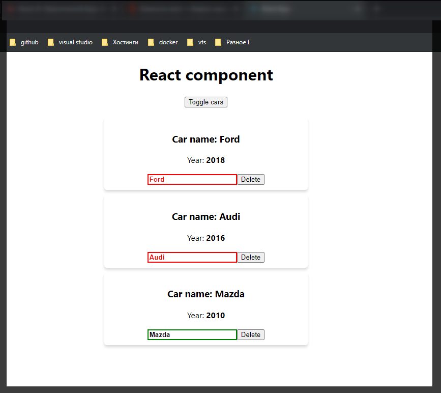
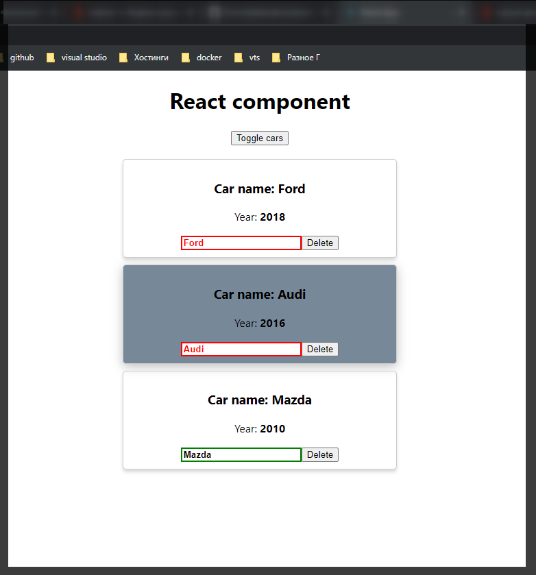

# radium

Разберем одну задачу которая может понадобится при работе со стилями в **React**. Для этого давайте предположим что я не хочу задавать свойства **border** и **box-shadow** прямо в **css**, я хочу ими монупулировакть прямо в **JS** через **inline** стили.

```css
/* Car.css */
.Car {
  /* border: 1px solid #ccc; */
  margin-bottom: 10px;
  padding: 10px;
  /* box-shadow: 0 4px 5px 0 rgba(0, 0, 0, 0.14); */
  border-radius: 5px;
}

.input {
}

.input:active,
.input:focus {
  outline: none;
}

.input.green {
  border: 1px solid green;
}

.input.red {
  border: 1px solid red;
}

.input.bold {
  border: 2px solid green;
  font-weight: bold;
}
.input.bold_red {
  color: red;
  border: 2px solid red;
  font-weight: bold;
}
```

Перехожу в компонент и создаю объект

```js
style = {
  border: '1px solid #ccc;',
  boxShadow: '0 4px 5px 0 rgba(0, 0, 0, 0.14)',
};
```

Теперь данный объект мы можем задать корневому элементу компонента **Car** атрибут **style={style}**.

```jsx
//src/components.Car.js
import React from 'react';
import './Car.css';

export default (props) => {
  const inputClasses = ['input'];

  if (props.name !== '') {
    inputClasses.push('green');
  } else {
    inputClasses.push('red');
  }

  if (props.name.length > 4) {
    inputClasses.push('bold');
  } else {
    inputClasses.push('bold_red'); // это я уже добавляю свой класс он вообще else не использует
  }

  const style = {
    border: '1px solid #ccc;',
    boxShadow: '0 4px 5px 0 rgba(0, 0, 0, 0.14)',
  };

  return (
    <div className="Car" style={style}>
      <h3>Сar name: {props.name}</h3>
      <p>
        Year: <strong>{props.year}</strong>
      </p>
      <input
        type="text"
        onChange={props.onChangeName}
        value={props.name}
        className={inputClasses.join(' ')}
      />
      <button onClick={props.onDelete}>Delete</button>
    </div>
  );
};
```



Ничего не сломалось не смотря на то что некоторые стили заданы через **JS**.

Теперь зачем мы это сделали?

Разберем следующую задачу. Допустим мы при наведении на каждый из элементов мы хотим его как-то его визуально выделять. И здесь задается вопрос как мы можем внутри **JS** задавать псевдоселекторы?

Нативно мы здесь ничего не можем сделать не принимая какие-то сторонние инструменты. Есть один иструмент который может помочь.

[https://github.com/FormidableLabs/radium](https://github.com/FormidableLabs/radium)

```shell
npm install --save radium
```

Для использования данной библиотеки придется сделать некоторые манипуляции. Импортирую саму библиотеку **import Radium from 'radium';** Данная переменная по сути является **React** компонентом. Это компонент высшего порядка **hoc**.

Преобразую код. Присваиваю описание данного компонента в переменную **Car** т.е. я просто получаю функцию **Car**

```jsx
//src/components.Car.js
import React from 'react';
import Radium from 'radium';
import './Car.css';

const Car = (props) => {
  const inputClasses = ['input'];

  if (props.name !== '') {
    inputClasses.push('green');
  } else {
    inputClasses.push('red');
  }

  if (props.name.length > 4) {
    inputClasses.push('bold');
  } else {
    inputClasses.push('bold_red'); // это я уже добавляю свой класс он вообще else не использует
  }

  const style = {
    border: '1px solid #ccc;',
    boxShadow: '0 4px 5px 0 rgba(0, 0, 0, 0.14)',
  };

  return (
    <div className="Car" style={style}>
      <h3>Сar name: {props.name}</h3>
      <p>
        Year: <strong>{props.year}</strong>
      </p>
      <input
        type="text"
        onChange={props.onChangeName}
        value={props.name}
        className={inputClasses.join(' ')}
      />
      <button onClick={props.onDelete}>Delete</button>
    </div>
  );
};
export default Car;
```

Для того что бы использовать **Radium** его нужно экспортировать по умолчанию в параметры которого передается компонент.

```js
//src/components.Car.js
import React from 'react';
import Radium from 'radium';
import './Car.css';

const Car = (props) => {
  const inputClasses = ['input'];

  if (props.name !== '') {
    inputClasses.push('green');
  } else {
    inputClasses.push('red');
  }

  if (props.name.length > 4) {
    inputClasses.push('bold');
  } else {
    inputClasses.push('bold_red'); // это я уже добавляю свой класс он вообще else не использует
  }

  const style = {
    border: '1px solid #ccc;',
    boxShadow: '0 4px 5px 0 rgba(0, 0, 0, 0.14)',
  };

  return (
    <div className="Car" style={style}>
      <h3>Сar name: {props.name}</h3>
      <p>
        Year: <strong>{props.year}</strong>
      </p>
      <input
        type="text"
        onChange={props.onChangeName}
        value={props.name}
        className={inputClasses.join(' ')}
      />
      <button onClick={props.onDelete}>Delete</button>
    </div>
  );
};
export default Radium(Car);
```

Т.е. по сути мы берем наш компонент и оборачиваем в функционал данного пакета который мы установили.

Теперь в обхекте **style** можно использовать расширенные возможности. Добавляю псевдоселектор. Важно понимать что его нужно оборачивать в строковое значение, в **JS** можно так делать оборачивать ключи в строковый формат потому что данный селектор начинается с двоеточия. И в качестве объекта передаю ему css свойства которые будут применены к компоненту.

```jsx
//src/components.Car.js
import React from 'react';
import Radium from 'radium';
import './Car.css';

const Car = (props) => {
  const inputClasses = ['input'];

  if (props.name !== '') {
    inputClasses.push('green');
  } else {
    inputClasses.push('red');
  }

  if (props.name.length > 4) {
    inputClasses.push('bold');
  } else {
    inputClasses.push('bold_red'); // это я уже добавляю свой класс он вообще else не использует
  }

  const style = {
    border: '1px solid #ccc',
    boxShadow: '0 4px 5px 0 rgba(0, 0, 0, 0.14)',
    ':hover': {
      border: '1ps solid #aaa',
      boxShadow: '0 4px 15px 0 rgba(0, 0, 0, .25) ',
      backgroundColor: 'LightSlateGray',
      cursor: 'pointer',
    },
  };

  return (
    <div className="Car" style={style}>
      <h3>Сar name: {props.name}</h3>
      <p>
        Year: <strong>{props.year}</strong>
      </p>
      <input
        type="text"
        onChange={props.onChangeName}
        value={props.name}
        className={inputClasses.join(' ')}
      />
      <button onClick={props.onDelete}>Delete</button>
    </div>
  );
};
export default Radium(Car);
```



C помощью **Radium** управлять цветом, различными **media-query** так жи их описывать. Смотри в документации.
