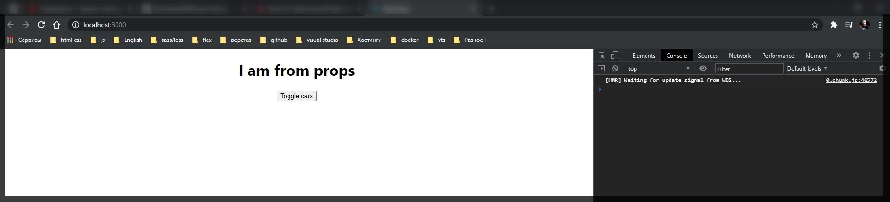

# Передача параметров в компонент

Начнем рассмотрение с корневоко компонента **App.js**

```js
// src/App.js
import React, { Component } from 'react';
import './App.scss';
import Car from './components/Car/Car';

class App extends Component {
  state = {
    cars: [
      { name: 'Ford', year: 2018 },
      { name: 'Audi', year: 2016 },
      { name: 'Mazda', year: 2010 },
    ],
    pageTitle: 'React component',
    showCars: false,
  };

  toggleCarsHandler = () => {
    this.setState({
      showCars: !this.state.showCars,
    });
  };

  onChangeName(name, index) {
    console.log(name, index);
    const car = this.state.cars[index];
    car.name = name;
    const cars = [...this.state.cars];
    cars[index] = car;
    this.setState({ cars });
  }

  deleteHandler(index) {
    const cars = this.state.cars.concat();
    cars.splice(index, 1);
    this.setState({ cars });
  }

  render() {
    const divStyle = {
      textAlign: 'center',
    };

    let cars = null;

    if (this.state.showCars) {
      // переопределяю переменную на то что я пытаюсь вытащить в данном случае это генерация списка
      cars = this.state.cars.map((car, index) => {
        return (
          <Car
            key={index}
            name={car.name}
            year={car.year}
            onDelete={this.deleteHandler.bind(this, index)}
            onChangeName={(event) =>
              this.onChangeName(event.target.value, index)
            }
          />
        );
      });
    }

    return (
      <div style={divStyle}>
        <h1>{this.state.pageTitle}</h1>

        <button onClick={this.toggleCarsHandler}>Toggle cars</button>

        <div
          style={{
            width: 400,
            margin: 'auto',
            paddingTop: '20px',
          }}
        >
          {cars}
        </div>
      </div>
    );
  }
}

export default App;
```

Рассмотрим как мы можем передавать сюда различные опции и выводить их в методе **render**.

Сначало посморим то где мы рендерим **App** компонент все происходит в

```js
// index.js
import React from 'react';
import ReactDOM from 'react-dom';
import './index.scss';
import App from './App';
import reportWebVitals from './reportWebVitals';

ReactDOM.render(
  <React.StrictMode>
    <App />
  </React.StrictMode>,
  document.getElementById('root')
);

reportWebVitals();
```

C помощью библиотеки **ReactDOM** и метода **render** выводим **App** компонент в **DOM**.

Предположим следующую задачу. Допустим мы хотим в **App** компонент передавать некоторый **title** который у нас отображается на главной странице нашего приложения и которое выводится в **h1**.

Мы как и в любом другом компоненте можем воспользоваться путем передачи атрибутов. К примеру **title={'I am from props'}**

```jsx
// index.js
import React from 'react';
import ReactDOM from 'react-dom';
import './index.scss';
import App from './App';
import reportWebVitals from './reportWebVitals';

ReactDOM.render(
  <React.StrictMode>
    <App title={'I am from props'} />
  </React.StrictMode>,
  document.getElementById('root')
);

reportWebVitals();
```

И теперь я хочу получить доступ.

Если посмотреть на компонент **Car.js**, то как мы здесь работаем с свойствами которые приходят в компонент. Мы просто получаем их в функции и в последствии мы просто их используем как обычный объект.

```jsx
//src/components.Car.js
import React from 'react';
import Radium from 'radium';
import './Car.scss';

const Car = (props) => {
  const inputClasses = ['input'];

  if (props.name !== '') {
    inputClasses.push('green');
  } else {
    inputClasses.push('red');
  }

  if (props.name.length > 4) {
    inputClasses.push('bold');
  } else {
    inputClasses.push('bold_red'); // это я уже добавляю свой класс он вообще else не использует
  }

  const style = {
    border: '1px solid #ccc',
    boxShadow: '0 4px 5px 0 rgba(0, 0, 0, 0.14)',
    ':hover': {
      border: '1ps solid #aaa',
      boxShadow: '0 4px 15px 0 rgba(0, 0, 0, .25) ',
      backgroundColor: 'LightSlateGray',
      cursor: 'pointer',
    },
  };

  return (
    <div className="Car" style={style}>
      <h3>Сar name: {props.name}</h3>
      <p>
        Year: <strong>{props.year}</strong>
      </p>
      <input
        type="text"
        onChange={props.onChangeName}
        value={props.name}
        className={inputClasses.join(' ')}
      />
      <button onClick={props.onDelete}>Delete</button>
    </div>
  );
};
export default Radium(Car);
```

Логично будет предположить что работа с **App** компонентом будет такова т.е. мы получим некоторые свойства и попробуем их вывести.

В **h1** достаточно обатится к **props**. и названию тех свойств которые мы передаем в компонент т.е. **title**. Единственно что здесь нужно изменить, так как мы сюда передаем объект **props**, а он здесь нигде не определен, то для того что бы получить доступ к свойствам которые входят в компонент, нам необходимо к ним обращаться через ключевое слово **this**.

```jsx
// src/App.js
import React, { Component } from 'react';
import './App.scss';
import Car from './components/Car/Car';

class App extends Component {
  state = {
    cars: [
      { name: 'Ford', year: 2018 },
      { name: 'Audi', year: 2016 },
      { name: 'Mazda', year: 2010 },
    ],
    pageTitle: 'React component',
    showCars: false,
  };

  toggleCarsHandler = () => {
    this.setState({
      showCars: !this.state.showCars,
    });
  };

  onChangeName(name, index) {
    console.log(name, index);
    const car = this.state.cars[index];
    car.name = name;
    const cars = [...this.state.cars];
    cars[index] = car;
    this.setState({ cars });
  }

  deleteHandler(index) {
    const cars = this.state.cars.concat();
    cars.splice(index, 1);
    this.setState({ cars });
  }

  render() {
    const divStyle = {
      textAlign: 'center',
    };

    let cars = null;

    if (this.state.showCars) {
      // переопределяю переменную на то что я пытаюсь вытащить в данном случае это генерация списка
      cars = this.state.cars.map((car, index) => {
        return (
          <Car
            key={index}
            name={car.name}
            year={car.year}
            onDelete={this.deleteHandler.bind(this, index)}
            onChangeName={(event) =>
              this.onChangeName(event.target.value, index)
            }
          />
        );
      });
    }

    return (
      <div style={divStyle}>
        {/* <h1>{this.state.pageTitle}</h1> */}
        <h1>{this.props.title}</h1>

        <button onClick={this.toggleCarsHandler}>Toggle cars</button>

        <div
          style={{
            width: 400,
            margin: 'auto',
            paddingTop: '20px',
          }}
        >
          {cars}
        </div>
      </div>
    );
  }
}

export default App;
```



Т.е. все сводится к тому что если мы с вами передаем какие-то параметры в компонент который определен через ключевое слово **class**, то мы так же можем получить доступ к различным свойствам. Но мы так же не должны забывать что мы должны обращаться к props через **this**.
