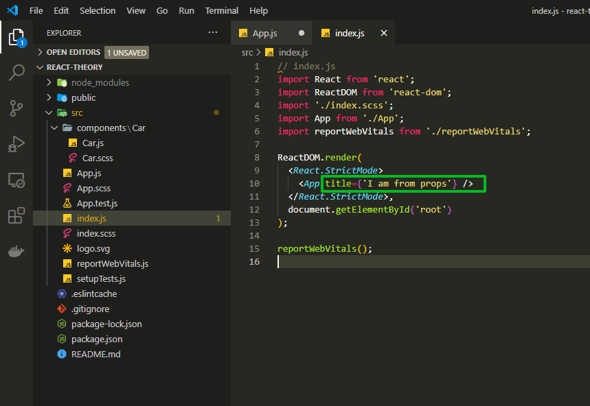
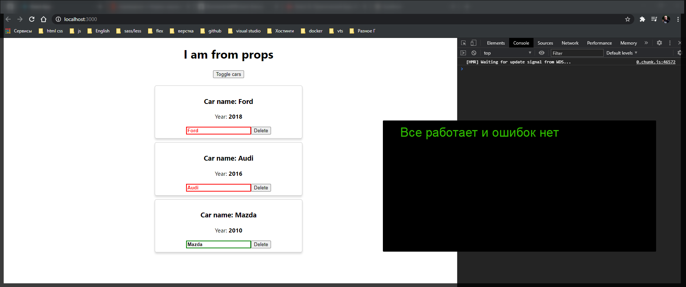

# Инициализация state

Рассмотрим еще одну особенность которая есть у **React** компонентов
которые создаются через ключевое слово **class**.

Мы с вами уже научились создавать **state** путем задания ключевого слова **state** в теле класса и дальше мы описываем **state** как обычный **JS** объект.

```js
state = {
  cars: [
    { name: 'Ford', year: 2018 },
    { name: 'Audi', year: 2016 },
    { name: 'Mazda', year: 2010 },
  ],
  pageTitle: 'React component',
  showCars: false,
};
```

Но в других проектах вы можете встретить и другую запись. Когда мы в **JS** создаем некоторые классы через ключевое слово **class** мы так же получаем специальный метод который называется **constructor**, это синтаксис **ES6**, и мы можем определить метод при создании данного класса т.е. как в обычном языке программирования. Запипсывается как **constructor(){}** и это обычный метод.

В **React** компонентах мы можем так же его определить, но здесь есть одна особенность. Т.к. мы с вами наследуемся от базового класса **React** компонента т.е. **class App extends Component**, то в React компоненте так же вызывается метод **constructor**. И для того что бы данный **constructor(){}** отработал правильно и у нас небыло ни каких ошибок нам необходимо так же форсированно вызвать и родительский класс,Component, и его метод **constructor**.

Для этого когда мы определяем функцию конструктора мы должны вызвать метод **super** в начале данного метода. Помимо того что мы все записываем таким образом

```js
  constructor(){
    super()
  }

```

нам так же необходимо передать сюда некоторые параметры.

Если вы помните, когда мы создаем класс App мы передаем в него некоторые свойства, к примеру как в прошлом уроке



И как раз таки эти свойства и попадают в конструктор т.е. в виде объекта **props**. Так вот для того что бы данный класс и **React** компонент правильно отработал, нам необходимо эти параметры, которые к нам поступают в класс так же передать в метод **super** для того что бы у нас **react** работал корректно.

```js
constructor(props){
    super(props)
  }
```

Теперь какую запись вы можете иногда видить? Часто бывает что **state** у нас определяется именно в конструкторе. По-этому если мы захотим это все переписать, то в конструкторе мы можем определить **state** через ключевое слово **this** и дальше обратиться к состоянию после чего мы можем так же создать обычный объект. И именно вот такую запись вы можете увидеть при создании при создании **react** классов.

```js
class App extends Component {
  constructor(props) {
    super(props);
    this.state = {
      cars: [
        { name: 'Ford', year: 2018 },
        { name: 'Audi', year: 2016 },
        { name: 'Mazda', year: 2010 },
      ],
      pageTitle: 'React component',
      showCars: false,
    };
  }
```

И полный файл.

```jsx
// src/App.js
import React, { Component } from 'react';
import './App.scss';
import Car from './components/Car/Car';

class App extends Component {
  constructor(props) {
    super(props);
    this.state = {
      cars: [
        { name: 'Ford', year: 2018 },
        { name: 'Audi', year: 2016 },
        { name: 'Mazda', year: 2010 },
      ],
      pageTitle: 'React component',
      showCars: false,
    };
  }

  toggleCarsHandler = () => {
    this.setState({
      showCars: !this.state.showCars,
    });
  };

  onChangeName(name, index) {
    console.log(name, index);
    const car = this.state.cars[index];
    car.name = name;
    const cars = [...this.state.cars];
    cars[index] = car;
    this.setState({ cars });
  }

  deleteHandler(index) {
    const cars = this.state.cars.concat();
    cars.splice(index, 1);
    this.setState({ cars });
  }

  render() {
    const divStyle = {
      textAlign: 'center',
    };

    let cars = null;

    if (this.state.showCars) {
      // переопределяю переменную на то что я пытаюсь вытащить в данном случае это генерация списка
      cars = this.state.cars.map((car, index) => {
        return (
          <Car
            key={index}
            name={car.name}
            year={car.year}
            onDelete={this.deleteHandler.bind(this, index)}
            onChangeName={(event) =>
              this.onChangeName(event.target.value, index)
            }
          />
        );
      });
    }

    return (
      <div style={divStyle}>
        {/* <h1>{this.state.pageTitle}</h1> */}
        <h1>{this.props.title}</h1>

        <button onClick={this.toggleCarsHandler}>Toggle cars</button>

        <div
          style={{
            width: 400,
            margin: 'auto',
            paddingTop: '20px',
          }}
        >
          {cars}
        </div>
      </div>
    );
  }
}

export default App;
```


