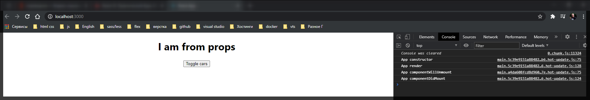
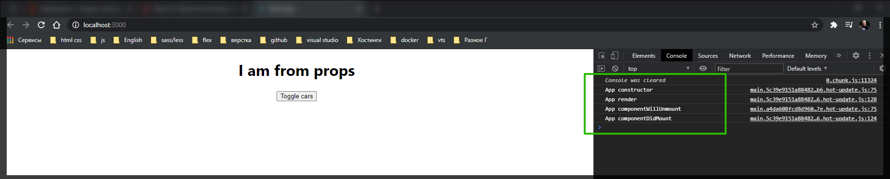

# Базовый жизненный цикл

**Жизненный цикл** - это определенные этапы которые проходит **react** компонент в процессе его определения.

Важный момент. Жизненные циклы они доступны только для тех компонентов которые наследуются от базового компонента **class App extends Component** потому что именно он нам предоставляет данный метод.

Рассмотрим базовые жизненные циклы которые свойственны компоненту в процессе его инициализации. Все жизненные циклы по сути представляют собой обычные функции которые мы можем определить и в них мы можем определить доступ к определенным этапам становления **react** компонента.

Перехожу в **App** компонент который пока единственный наследуется от **Component**. И мы где-нибудь перед методом **render** создадим пару функций.

Первая функция которая является первым жизненным этапом компонента называется **componentWillUnmount(){}**. И давайте пока для примера мы будем просто писать **console.log** в каждом методе и просто смотреть в какой момент оны вызываются.

```js
 componentWillUnmount() {
    console.log('App componentWillUnmount');
  }
```

Следующий жизненный цикл который у нас есть это **componentDidMount(){}**. **Mount** - переводится как некоторое внедрение. Если вы пришли из других **frameworks** то их можно описать как **render**. Просто в React это называется Mount т.е. что-то положить в **html** или в **DOM**.

```js
 componentDidMount() {
    console.log('App componentDidMount');
  }
```

Еще одним жизненным циклом react компонента является метод render который непосредственно служит для того что бы положить что-то в **DOM**. Т.е. именно здесь мы формируем тот конечный **HTML** или **JSX** который будет у нас находится в **DOM**. По-этому в **render** тоже выведу **console.log**.

```jsx
// src/App.js
import React, { Component } from 'react';
import './App.scss';
import Car from './components/Car/Car';

class App extends Component {
  constructor(props) {
    super(props);
    this.state = {
      cars: [
        { name: 'Ford', year: 2018 },
        { name: 'Audi', year: 2016 },
        { name: 'Mazda', year: 2010 },
      ],
      pageTitle: 'React component',
      showCars: false,
    };
  }

  toggleCarsHandler = () => {
    this.setState({
      showCars: !this.state.showCars,
    });
  };

  onChangeName(name, index) {
    console.log(name, index);
    const car = this.state.cars[index];
    car.name = name;
    const cars = [...this.state.cars];
    cars[index] = car;
    this.setState({ cars });
  }

  deleteHandler(index) {
    const cars = this.state.cars.concat();
    cars.splice(index, 1);
    this.setState({ cars });
  }

  componentWillUnmount() {
    console.log('App componentWillUnmount');
  }

  componentDidMount() {
    console.log('App componentDidMount');
  }

  render() {
    console.log('App render');

    const divStyle = {
      textAlign: 'center',
    };

    let cars = null;

    if (this.state.showCars) {
      // переопределяю переменную на то что я пытаюсь вытащить в данном случае это генерация списка
      cars = this.state.cars.map((car, index) => {
        return (
          <Car
            key={index}
            name={car.name}
            year={car.year}
            onDelete={this.deleteHandler.bind(this, index)}
            onChangeName={(event) =>
              this.onChangeName(event.target.value, index)
            }
          />
        );
      });
    }

    return (
      <div style={divStyle}>
        {/* <h1>{this.state.pageTitle}</h1> */}
        <h1>{this.props.title}</h1>

        <button onClick={this.toggleCarsHandler}>Toggle cars</button>

        <div
          style={{
            width: 400,
            margin: 'auto',
            paddingTop: '20px',
          }}
        >
          {cars}
        </div>
      </div>
    );
  }
}

export default App;
```

Теперь давайте посмотрим в каком порядке вызываются данные методы. Полная хрень какая-то. Должно выводится

```shell
App componentWillUnmount
App render
App componentDidMount
```

Сначало вызывается **componentWillUnmount**. Данная функция вызывается тогда когда произошла инициализация **react** |компонента. Мы подготовили все необходимые параметры и дальше наш **react** компонент готов для того что бы он был зарендерин. И в тот моммент когда у нас проходит метод render у нас вызывается метод **componentDidMount** который сообщает нам о том что впринципе весь **html** **react** готов и теперь мы можем его как-то преобразовывать.

Очень важно понимать что **componentWillUnmount** в проектах очень редко используется потому что к этому моменту react еще не готов, он был только лишь проинициализирован, и пока что в нем не стоит ничего делать например изменять **state** потому что сам **html** еще не готов и по сути данный метод он просто остался как старый **API react**. Пока что он есть. Здесь мы можем делать какие-то базовые настройки. Но важно понимать что здесь не нужно обращаться к **back-end**.Видимо по этому у меня в более новой версии функция **componentWillUnmount** вызывается после **render**.

Все обращения мы должны делать в методе **componentDidMount** т.е. в тот момент когда у нас уже готов некоторый **html** и мы можем с ним работать.

Метод render он так же будет вызываться несколько раз если мы изменяем какие-то параметры, изменяется **state**, если изменяются входящие свойства и т.д.

Еще один момент который нужно пояснить относятся не то что бы к жизненному циклу но при этом его так же нужно понимать.

Перехожу в конструктор и выведу конструктор в консоль.

```jsx
// src/App.js
import React, { Component } from 'react';
import './App.scss';
import Car from './components/Car/Car';

class App extends Component {
  constructor(props) {
    console.log('App constructor');
    super(props);
    this.state = {
      cars: [
        { name: 'Ford', year: 2018 },
        { name: 'Audi', year: 2016 },
        { name: 'Mazda', year: 2010 },
      ],
      pageTitle: 'React component',
      showCars: false,
    };
  }

  toggleCarsHandler = () => {
    this.setState({
      showCars: !this.state.showCars,
    });
  };

  onChangeName(name, index) {
    console.log(name, index);
    const car = this.state.cars[index];
    car.name = name;
    const cars = [...this.state.cars];
    cars[index] = car;
    this.setState({ cars });
  }

  deleteHandler(index) {
    const cars = this.state.cars.concat();
    cars.splice(index, 1);
    this.setState({ cars });
  }

  componentWillUnmount() {
    console.log('App componentWillUnmount');
  }

  componentDidMount() {
    console.log('App componentDidMount');
  }

  render() {
    console.log('App render');

    const divStyle = {
      textAlign: 'center',
    };

    let cars = null;

    if (this.state.showCars) {
      // переопределяю переменную на то что я пытаюсь вытащить в данном случае это генерация списка
      cars = this.state.cars.map((car, index) => {
        return (
          <Car
            key={index}
            name={car.name}
            year={car.year}
            onDelete={this.deleteHandler.bind(this, index)}
            onChangeName={(event) =>
              this.onChangeName(event.target.value, index)
            }
          />
        );
      });
    }

    return (
      <div style={divStyle}>
        {/* <h1>{this.state.pageTitle}</h1> */}
        <h1>{this.props.title}</h1>

        <button onClick={this.toggleCarsHandler}>Toggle cars</button>

        <div
          style={{
            width: 400,
            margin: 'auto',
            paddingTop: '20px',
          }}
        >
          {cars}
        </div>
      </div>
    );
  }
}

export default App;
```



Помимо того что у нас вызываются жизненные этапы нашего компонента у нас так же вызывается **constructor**. И сам конструктор это первая функция которая вызывается при создании **react** компонента. Но конструктор относится именно к **API** **JS** но ни как не к **API** **React**. Поэтому по сути первая функция действительно конструктор, но она не относится к жизненным циклам. В конструкторе мы обычно определяем какие-то параметры по умолчанию т.е. **state** и т.д. Здесь так же не нужно делать обращение к **back-end** и всему остальному. Просто важно понимать что у нас именно такой порядок



Помимо данных жизненных циклов которые мы перечислили существует еще множество других. Рассмотрим их далее.
