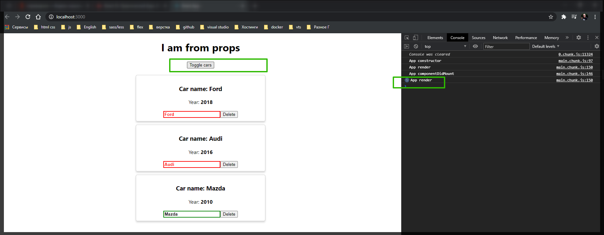

# Создание statefull компонента.

Для того что бы рассмотреть другие жизненные циклы которые есть в **react** давайте мы рассмотрим следующую задачу. Мы научимся превращать функциональные компоненты в обычные react компоненты.

Для этого у нас есть **Car** компонент, который обычный функциональный компонент. Он просто возвращает что-то в методе **render** и больше ничего не делает.

Как я говорил ранее жизненные циклы доступны только тем компонентам которые образованы и наследуются от базового класса. По-этому сначало научимся превращать данный функциональный компонент в обычный **react** компонент.

Пишу **class Car extends от react** компонента. Мы можем отдельно импортировать данный класс **import React, { Component } from 'react';** через деструктуризацию. Илиже мы можем напрямую обратится к переменной **React**. и указать класс **Component**. Это идентичыные записи.

```js
class Car extends React.Component {}
```

После чего должен быть определен метод **render(){}** и в него мы можем скопировать то что у нас есть в функциональном компоненте. И удаляе функцию которая до этого была. Помимо этого нужно сделать еще некоторые манипуляции.

Как я уже до этого говорил если мы образуем компонент через ключевое слово **class** нам так же доступны некоторые свойства, они доступны нам через ключевое слово **this**. Т.е. везде где мы используем **props** мы должны дописать ключевое слово **this**.

Так же обратите внимание что когда мы экспортируем класс мы оставляем все без изменений.

```jsx
//src/components.Car.js
import React from 'react';
import Radium from 'radium';
import './Car.scss';

class Car extends React.Component {
  render() {
    const inputClasses = ['input'];

    if (this.props.name !== '') {
      inputClasses.push('green');
    } else {
      inputClasses.push('red');
    }

    if (this.props.name.length > 4) {
      inputClasses.push('bold');
    } else {
      inputClasses.push('bold_red'); // это я уже добавляю свой класс он вообще else не использует
    }

    const style = {
      border: '1px solid #ccc',
      boxShadow: '0 4px 5px 0 rgba(0, 0, 0, 0.14)',
      ':hover': {
        border: '1ps solid #aaa',
        boxShadow: '0 4px 15px 0 rgba(0, 0, 0, .25) ',
        backgroundColor: 'LightSlateGray',
        cursor: 'pointer',
      },
    };

    return (
      <div className="Car" style={style}>
        <h3>Сar name: {this.props.name}</h3>
        <p>
          Year: <strong>{this.props.year}</strong>
        </p>
        <input
          type="text"
          onChange={this.props.onChangeName}
          value={this.props.name}
          className={inputClasses.join(' ')}
        />
        <button onClick={this.props.onDelete}>Delete</button>
      </div>
    );
  }
}

export default Radium(Car);
```



Когда я жму на кнопку открытия/ закрытия списка в консоли выводится счетчик этого действия. Это происходит потому что у нас изменяется некоторое состояние нашего компонента и по этому мы снова заходим в метод render для того что бы изменить структуру **JSX** которая у нас получилась.

Теперь у нас компонент **Car** наследуется от **React** компонента. Теперь в данном компоненте у нас доступен **local state** и так же нам доступны разные жизненные циклы которые нам доступны.

Один маленький момент.

Вся структура **React** сводится к тому что бы мы использовали как можно меньше таких вот классов и **react** компонентов потому что когда мы создаем компоненты наследуюясь от базового класса это требует больше ресурсов для того что бы обрабатывать данные компоненты. По-сути вся иерархия сводится к тому что бы у нас был один базовый класс и базовый компонент который наследуется от **React.Component**. А все что входит внутрь данного компонента, другие компоненты, они должны быть функциональными.
