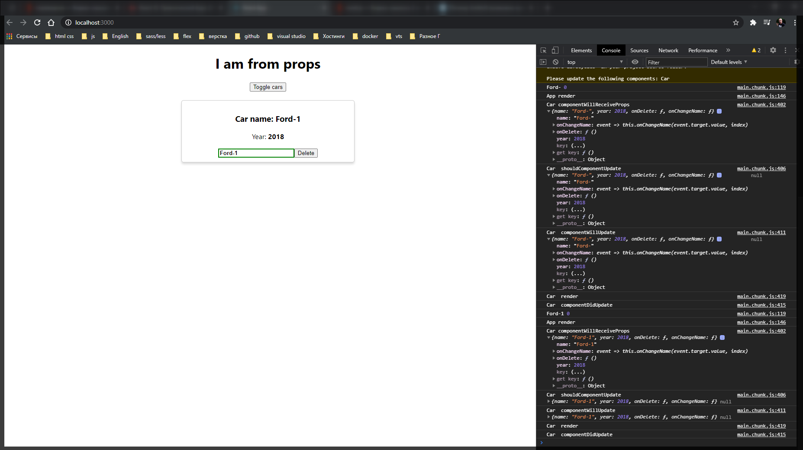
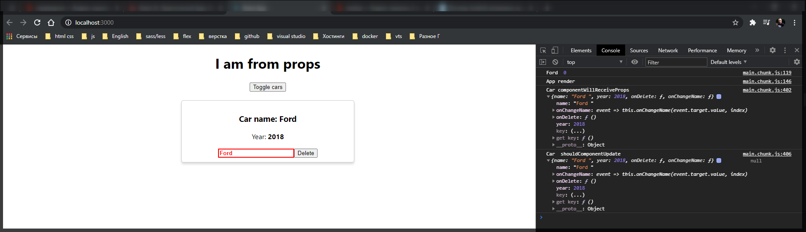

# Жизненный цикл изменения

Теперь когда мы с вами изменили компонент **Car** на компонент который у нас является **statefull** т.е. он у нас наследуется от базового компонента. Мы получили доступ к различным жизненным циклам которые у нас есть в **react**.

И теперь на примере данного компонента данного компонента давайте рассмотрим другие жизненные циклы которые мы еще не успели рассмотреть и которые относятся именно к изменению состояния компонента.

Давайте перейдем в компонент **Car** и опишем следующие методы.

1. Первый компонент который у нас есть называется **componentWillReceiveProps(){}** и данный метод принимает в себя некоторый параметр который называется **nextProps**
2. **shouldComponentUpdate(){}** - он является немного особенным и принимает в себя два параметра **nextProps** и **nextState**
3. **componentWillUpdate(){}** он так же принимает два параметра **nextProps** и **nextState**
4. **componentDidUpdate(){}** он ничего не принимает.

Впринципе по названию данных методов уже можно понять что они делают и в какой момент они вызываются. Вывожу в консоль данные методы и передаю пераметры с которыми они вызываются.

И еще один момент у нас есть специальный метод который называется **shouldComponentUpdate**, он едиственный метод среди жизненных циклов который должен что-то вернуть. И пока что пропешу **return true**.

```jsx
//src/components.Car.js
import React from 'react';
import Radium from 'radium';
import './Car.scss';

class Car extends React.Component {
  componentWillReceiveProps(nextProps) {
    console.log('Car componentWillReceiveProps', nextProps);
  }

  shouldComponentUpdate(nextProps, nextState) {
    console.log('Car  shouldComponentUpdate', nextProps, nextState);
    return true;
  }

  componentWillUpdate(nextProps, nextState) {
    console.log('Car  componentWillUpdate', nextProps, nextState);
  }

  componentDidUpdate() {
    console.log('Car  componentDidUpdate');
  }

  render() {
    console.log('Car  render');
    const inputClasses = ['input'];

    if (this.props.name !== '') {
      inputClasses.push('green');
    } else {
      inputClasses.push('red');
    }

    if (this.props.name.length > 4) {
      inputClasses.push('bold');
    } else {
      inputClasses.push('bold_red'); // это я уже добавляю свой класс он вообще else не использует
    }

    const style = {
      border: '1px solid #ccc',
      boxShadow: '0 4px 5px 0 rgba(0, 0, 0, 0.14)',
      ':hover': {
        border: '1ps solid #aaa',
        boxShadow: '0 4px 15px 0 rgba(0, 0, 0, .25) ',
        backgroundColor: 'LightSlateGray',
        cursor: 'pointer',
      },
    };

    return (
      <div className="Car" style={style}>
        <h3>Сar name: {this.props.name}</h3>
        <p>
          Year: <strong>{this.props.year}</strong>
        </p>
        <input
          type="text"
          onChange={this.props.onChangeName}
          value={this.props.name}
          className={inputClasses.join(' ')}
        />
        <button onClick={this.props.onDelete}>Delete</button>
      </div>
    );
  }
}

export default Radium(Car);
```

Теперь для того что бы более легко проверить эти методы и понять когда они работают сделаем еще два изменения. В самом низу в **export** удаляю **Radium** т.к. он пока будет мешать нам понять жизненные циклы из- за того что он тоже добавляет некоторый функционал.

```jsx
//src/components.Car.js
import React from 'react';
// import Radium from 'radium';
import './Car.scss';

class Car extends React.Component {
  componentWillReceiveProps(nextProps) {
    console.log('Car componentWillReceiveProps', nextProps);
  }

  shouldComponentUpdate(nextProps, nextState) {
    console.log('Car  shouldComponentUpdate', nextProps, nextState);
    return true;
  }

  componentWillUpdate(nextProps, nextState) {
    console.log('Car  componentWillUpdate', nextProps, nextState);
  }

  componentDidUpdate() {
    console.log('Car  componentDidUpdate');
  }

  render() {
    console.log('Car  render');
    const inputClasses = ['input'];

    if (this.props.name !== '') {
      inputClasses.push('green');
    } else {
      inputClasses.push('red');
    }

    if (this.props.name.length > 4) {
      inputClasses.push('bold');
    } else {
      inputClasses.push('bold_red'); // это я уже добавляю свой класс он вообще else не использует
    }

    const style = {
      border: '1px solid #ccc',
      boxShadow: '0 4px 5px 0 rgba(0, 0, 0, 0.14)',
      ':hover': {
        border: '1ps solid #aaa',
        boxShadow: '0 4px 15px 0 rgba(0, 0, 0, .25) ',
        backgroundColor: 'LightSlateGray',
        cursor: 'pointer',
      },
    };

    return (
      <div className="Car" style={style}>
        <h3>Сar name: {this.props.name}</h3>
        <p>
          Year: <strong>{this.props.year}</strong>
        </p>
        <input
          type="text"
          onChange={this.props.onChangeName}
          value={this.props.name}
          className={inputClasses.join(' ')}
        />
        <button onClick={this.props.onDelete}>Delete</button>
      </div>
    );
  }
}

export default Car;
```

А так же в **App.js** закоментирую две машины для того что бы было меньше ошибок при выводе.

```jsx
// src/App.js
import React, { Component } from 'react';
import './App.scss';
import Car from './components/Car/Car';

class App extends Component {
  constructor(props) {
    console.log('App constructor');
    super(props);
    this.state = {
      cars: [
        { name: 'Ford', year: 2018 },
        // { name: 'Audi', year: 2016 },
        // { name: 'Mazda', year: 2010 },
      ],
      pageTitle: 'React component',
      showCars: false,
    };
  }

  toggleCarsHandler = () => {
    this.setState({
      showCars: !this.state.showCars,
    });
  };

  onChangeName(name, index) {
    console.log(name, index);
    const car = this.state.cars[index];
    car.name = name;
    const cars = [...this.state.cars];
    cars[index] = car;
    this.setState({ cars });
  }

  deleteHandler(index) {
    const cars = this.state.cars.concat();
    cars.splice(index, 1);
    this.setState({ cars });
  }

  componentWillUnmount() {
    console.log('App componentWillUnmount');
  }

  componentDidMount() {
    console.log('App componentDidMount');
  }

  render() {
    console.log('App render');

    const divStyle = {
      textAlign: 'center',
    };

    let cars = null;

    if (this.state.showCars) {
      // переопределяю переменную на то что я пытаюсь вытащить в данном случае это генерация списка
      cars = this.state.cars.map((car, index) => {
        return (
          <Car
            key={index}
            name={car.name}
            year={car.year}
            onDelete={this.deleteHandler.bind(this, index)}
            onChangeName={(event) =>
              this.onChangeName(event.target.value, index)
            }
          />
        );
      });
    }

    return (
      <div style={divStyle}>
        {/* <h1>{this.state.pageTitle}</h1> */}
        <h1>{this.props.title}</h1>

        <button onClick={this.toggleCarsHandler}>Toggle cars</button>

        <div
          style={{
            width: 400,
            margin: 'auto',
            paddingTop: '20px',
          }}
        >
          {cars}
        </div>
      </div>
    );
  }
}

export default App;
```


И так у нас есть три лога которые относятся непосредственно к **App** компоненту. Мы видим жизненный цикл **App** компонента, но при этом мы не видим ни каких жизненных циклов **Car** компонента. Потому что пока что их нет в **DOM** дереве, они не отрисовываются.

Теперь включим наш компонент путем нажатия на кнопку **toggle cars**


И у нас появляется еще два лога. Первым выводится **App render**. Т.е. у нас что-то изменилось в состоянии нашего **app** компонента и по этому мы вызываем метод **render**. И потом у нас выводится **Car render**. т.е. мы рендерим содержимое компонента **Car**, но при этом все те методы которые мы описывали они пока не вызваны.

Как я уже говорил они относятся к **update** нашего компонента и поэтому мы их сейчас не видим. Давайте подумаем как мы их можем вызвать для того что бы посмотреть что они обозначают.

По сути мы должны что-то изменить в самом нашем компоненте. Мы это можем сделать путем написания что-либо в **input**.



И вот мы моментально получаем все эти **console.log** которые прописывали. давайте проанализируем и посмотрим в каком порядке они получаются.

Первый метод который был вызван называется **componentWillReceiveProps**. И внутри него мы принимаем некоторые параметры которые поступаю нам в компонент. Т.е. в данном методе мы можем делать следующее. По сути он предназначен для того что бы синхронизировать некий локальный **state** если он есть с входящими свойствами. Свойства пока мы не отрисовывали. Мы просто получаем доступ к ним. Мы можем посмотреть данные параметры


Здесь указывается новое имя которое мы вписали. И именно таким методом мы работаем с данным методом. Но опять же мы достаточно редко встретим его **componentWillReceiveProps** использование в рабочем коде.

Второй интересный метод **shouldComponentUpdate**. И про данный метод давайте поговорим более подробно. Здесь мы можем оптимизировать наше приложение. Это единственный метод который должен что-то вернуть true или **false**. И если мы возвращаем true то это означает что компонент должен изменится и мы должны его перерисовать. Но если мы сделаем какую-то проверку и вернем значение **false**, то это будет обозначать что данный компонент нам не нужно перерисовывать т.е. нам не нужно тратить силы на достаточно затратную операцию перерисовки данных и мы можем таким образом оптимизировать наше приложение. Сейчас мы рассмотрим это на примере но пока давайте перейдем к следующему жизненному циклу.

**componentWillUpdate** по сути идентичный метод который вызывается после **shouldComponentUpdate**. Он идентичен первому методу **componentWillReceiveProps**. Здесь мы получаем те же самые параметры которые приходят нам в компонент, но здесь мы уже знаем что наш компонент будет изменен и по этому мы просто готовимся к его изменению.


Здесь мы так же можем синхронизировать например локальный **state** если он есть с параметрами которые у нас будут входить и т.д.

После чего у нас вызывается **Car render**


т.е. у нас идет прямая аналогия с **App render**. Т.е. вначале у нас идет подготовка к изменению нашего компонента. Потом идет непосредственно само изменение и после чего нам выдается сообщение о том что у нас компонент изменился и мы можем дальше с ним работать.


Возвращаюсь к методу **shouldComponentUpdate** и посмотрим как мы можем оптимизировать наше приложение. И для этого я сделаю следующую проверку. Мы знаем что в параметре **nextProps** мы принимаем следующие параметры которые поступят нам в компонент. И давайте проверим следующее. Допустим мы хотим знать что в **nextProps.name** у нас будет находится то состояние что и сейчас т.е. **return nextProps.name !== this.props.name;** то тогда мы не хотим изменять наш компонент.

Но здесь есть момент. Оно не может быть равно старому имени так как мы все время меняем его в **input** и оно в любом случае будет другое. Но допустим давайте сделаем проверку что допустим мы в **input** ввели пробел т.е. мы не хотим учитывать пробелы, то тогда мы не будем перерисовывать наш компонент. Поэтому у каждого name мы можем вызвать метод **trim()** для того что бы удалить пробелы **return nextProps.name.trim() !== this.props.name.trim();** и таким образом мы оптимизируем наше приложение.

```jsx
//src/components.Car.js
import React from 'react';
// import Radium from 'radium';
import './Car.scss';

class Car extends React.Component {
  componentWillReceiveProps(nextProps) {
    console.log('Car componentWillReceiveProps', nextProps);
  }

  shouldComponentUpdate(nextProps, nextState) {
    console.log('Car  shouldComponentUpdate', nextProps, nextState);
    return nextProps.name.trim() !== this.props.name.trim();
  }

  componentWillUpdate(nextProps, nextState) {
    console.log('Car  componentWillUpdate', nextProps, nextState);
  }

  componentDidUpdate() {
    console.log('Car  componentDidUpdate');
  }

  render() {
    console.log('Car  render');
    const inputClasses = ['input'];

    if (this.props.name !== '') {
      inputClasses.push('green');
    } else {
      inputClasses.push('red');
    }

    if (this.props.name.length > 4) {
      inputClasses.push('bold');
    } else {
      inputClasses.push('bold_red'); // это я уже добавляю свой класс он вообще else не использует
    }

    const style = {
      border: '1px solid #ccc',
      boxShadow: '0 4px 5px 0 rgba(0, 0, 0, 0.14)',
      ':hover': {
        border: '1ps solid #aaa',
        boxShadow: '0 4px 15px 0 rgba(0, 0, 0, .25) ',
        backgroundColor: 'LightSlateGray',
        cursor: 'pointer',
      },
    };

    return (
      <div className="Car" style={style}>
        <h3>Сar name: {this.props.name}</h3>
        <p>
          Year: <strong>{this.props.year}</strong>
        </p>
        <input
          type="text"
          onChange={this.props.onChangeName}
          value={this.props.name}
          className={inputClasses.join(' ')}
        />
        <button onClick={this.props.onDelete}>Delete</button>
      </div>
    );
  }
}

export default Car;
```


При вводе побела вызывается **App render** потому что мы что-то изменили в **input**. Потом вызывается метод **Car componentWillReceiveProps** т.е. мы что-то изменили в **input**. Далее смотрим что имя осталось тем же но появился дополнительный пробел.


И далее в методе **shouldComponentUpdate** мы проверяем нужно ли нам перерисовывать данный компонент. После проверки он убеждается что отрисовывать не нужно. Останавливается. И по этому в консоли мы не видим вывод дальнейших жизненных циклов.


