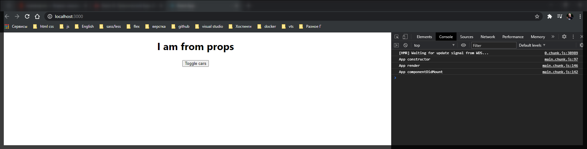
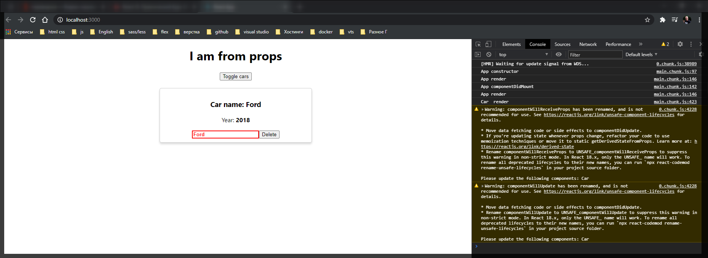
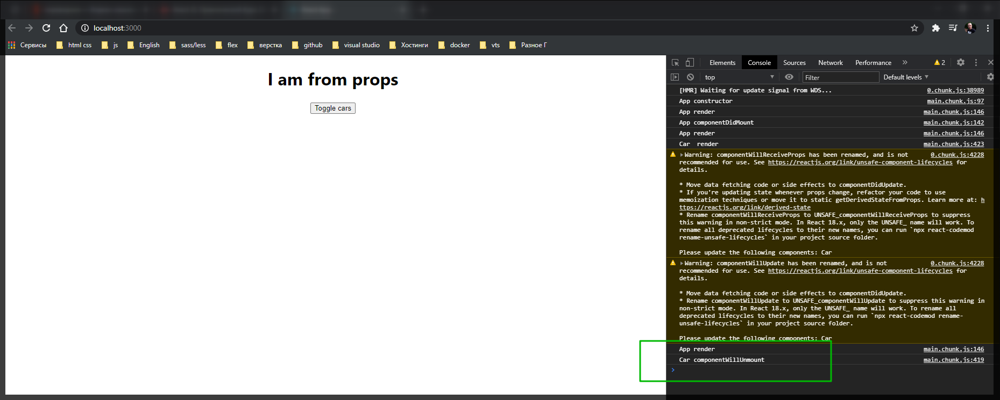

# Жизненный цикл

Нам осталось рассмотреть последний базовый жизненный цикл компонента который есть в **React**.

**componentWillUnmount(){}**

```jsx
//src/components.Car.js
import React from 'react';
// import Radium from 'radium';
import './Car.scss';

class Car extends React.Component {
  componentWillReceiveProps(nextProps) {
    console.log('Car componentWillReceiveProps', nextProps);
  }

  shouldComponentUpdate(nextProps, nextState) {
    console.log('Car  shouldComponentUpdate', nextProps, nextState);
    return nextProps.name.trim() !== this.props.name.trim();
  }

  componentWillUpdate(nextProps, nextState) {
    console.log('Car  componentWillUpdate', nextProps, nextState);
  }

  componentDidUpdate() {
    console.log('Car  componentDidUpdate');
  }

  componentWillUnmount() {
    console.log('Car componentWillUnmount');
  }

  render() {
    console.log('Car  render');
    const inputClasses = ['input'];

    if (this.props.name !== '') {
      inputClasses.push('green');
    } else {
      inputClasses.push('red');
    }

    if (this.props.name.length > 4) {
      inputClasses.push('bold');
    } else {
      inputClasses.push('bold_red'); // это я уже добавляю свой класс он вообще else не использует
    }

    const style = {
      border: '1px solid #ccc',
      boxShadow: '0 4px 5px 0 rgba(0, 0, 0, 0.14)',
      ':hover': {
        border: '1ps solid #aaa',
        boxShadow: '0 4px 15px 0 rgba(0, 0, 0, .25) ',
        backgroundColor: 'LightSlateGray',
        cursor: 'pointer',
      },
    };

    return (
      <div className="Car" style={style}>
        <h3>Сar name: {this.props.name}</h3>
        <p>
          Year: <strong>{this.props.year}</strong>
        </p>
        <input
          type="text"
          onChange={this.props.onChangeName}
          value={this.props.name}
          className={inputClasses.join(' ')}
        />
        <button onClick={this.props.onDelete}>Delete</button>
      </div>
    );
  }
}

export default Car;
```

Данный метод вызывается тогда когда разрушается компонент и он удаляется из **DOM** дерева. При загрузке мы его не видим.



При просмотре машины мы все также не видим этот жизненный цикл.



Вызвать метод жизненного цикла можно нажав на кнопку **delete** или на **toggle cars** которые удаляют элемент из DOM дерева.



И как видите у нас сначало происходит метод **render** и после этого у нас вызывается удалениенашего компонента т.е. в данном жизненном цикле мы можем очищать различные таймеры, удалять различные подписки и делать различные вещи которые позволяют очистить память при удалении компонента.
