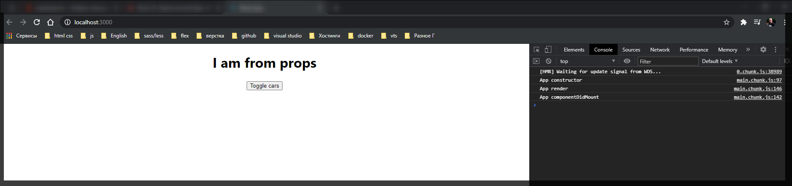
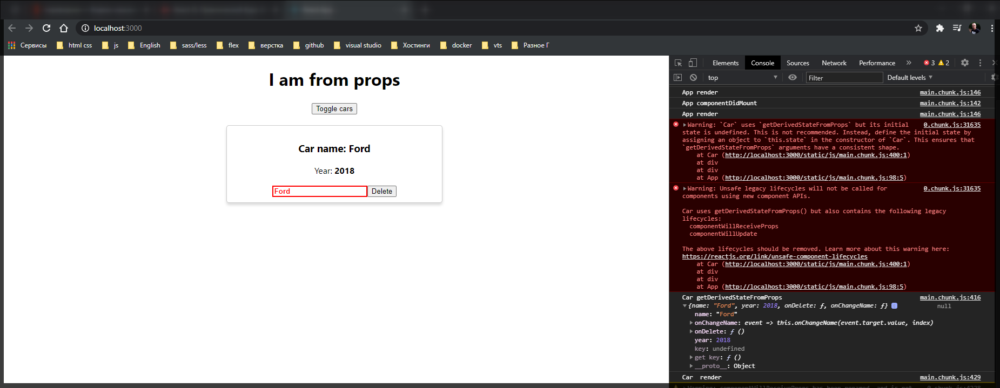
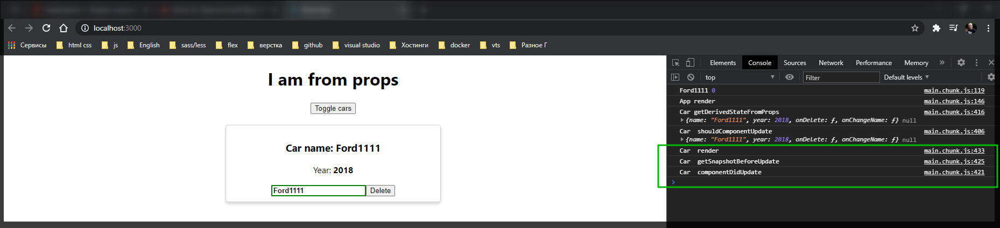

# Жизненные циклы React 16.3+

В **React 16.3+** появилось много много нововведений которые мы уже можем использовать. И давайте рассмотрим на примере жизненных циклов которые так же появились у нас в **React**.

Рассмотрим из **Car** компонента жизненный цикл **componentWillUpdate**. Он отвечает у нас за получение каких-то новых параметров. И здесь мы можем уже обновлять **state** т.е. в его параметрах мы получаем **nextProps**, **nextState** это неготорый параметр и следующий **state**. Мы можем **state** здесь синхронизировать и после этого компонент будет обновляться.

Теперь для тоо что бы немного обезопасить работу в **react** у нас появился новый жизненный цикл который делает тоже самое.

Почему я говорю что он обеспечивает более лучшую безопасность. Потому что в подобном методе **componentWillUpdate** и в **componentWillReceiveProps** мы можем обращаться к ключевому слову **this** и например вызывать метод **setState()**

```js
componentWillUpdate(nextProps, nextState) {
   this.setState()
  console.log('Car  componentWillUpdate', nextProps, nextState);
}
```

Хотя на данный момент вызова **setState()** компонент еще не отрисован и по этому это может вызывать некоторые проблемы.

Для этого был введен новый жизненный цикл который делает тоже самое что и **componentWillUpdate**, но при этом он запрещает преобразование **state** напрямую и при этом он позволяет это делать немного по другому.

Вначале мы должны завести статический метод который называется **getDirivedStateFromProps(){}**. Обязательно метод должен быть с ключевым словом **static**. Данный метод принимает в себя два параметра **nextProps** и **prevState**.

```js
static getDerivedStateFromProps(nextProps, prevState) {
    console.log('Car getDerivedStateFromProps', nextProps, prevState);
  }
```

И здесь есть важный момент как мы преобразуем наш **state** и синхронизируем его свойство если это нужно делать. Учитывая что данный метод **static** мы не имеем доступ к ключевому слову **this** в данном методе.

Для этого мы должны вернуть объект из данного метода который будет являться по сути результирующим **state** нашего компонента. Т.е. мы возвращаем обхект который в последствии будет **merge** слит с основным **state**. Или же мы можем вернуть **prevState**, или просто обновленный объект какой-то, и все будет работать как и прежде.

```js
static getDerivedStateFromProps(nextProps, prevState) {
    console.log('Car getDerivedStateFromProps', nextProps, prevState);
    return prevState;
  }
```

Пока оставляю так. Пока все выглядит так что наш state пока обновляться не будет, но тем не менее мы его сохраним.

```jsx
//src/components.Car.js
import React from 'react';
// import Radium from 'radium';
import './Car.scss';

class Car extends React.Component {
  componentWillReceiveProps(nextProps) {
    console.log('Car componentWillReceiveProps', nextProps);
  }

  shouldComponentUpdate(nextProps, nextState) {
    console.log('Car  shouldComponentUpdate', nextProps, nextState);
    return nextProps.name.trim() !== this.props.name.trim();
  }

  componentWillUpdate(nextProps, nextState) {
    this.setState();
    console.log('Car  componentWillUpdate', nextProps, nextState);
  }

  static getDerivedStateFromProps(nextProps, prevState) {
    console.log('Car getDerivedStateFromProps', nextProps, prevState);
    return prevState;
  }

  componentDidUpdate() {
    console.log('Car  componentDidUpdate');
  }

  componentWillUnmount() {
    console.log('Car componentWillUnmount');
  }

  render() {
    console.log('Car  render');
    const inputClasses = ['input'];

    if (this.props.name !== '') {
      inputClasses.push('green');
    } else {
      inputClasses.push('red');
    }

    if (this.props.name.length > 4) {
      inputClasses.push('bold');
    } else {
      inputClasses.push('bold_red'); // это я уже добавляю свой класс он вообще else не использует
    }

    const style = {
      border: '1px solid #ccc',
      boxShadow: '0 4px 5px 0 rgba(0, 0, 0, 0.14)',
      ':hover': {
        border: '1ps solid #aaa',
        boxShadow: '0 4px 15px 0 rgba(0, 0, 0, .25) ',
        backgroundColor: 'LightSlateGray',
        cursor: 'pointer',
      },
    };

    return (
      <div className="Car" style={style}>
        <h3>Сar name: {this.props.name}</h3>
        <p>
          Year: <strong>{this.props.year}</strong>
        </p>
        <input
          type="text"
          onChange={this.props.onChangeName}
          value={this.props.name}
          className={inputClasses.join(' ')}
        />
        <button onClick={this.props.onDelete}>Delete</button>
      </div>
    );
  }
}

export default Car;
```





И мы получаем **console.log** метода. Мы получаем две ошибки.Здесь написано что использование старых методов **componentWillReceiveProps**, **componentWillUpdate** при наличии метода **getDerivedStateFromProps** является не безопасным. Старые методы должны быть удалены.

И теперь давайте разберем еще один метод который появился так же в **React**. Данный метод называется **getSnapshotBeforeUpdate(){}**. данный метод ничего в себя не принимает.

```js
getSnapshotBeforeUpdate() {
    console.log('Car  getSnapshotBeforeUpdate');
  }
```

Весь файл

```jsx
//src/components.Car.js
import React from 'react';
// import Radium from 'radium';
import './Car.scss';

class Car extends React.Component {
  componentWillReceiveProps(nextProps) {
    console.log('Car componentWillReceiveProps', nextProps);
  }

  shouldComponentUpdate(nextProps, nextState) {
    console.log('Car  shouldComponentUpdate', nextProps, nextState);
    return nextProps.name.trim() !== this.props.name.trim();
  }

  componentWillUpdate(nextProps, nextState) {
    this.setState();
    console.log('Car  componentWillUpdate', nextProps, nextState);
  }

  static getDerivedStateFromProps(nextProps, prevState) {
    console.log('Car getDerivedStateFromProps', nextProps, prevState);
    return prevState;
  }

  componentDidUpdate() {
    console.log('Car  componentDidUpdate');
  }

  getSnapshotBeforeUpdate() {
    console.log('Car  getSnapshotBeforeUpdate');
  }

  componentWillUnmount() {
    console.log('Car componentWillUnmount');
  }

  render() {
    console.log('Car  render');
    const inputClasses = ['input'];

    if (this.props.name !== '') {
      inputClasses.push('green');
    } else {
      inputClasses.push('red');
    }

    if (this.props.name.length > 4) {
      inputClasses.push('bold');
    } else {
      inputClasses.push('bold_red'); // это я уже добавляю свой класс он вообще else не использует
    }

    const style = {
      border: '1px solid #ccc',
      boxShadow: '0 4px 5px 0 rgba(0, 0, 0, 0.14)',
      ':hover': {
        border: '1ps solid #aaa',
        boxShadow: '0 4px 15px 0 rgba(0, 0, 0, .25) ',
        backgroundColor: 'LightSlateGray',
        cursor: 'pointer',
      },
    };

    return (
      <div className="Car" style={style}>
        <h3>Сar name: {this.props.name}</h3>
        <p>
          Year: <strong>{this.props.year}</strong>
        </p>
        <input
          type="text"
          onChange={this.props.onChangeName}
          value={this.props.name}
          className={inputClasses.join(' ')}
        />
        <button onClick={this.props.onDelete}>Delete</button>
      </div>
    );
  }
}

export default Car;
```

И теперь пробую что-то изменить в форме. Ввожу какое либо значение.



Данный метод вызывается сразу после render страницы, но перед тем как компонент обновится. За что отвечает данный метод? По-сути если почитать официальную документацию то в ней сказано что данный метод позволяет получить еще не измененное **DOM** дерево до обновления. Как видите данный метод **getSnapshotBeforeUpdate** вызывается после метода **render**. И при этом мы в нем можем получить ту картину которая была еще до обновления **DOM** дерева.

Например зачем это может быть нужно? Например мы можем сохранить позицию **scrole** человека. После этого приложение обновляется и мы можем каким-нибудь образом использовать данную позицию. Мы можем в данном методе лелать что угодно. Главное понимать что здесь мы получаем доступ к тому **DOM** дереву еще до обновления **state**, но вызывается оно как раз в момент обновления **DOM**.
