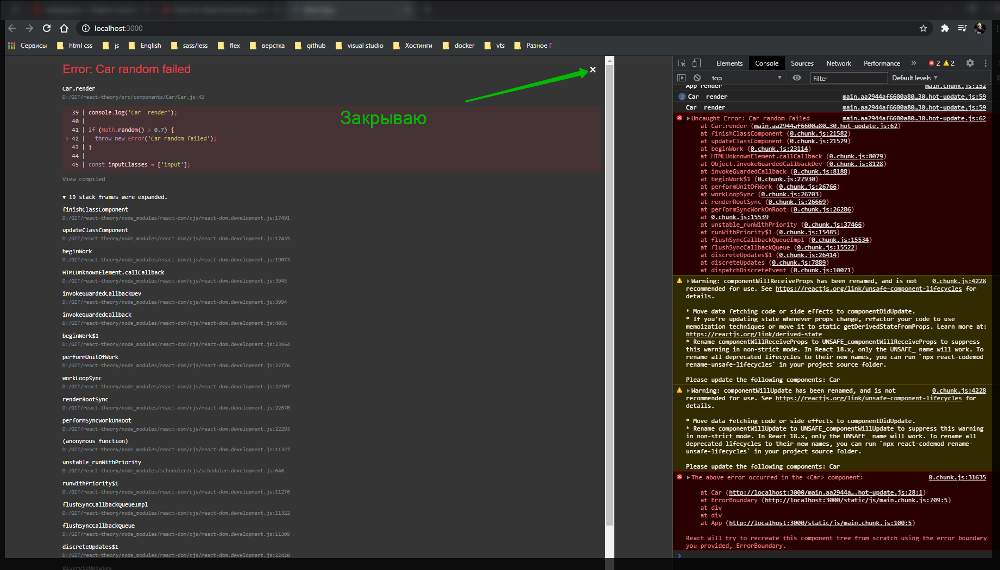

# ErrorBoundry

Его так же можно отнести к жизненному циклу. Он служит для того что бы мы более удобно обрабатывали ошибки которые у нас появляются в процессе написания нашего кода и функционирования нашего приложения.

Для этого нам придеться создать новый компонент и на его примере посмотреть. Для этого создаю новый компонент **ErrorBoundary**.

```jsx
// src/components/ErrorBoundary/ErrorBoundary/js
import React from 'react';

export default class ErrorBoundary extends React.Component {}
```

У данного класса должен быть какой-то локальный state где мы будем хранить информацию об ошибке. **state = {}** например в поле **hasError = false**.

```jsx
// src/components/ErrorBoundary/ErrorBoundary/js
import React from 'react';

export default class ErrorBoundary extends React.Component {

  state = {
    hasError = false,
  }
}

```

Теперь в данном компоненте нам необходимо реализовать специальный метод который называется **componentDidCatch(){}**. Данный метод принимает два параметра **componentDidCatch(error, info){}**.

Данный метод будет вызван в том случае если данный компонент поймет что его дети словили некоторый **exception(исключение)**. И поэтому как раз таки служит данный компонент т.е. он оборачивает другие компоненты в себя и ловит какие-то ошибки и красиво их выводит.

Если мы получаем какую-то ошибку. Мы обращаемся к локальному **state** c помощью метода **this.setState()**. в нем указываем объект и говорим о том что **hasError: true**.

```js
// src/components/ErrorBoundary/ErrorBoundary/js
import React from 'react';

export default class ErrorBoundary extends React.Component {
  state = {
    hasError: false,
  };

  componentDidCatch(error, info) {
    this.setState({ hasError: true });
  }
}
```

Теперь реализую метод **render**. И здесь давайте проверять. Если у нас в **state** храниться значение **hasError** то тогда мы возвращаем сообщение об ошибке. А если ошибки нет возвращаем значение ребенка **return this.props.children;**.

```jsx
// src/components/ErrorBoundary/ErrorBoundary/js
import React from 'react';

export default class ErrorBoundary extends React.Component {
  state = {
    hasError: false,
  };

  componentDidCatch(error, info) {
    this.setState({ hasError: true });
  }

  render() {
    if (this.state.hasError) {
      return <h1 style={{ color: 'red' }}>Something went wrong</h1>;
    } else {
      return this.props.children;
    }
  }
}
```

Теперь для того что бы применить данный компонент перехожу в **App.js**. Импортирую **ErrorBoundary**. Плсе чего в возвращаемом **JSX** обращаюсь к массиву который формирует список наших машин и каждую машину обернуть в компонент **ErrorBoundary**. После оборачивания из компонента **Car** вырезаю атрибут **key={index}** и вставляю его в **ErrorBoundary** потому что он является корневым в данном случае и именно он должен в себе содержать атрибут **key={index}**.


Хоть ошибки и вываливаются с других жизненных циклов, но по крайней мере все работает.

Коментирую их.

```js
//src/components.Car.js
import React from 'react';
// import Radium from 'radium';
import './Car.scss';

class Car extends React.Component {
  componentWillReceiveProps(nextProps) {
    console.log('Car componentWillReceiveProps', nextProps);
  }

  shouldComponentUpdate(nextProps, nextState) {
    console.log('Car  shouldComponentUpdate', nextProps, nextState);
    return nextProps.name.trim() !== this.props.name.trim();
  }

  componentWillUpdate(nextProps, nextState) {
    this.setState();
    console.log('Car  componentWillUpdate', nextProps, nextState);
  }

  // static getDerivedStateFromProps(nextProps, prevState) {
  //   console.log('Car getDerivedStateFromProps', nextProps, prevState);
  //   return prevState;
  // }

  componentDidUpdate() {
    console.log('Car  componentDidUpdate');
  }

  // getSnapshotBeforeUpdate() {
  //   console.log('Car  getSnapshotBeforeUpdate');
  // }

  componentWillUnmount() {
    console.log('Car componentWillUnmount');
  }

  render() {
    console.log('Car  render');
    const inputClasses = ['input'];

    if (this.props.name !== '') {
      inputClasses.push('green');
    } else {
      inputClasses.push('red');
    }

    if (this.props.name.length > 4) {
      inputClasses.push('bold');
    } else {
      inputClasses.push('bold_red'); // это я уже добавляю свой класс он вообще else не использует
    }

    const style = {
      border: '1px solid #ccc',
      boxShadow: '0 4px 5px 0 rgba(0, 0, 0, 0.14)',
      ':hover': {
        border: '1ps solid #aaa',
        boxShadow: '0 4px 15px 0 rgba(0, 0, 0, .25) ',
        backgroundColor: 'LightSlateGray',
        cursor: 'pointer',
      },
    };

    return (
      <div className="Car" style={style}>
        <h3>Сar name: {this.props.name}</h3>
        <p>
          Year: <strong>{this.props.year}</strong>
        </p>
        <input
          type="text"
          onChange={this.props.onChangeName}
          value={this.props.name}
          className={inputClasses.join(' ')}
        />
        <button onClick={this.props.onDelete}>Delete</button>
      </div>
    );
  }
}

export default Car;
```

Для того что бы проверить работает ли **ErrorBoundary** в компоненте **Car** в **render** съэмулируем ошибку.

```js
if (Math.random() > 0.7) {
  throw new Error('Car random failed');
}
```

Весь файл

```jsx
//src/components.Car.js
import React from 'react';
// import Radium from 'radium';
import './Car.scss';

class Car extends React.Component {
  componentWillReceiveProps(nextProps) {
    console.log('Car componentWillReceiveProps', nextProps);
  }

  shouldComponentUpdate(nextProps, nextState) {
    console.log('Car  shouldComponentUpdate', nextProps, nextState);
    return nextProps.name.trim() !== this.props.name.trim();
  }

  componentWillUpdate(nextProps, nextState) {
    this.setState();
    console.log('Car  componentWillUpdate', nextProps, nextState);
  }

  // static getDerivedStateFromProps(nextProps, prevState) {
  //   console.log('Car getDerivedStateFromProps', nextProps, prevState);
  //   return prevState;
  // }

  componentDidUpdate() {
    console.log('Car  componentDidUpdate');
  }

  // getSnapshotBeforeUpdate() {
  //   console.log('Car  getSnapshotBeforeUpdate');
  // }

  componentWillUnmount() {
    console.log('Car componentWillUnmount');
  }

  render() {
    console.log('Car  render');

    if (Math.random() > 0.7) {
      throw new Error('Car random failed');
    }

    const inputClasses = ['input'];

    if (this.props.name !== '') {
      inputClasses.push('green');
    } else {
      inputClasses.push('red');
    }

    if (this.props.name.length > 4) {
      inputClasses.push('bold');
    } else {
      inputClasses.push('bold_red'); // это я уже добавляю свой класс он вообще else не использует
    }

    const style = {
      border: '1px solid #ccc',
      boxShadow: '0 4px 5px 0 rgba(0, 0, 0, 0.14)',
      ':hover': {
        border: '1ps solid #aaa',
        boxShadow: '0 4px 15px 0 rgba(0, 0, 0, .25) ',
        backgroundColor: 'LightSlateGray',
        cursor: 'pointer',
      },
    };

    return (
      <div className="Car" style={style}>
        <h3>Сar name: {this.props.name}</h3>
        <p>
          Year: <strong>{this.props.year}</strong>
        </p>
        <input
          type="text"
          onChange={this.props.onChangeName}
          value={this.props.name}
          className={inputClasses.join(' ')}
        />
        <button onClick={this.props.onDelete}>Delete</button>
      </div>
    );
  }
}

export default Car;
```





И вот мы видим собственно результат работы нашего **ErrorBoundary**.

В чем заключается суть? Вместо того что бы сейчас вывести три элемента машины мы красиво визуально отображаем ошибки а не ломаем все приложение.

**ErrorBoundary** является **hoc** т.е. компонентом высшего порядка потому что мы в него оборачиваем другие компоненты. И с помощью его специального метода **componentDidCatch** он может ловить ошибки и как-то по умному их обрабатывать.

[https://reactjs.org/docs/error-boundaries.html](https://reactjs.org/docs/error-boundaries.html)
