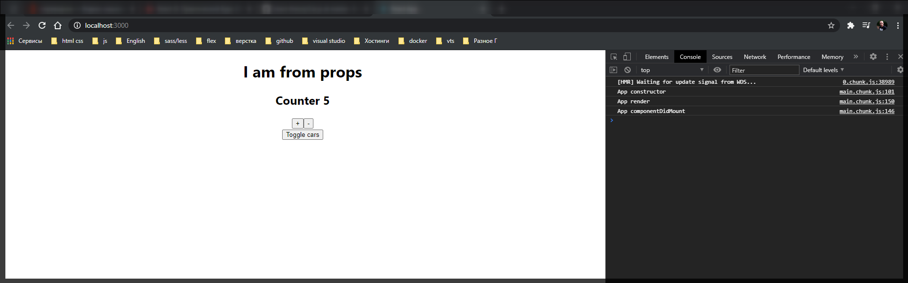
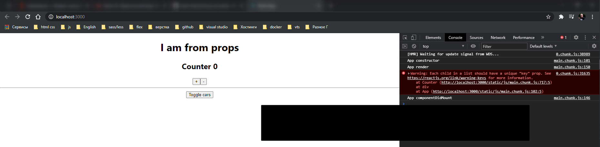

# Фрагмент часть 1

Внесем некоторые изменения в проект и создам новый компонент.

В **Car.js** удаляю генерацию рандомной ошибки.

```jsx
//src/components.Car.js
import React from 'react';
// import Radium from 'radium';
import './Car.scss';

class Car extends React.Component {
  componentWillReceiveProps(nextProps) {
    console.log('Car componentWillReceiveProps', nextProps);
  }

  shouldComponentUpdate(nextProps, nextState) {
    console.log('Car  shouldComponentUpdate', nextProps, nextState);
    return nextProps.name.trim() !== this.props.name.trim();
  }

  componentWillUpdate(nextProps, nextState) {
    this.setState();
    console.log('Car  componentWillUpdate', nextProps, nextState);
  }

  // static getDerivedStateFromProps(nextProps, prevState) {
  //   console.log('Car getDerivedStateFromProps', nextProps, prevState);
  //   return prevState;
  // }

  componentDidUpdate() {
    console.log('Car  componentDidUpdate');
  }

  // getSnapshotBeforeUpdate() {
  //   console.log('Car  getSnapshotBeforeUpdate');
  // }

  componentWillUnmount() {
    console.log('Car componentWillUnmount');
  }

  render() {
    console.log('Car  render');

    // if (Math.random() > 0.7) {
    //   throw new Error('Car random failed');
    // }

    const inputClasses = ['input'];

    if (this.props.name !== '') {
      inputClasses.push('green');
    } else {
      inputClasses.push('red');
    }

    if (this.props.name.length > 4) {
      inputClasses.push('bold');
    } else {
      inputClasses.push('bold_red'); // это я уже добавляю свой класс он вообще else не использует
    }

    const style = {
      border: '1px solid #ccc',
      boxShadow: '0 4px 5px 0 rgba(0, 0, 0, 0.14)',
      ':hover': {
        border: '1ps solid #aaa',
        boxShadow: '0 4px 15px 0 rgba(0, 0, 0, .25) ',
        backgroundColor: 'LightSlateGray',
        cursor: 'pointer',
      },
    };

    return (
      <div className="Car" style={style}>
        <h3>Сar name: {this.props.name}</h3>
        <p>
          Year: <strong>{this.props.year}</strong>
        </p>
        <input
          type="text"
          onChange={this.props.onChangeName}
          value={this.props.name}
          className={inputClasses.join(' ')}
        />
        <button onClick={this.props.onDelete}>Delete</button>
      </div>
    );
  }
}

export default Car;
```

Так же перехожу в компонент **App.js** и там просто коментирую две машины для того что бы было меньше логов.

```js
// src/App.js
import React, { Component } from 'react';
import './App.scss';
import Car from './components/Car/Car';
import ErrorBoundary from './components/ErrorBoundary/ErrorBoundary';

class App extends Component {
  constructor(props) {
    console.log('App constructor');
    super(props);
    this.state = {
      cars: [
        { name: 'Ford', year: 2018 },
        // { name: 'Audi', year: 2016 },
        // { name: 'Mazda', year: 2010 },
      ],
      pageTitle: 'React component',
      showCars: false,
    };
  }

  toggleCarsHandler = () => {
    this.setState({
      showCars: !this.state.showCars,
    });
  };

  onChangeName(name, index) {
    console.log(name, index);
    const car = this.state.cars[index];
    car.name = name;
    const cars = [...this.state.cars];
    cars[index] = car;
    this.setState({ cars });
  }

  deleteHandler(index) {
    const cars = this.state.cars.concat();
    cars.splice(index, 1);
    this.setState({ cars });
  }

  componentWillUnmount() {
    console.log('App componentWillUnmount');
  }

  componentDidMount() {
    console.log('App componentDidMount');
  }

  render() {
    console.log('App render');

    const divStyle = {
      textAlign: 'center',
    };

    let cars = null;

    if (this.state.showCars) {
      // переопределяю переменную на то что я пытаюсь вытащить в данном случае это генерация списка
      cars = this.state.cars.map((car, index) => {
        return (
          <ErrorBoundary key={index}>
            <Car
              name={car.name}
              year={car.year}
              onDelete={this.deleteHandler.bind(this, index)}
              onChangeName={(event) =>
                this.onChangeName(event.target.value, index)
              }
            />
          </ErrorBoundary>
        );
      });
    }

    return (
      <div style={divStyle}>
        {/* <h1>{this.state.pageTitle}</h1> */}
        <h1>{this.props.title}</h1>

        <button onClick={this.toggleCarsHandler}>Toggle cars</button>

        <div
          style={{
            width: 400,
            margin: 'auto',
            paddingTop: '20px',
          }}
        >
          {cars}
        </div>
      </div>
    );
  }
}

export default App;
```

Далее создаю новый компонент **Counter**.

```jsx
import React, { Component } from 'react';

export default class Counter extends Component {
  state = {
    counter: 0,
  };

  render() {
    return (
      <div>
        <h2>Counter {this.state.counter} </h2>
        <button>+</button>
        <button>-</button>
      </div>
    );
  }
}
```

Вывожу счетчик у которог две кнопки. Локальный **state** должен быть у любоко компонента.

Далее я оживляю кнопки. Для этого я реализую два метода. первый **addCounter** создаю как стрелочную функцию что бы не потерять контекст. И в теле функции увеличиваю предыдущее состояние на еденицу. И не забываю вешать событие на кнопку.

```jsx
import React, { Component } from 'react';

export default class Counter extends Component {
  state = {
    counter: 0,
  };

  addCounter = () => {
    this.setState({
      counter: this.state.counter + 1,
    });
  };

  render() {
    return (
      <div>
        <h2>Counter {this.state.counter} </h2>
        <button onClick={this.addCounter}>+</button>
        <button>-</button>
      </div>
    );
  }
}
```

И для кнопки минус сделаю подругому для наглядности.

```jsx
import React, { Component } from 'react';

export default class Counter extends Component {
  state = {
    counter: 0,
  };

  addCounter = () => {
    this.setState({
      counter: this.state.counter + 1,
    });
  };

  render() {
    return (
      <div>
        <h2>Counter {this.state.counter} </h2>
        <button onClick={this.addCounter}>+</button>
        <button
          onClick={() => this.setState({ counter: this.state.counter - 1 })}
        >
          -
        </button>
      </div>
    );
  }
}
```

Использование **setState** так же возможно в **JSX** в этом нет ничего противтестетственного.

Теперь перехожу в **App.js** импортирую **Counter** и вывожу данный компонент.

```jsx
// src/App.js
import React, { Component } from 'react';
import './App.scss';
import Car from './components/Car/Car';
import ErrorBoundary from './components/ErrorBoundary/ErrorBoundary';
import Counter from './components/Counter/Counter';

class App extends Component {
  constructor(props) {
    console.log('App constructor');
    super(props);
    this.state = {
      cars: [
        { name: 'Ford', year: 2018 },
        // { name: 'Audi', year: 2016 },
        // { name: 'Mazda', year: 2010 },
      ],
      pageTitle: 'React component',
      showCars: false,
    };
  }

  toggleCarsHandler = () => {
    this.setState({
      showCars: !this.state.showCars,
    });
  };

  onChangeName(name, index) {
    console.log(name, index);
    const car = this.state.cars[index];
    car.name = name;
    const cars = [...this.state.cars];
    cars[index] = car;
    this.setState({ cars });
  }

  deleteHandler(index) {
    const cars = this.state.cars.concat();
    cars.splice(index, 1);
    this.setState({ cars });
  }

  componentWillUnmount() {
    console.log('App componentWillUnmount');
  }

  componentDidMount() {
    console.log('App componentDidMount');
  }

  render() {
    console.log('App render');

    const divStyle = {
      textAlign: 'center',
    };

    let cars = null;

    if (this.state.showCars) {
      // переопределяю переменную на то что я пытаюсь вытащить в данном случае это генерация списка
      cars = this.state.cars.map((car, index) => {
        return (
          <ErrorBoundary key={index}>
            <Car
              name={car.name}
              year={car.year}
              onDelete={this.deleteHandler.bind(this, index)}
              onChangeName={(event) =>
                this.onChangeName(event.target.value, index)
              }
            />
          </ErrorBoundary>
        );
      });
    }

    return (
      <div style={divStyle}>
        {/* <h1>{this.state.pageTitle}</h1> */}

        <h1>{this.props.title}</h1>

        <Counter />

        <button onClick={this.toggleCarsHandler}>Toggle cars</button>

        <div
          style={{
            width: 400,
            margin: 'auto',
            paddingTop: '20px',
          }}
        >
          {cars}
        </div>
      </div>
    );
  }
}

export default App;
```



Все работает.
Теперь после реализации компонента мы можем поговорить о том что он из себя представляет и что мы в нем можем улучшить.

В **JSX** есть некоторые ограничения например то что всегда должен быть какой-то корневой элемент когда мы что-то возвращаем из компонента.

Но на самом деле с появлением 16 React этого можно избежать и просто возвращать просто набор элементов без корневого тега. Но просто удалив **div** этого сделать не получится.

Рассмотрим два спослба для того что бы избавится от **div**. Иногда **div** бываю лишними.

Мы можем это все возвращать в качестве массива.

```jsx
import React, { Component } from 'react';

export default class Counter extends Component {
  state = {
    counter: 0,
  };

  addCounter = () => {
    this.setState({
      counter: this.state.counter + 1,
    });
  };

  render() {
    //   return (
    //     <div>
    //       <h2>Counter {this.state.counter} </h2>
    //       <button onClick={this.addCounter}>+</button>
    //       <button
    //         onClick={() => this.setState({ counter: this.state.counter - 1 })}
    //       >
    //         -
    //       </button>
    //     </div>
    //   );
    // }

    return [
      <h2>Counter {this.state.counter} </h2>,
      <button onClick={this.addCounter}>+</button>,
      <button
        onClick={() => this.setState({ counter: this.state.counter - 1 })}
      >
        -
      </button>,
    ];
  }
}
```



```jsx
import React, { Component } from 'react';

export default class Counter extends Component {
  state = {
    counter: 0,
  };

  addCounter = () => {
    this.setState({
      counter: this.state.counter + 1,
    });
  };

  render() {
    //   return (
    //     <div>
    //       <h2>Counter {this.state.counter} </h2>
    //       <button onClick={this.addCounter}>+</button>
    //       <button
    //         onClick={() => this.setState({ counter: this.state.counter - 1 })}
    //       >
    //         -
    //       </button>
    //     </div>
    //   );
    // }

    return [
      <h2 key={1}>Counter {this.state.counter} </h2>,
      <button key={2} onClick={this.addCounter}>
        +
      </button>,
      <button
        key={3}
        onClick={() => this.setState({ counter: this.state.counter - 1 })}
      >
        -
      </button>,
    ];
  }
}
```
