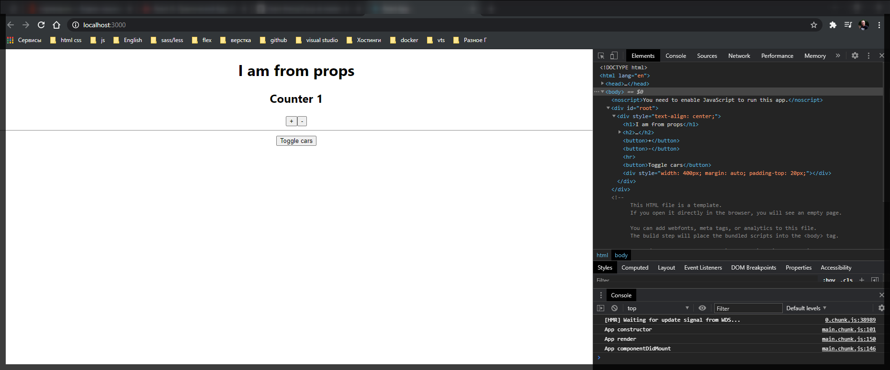
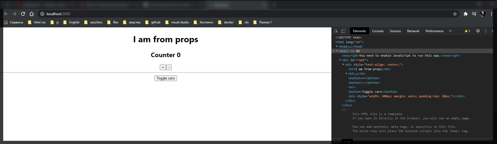

# Фрагменты часть 2

Так же если я не хочу использовать лишние элементы в **DOM** дереве я могу использовать тег **<React.Fragment></React.Fragment>**.

```jsx
import React, { Component } from 'react';

export default class Counter extends Component {
  state = {
    counter: 0,
  };

  addCounter = () => {
    this.setState({
      counter: this.state.counter + 1,
    });
  };

  render() {
    return (
      <React.Fragment>
        <h2>Counter {this.state.counter} </h2>
        <button onClick={this.addCounter}>+</button>
        <button
          onClick={() => this.setState({ counter: this.state.counter - 1 })}
        >
          -
        </button>
      </React.Fragment>
    );
  }

  //   return [
  //     <h2 key={1}>Counter {this.state.counter} </h2>,
  //     <button key={2} onClick={this.addCounter}>
  //       +
  //     </button>,
  //     <button
  //       key={3}
  //       onClick={() => this.setState({ counter: this.state.counter - 1 })}
  //     >
  //       -
  //     </button>,
  //   ];
  // }
}
```



Теперь рассмотрим как работает данный **Fragment** и напишем свой собственный. Для этого в корне нашего проекта мы можем создать новую папку которая будет называться **hoc** хотя создает он ее в компонентах. И создаем новый файл **Auxiliary.js**. Обычно этот файл называют **Aux.js** но у пользователей **Windows** возникают проблемы с данным названием т.к. это запрещенное название в **ОС**.

Что собой представляет этот компонент? Он является идентичным **React.Fragment**. Он просто оборачивает в себе некоторый **JSX** и возвращает то что положено внутри него, не создавая при этом какого-то корневого элемента.

```js
//src/components/Auxiliary/Auxiliary.js
import React from 'react';

const Auxiliary = (props) => {
  return props.children;
};

export default Auxiliary;
```

Идея заключается в том что мы создаем обычный функциональный компонент и все что он делает возвращает **props.children**.

И попробуем им воспользоваться в компоненте **Counter**. После импортирования я могу использовать его.

```js
import React, { Component } from 'react';
import Auxiliary from '../hoc/Auxiliary';

export default class Counter extends Component {
  state = {
    counter: 0,
  };

  addCounter = () => {
    this.setState({
      counter: this.state.counter + 1,
    });
  };

  render() {
    return (
      <Auxiliary>
        <h2>Counter {this.state.counter} </h2>
        <button onClick={this.addCounter}>+</button>
        <button
          onClick={() => this.setState({ counter: this.state.counter - 1 })}
        >
          -
        </button>
      </Auxiliary>
    );
  }

  //   return [
  //     <h2 key={1}>Counter {this.state.counter} </h2>,
  //     <button key={2} onClick={this.addCounter}>
  //       +
  //     </button>,
  //     <button
  //       key={3}
  //       onClick={() => this.setState({ counter: this.state.counter - 1 })}
  //     >
  //       -
  //     </button>,
  //   ];
  // }
}
```

Он так же оборачивает контент.



Смотри короткий синтакси может скоро в стандарт войдет

[https://reactjs.org/docs/fragments.html](https://reactjs.org/docs/fragments.html)
