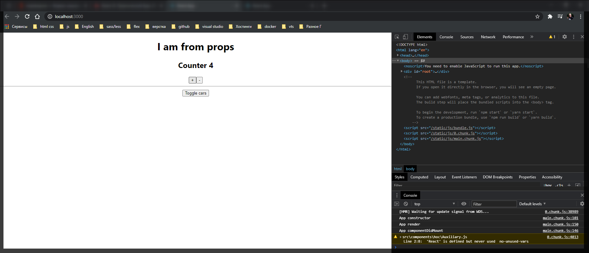

# Правильное использование state

Теперь возвращаюсь к компоненту **Counter** и рассмотрим другое использование метода **setState()**. Данный метод **setState()**, который меняет локально состояние какого-нибудь компонента, является асинхронным.

Например если у нас есть функция **addCounter** которая увеличивает счетчик на **1** мы основываемся на текущем состоянии **counter: this.state.counter + 1**.

Но может быть такая ситуация что данное состояние оно может быть где-нибудь изменено так же в этот момент. И в таком случае мы получим е правильное состояние счетчика и тем самым мы можем сломать наше приложение.

Как нам избежать такой ситуации и что бы мы знали что мы точно работаем с текущем состоянием **state**? А не стекущим состоянием которое уже может быть изменено со стороны.

Для этого мы можем по-другому использовать метод **setState()**. Обращаюсь к **this.setState()** и правильно будет сюда передавать некоторую функцию. В данную анонимную стрелочную функцию мы будем получать объект который называется **precState**. В нем точно хранится предыдущее состояние которое у нас было для нашего **state**.

```js
addCounter = () => {
  // this.setState({
  //   counter: this.state.counter + 1,
  // });

  this.setState((prevState) => {});
};
```

И теперь что мы можем с этим сделать? Мы можем вернуть новый объект где мы будем так же преобразовывать текущее состояние т.е. сделать аналогию с объектом который мы просто передаем в **setState()**. При обращении к **state** обращаться не к **this.state** а к **prevState**. т.е. предыдущее состояние которе было.

```js
this.setState((prevState) => {
      return {
        counter: prevState.counter + 1,
      };
    });
  };
```

И полный файл.

```jsx
import React, { Component } from 'react';
import Auxiliary from '../hoc/Auxiliary';

export default class Counter extends Component {
  state = {
    counter: 0,
  };

  addCounter = () => {
    // this.setState({
    //   counter: this.state.counter + 1,
    // });

    this.setState((prevState) => {
      return {
        counter: prevState.counter + 1,
      };
    });
  };

  render() {
    return (
      <Auxiliary>
        <h2>Counter {this.state.counter} </h2>
        <button onClick={this.addCounter}>+</button>
        <button
          onClick={() => this.setState({ counter: this.state.counter - 1 })}
        >
          -
        </button>
      </Auxiliary>
    );
  }

  //   return [
  //     <h2 key={1}>Counter {this.state.counter} </h2>,
  //     <button key={2} onClick={this.addCounter}>
  //       +
  //     </button>,
  //     <button
  //       key={3}
  //       onClick={() => this.setState({ counter: this.state.counter - 1 })}
  //     >
  //       -
  //     </button>,
  //   ];
  // }
}
```



Как видите приложение работает так же как до этого. Но теперь мы точно знаем что мы защищены от каких-то асинхронных изменений нашего **state** и мы используем метод более правильно.
