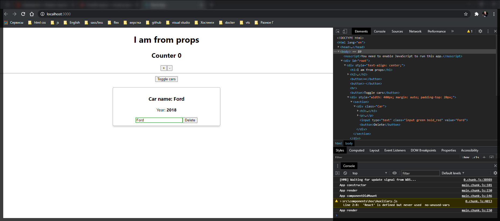

# Введение в компоненты высшего порядка

Для этого внесем изменения в проект.

Удаляю в **Car.js** импорт **Radium**. Избавляюсь от всех жизненных циклов которые мы с вами имплементировали.

```jsx
//src/components.Car.js
import React from 'react';
import './Car.scss';

class Car extends React.Component {
  render() {
    const inputClasses = ['input'];

    if (this.props.name !== '') {
      inputClasses.push('green');
    } else {
      inputClasses.push('red');
    }

    if (this.props.name.length > 4) {
      inputClasses.push('bold');
    } else {
      inputClasses.push('bold_red'); // это я уже добавляю свой класс он вообще else не использует
    }

    return (
      <div className="Car">
        <h3>Сar name: {this.props.name}</h3>
        <p>
          Year: <strong>{this.props.year}</strong>
        </p>
        <input
          type="text"
          onChange={this.props.onChangeName}
          value={this.props.name}
          className={inputClasses.join(' ')}
        />
        <button onClick={this.props.onDelete}>Delete</button>
      </div>
    );
  }
}

export default Car;
```

```scss
/* Car.css */

/*Это не правильный файл я отковырялся до гребаного обеда 
оказывается это не файл scss а css не применялось в Car.js переменная classes. Видимо работает только с css*/
$color_input_element: green;
$color_input_non_element: red;

$input_bold_border: green;
$input_bold_red_border: red;
$input_bold_color: red;

.Car {
  border: 1px solid #ccc;
  margin-bottom: 10px;
  padding: 10px;
  box-shadow: 0 4px 5px 0 rgba(0, 0, 0, 0.14);
  border-radius: 5px;
}

.Car:hover {
  border: 1ps solid #aaa;
  box-shadow: 0 4px 15px 0 rgba(0, 0, 0, 0.25);
  background-color: LightSlateGray;
  cursor: pointer;
}

.input {
}

.input:active,
.input:focus {
  outline: none;
}

.input.green {
  border: 1px solid $color_input_element;
}

.input.red {
  border: 1px solid $color_input_non_element;
}

.input.bold {
  border: 2px solid $input_bold_border;
  font-weight: bold;
}
.input.bold_red {
  color: $input_bold_color;
  border: 2px solid $input_bold_red_border;
  font-weight: bold;
}
```

Рассмотрим следующий момент. Допустим у нас сейчас в компоненте **Car.js** есть оборачивающий **div** который служит для того что бы задать некоторую стилистику. По-сути он здесь болше не нужен здесь как функциональный инструмент т.е. мы в принципе можем от него избавится если бы конечно могли бы оставить стилистику.

Реализуем данную задачу используя компоненты высокого порядка.

Сейчас посмотрим на парочку таких компонентов которые мы уже сделали. Потому что в данном уроке мы с вами будем применять другой подход.
Посмотрим на компонент **ErrorBoundary**.

```jsx
// src/components/ErrorBoundary/ErrorBoundary/js
import React from 'react';

export default class ErrorBoundary extends React.Component {
  state = {
    hasError: false,
  };

  componentDidCatch(error, info) {
    this.setState({ hasError: true });
  }

  render() {
    if (this.state.hasError) {
      return <h1 style={{ color: 'red' }}>Something went wrong</h1>;
    } else {
      return this.props.children;
    }
  }
}
```

По сути мы в данный компонент оборачивали другие компоненты. Добавляли какой-то функционал, в данном случае это был функционал поимки каких-то ошибок, и по сути далее мы возвращали обычный компонент. Т.е. визуально ни как это не отображалось. Это и есть вся суть высоких компонентов т.е. они просто добавляют функционал, но они ни как не влияют на его отображение.

Тоже самое можно сказать про компонент **Auxiliary.js** который просто возвращает содержимое тега своего в который мы положили контент. И избавляется от корневого элемента. И по сути тут тоже самое. Мы визуально ничего не меняем, но при этом мы накладываем дополнительный функционал.

Так вот по сути у нас один подход. Т.е мы реализуем обычный какой-то компонент и возвращаем **return this.props.children;** т.е. содержимое корневого тега.

Либо же мы можем использовать другой для реализации **hoc**.

Давайте реализуем очень простой компонент в папке **hoc** и назовем его **withClass.js**. Обратите внимание что в данном случае я пишу название файла с маленькой буквы. Потому что мы будем записывать данный компонент не как обычно используя стандартный функционаьный компонент или обычный React компонент. Здесь мы будем создавать некоторую функцию обертку.

```js
//src/components/hoc/withClass.js
import React from 'react';

const withClass = () => {};
```

Теперь что будет делать данная фугкция? Она будет в себя получать некоторый **Component**, и вторым параметром я буду добавлять некоторый корневой класс для компонента т.е. мы буудем принимать некоторый **className**.

```jsx
//src/components/hoc/withClass.js
import React from 'react';

const withClass = (Component, className) => {};
```

И что же будет делать дальше данная функия? Данная функция вернет нам новый компонент, т.е. она вернет нам новую функцию куда мы уже будем получать некоторый **props**.

```jsx
//src/components/hoc/withClass.js
import React from 'react';

const withClass = (Component, className) => {
  return (props) => {};
};
```

В данной функции мы так же вернем **JSX**. Все оборачиваю в неготорый **div**. И в этом **div** я задам **className={className}** который будет равен переменной **className**.

```jsx
//src/components/hoc/withClass.js
import React from 'react';

const withClass = (Component, className) => {
  return (props) => {
    return <dev className={className}></dev>;
  };
};
```

Повторюсь что данный **hoc** компонет **withClass** он будет просто добавлять некоторый класс к корневому элементу и потом будет рендерить наш компонент который мы сюда передадим. В который мы все это обернем.

Как мы будем рендерить наш компонент? Достаточно просто мы превратим его в обычный **React** компонент.

```jsx
//src/components/hoc/withClass.js
import React from 'react';

const withClass = (Component, className) => {
  return (props) => {
    return (
      <dev className={className}>
        <Component />
      </dev>
    );
  };
};

export default withClass;
```

Теперь попробуем переписать наш **Car.js** используя наш hoc компонент **withClass**.

Для начало я импортирую компонент высшего порядка **withClass.js** в **Car.js**. В **JSX** переименовываю корневой **div** в **React.Fragment**

```jsx
//src/components.Car.js
import React from 'react';
import './Car.scss';
import withClass from '../hoc/withClass';

class Car extends React.Component {
  render() {
    const inputClasses = ['input'];

    if (this.props.name !== '') {
      inputClasses.push('green');
    } else {
      inputClasses.push('red');
    }

    if (this.props.name.length > 4) {
      inputClasses.push('bold');
    } else {
      inputClasses.push('bold_red'); // это я уже добавляю свой класс он вообще else не использует
    }

    return (
      <React.Fragment>
        <h3>Сar name: {this.props.name}</h3>
        <p>
          Year: <strong>{this.props.year}</strong>
        </p>
        <input
          type="text"
          onChange={this.props.onChangeName}
          value={this.props.name}
          className={inputClasses.join(' ')}
        />
        <button onClick={this.props.onDelete}>Delete</button>
      </React.Fragment>
    );
  }
}

export default Car;
```

И теперь как я могу использовать данный компонент? На самом деле все достаточно просто. Учитывая то что **withClass** это некоторая функция которая принимает в себя **Component** и название класса **className**, то мы можем использовать его как обычную функцию. Поэтому в **Car.js** где я экспортирую по **default** наш компонент **Car** мы можем написать использование функции **withClass**. Первым параметром мы принимаем некоторый компонент, в нашем случае это компонент **Car**, и вторым параметром мы принимаем **className**, он у нас храниться в переменной **classes.Car**.

**ИСПРАВЛЕННЫЕ ФАЙЛЫ**

```jsx
//src/components.Car.js
import React from 'react';
import classes from './Car.css';
import withClass from '../hoc/withClass';

class Car extends React.Component {
  render() {
    const inputClasses = ['input'];

    if (this.props.name !== '') {
      inputClasses.push('green');
    } else {
      inputClasses.push('red');
    }

    if (this.props.name.length > 4) {
      inputClasses.push('bold');
    } else {
      inputClasses.push('bold_red'); // это я уже добавляю свой класс он вообще else не использует
    }

    return (
      <div className="Car">
        <h3>Сar name: {this.props.name}</h3>
        <p>
          Year: <strong>{this.props.year}</strong>
        </p>
        <input
          type="text"
          onChange={this.props.onChangeName}
          value={this.props.name}
          className={inputClasses.join(' ')}
        />
        <button onClick={this.props.onDelete}>Delete</button>
      </div>
    );
  }
}

export default withClass(Car, classes.Car);
```

```css
.Car {
  margin-bottom: 10px;
  display: block;
  padding: 10px;
  border-radius: 5px;
  transition: border, box-shadow 0.3s;
  border: 1px solid #ccc;
  box-shadow: 0 4px 5px 0 rgba(0, 0, 0, 0.14);
}

.Car:hover {
  border: 1px solid #aaa;
  box-shadow: 0 4px 15px 0 rgba(0, 0, 0, 0.25);
  cursor: pointer;
}

.input {
}

.input:active,
.input:focus {
  outline: none;
}

.input.green {
  border: 1px solid green;
}

.input.red {
  border: 1px solid red;
}

.input.bold {
  border: 2px solid green;
  font-weight: bold;
}
```

```jsx
//src/components/hoc/withClass.js
import React from 'react';

const withClass = (Component, className) => {
  return (props) => {
    return (
      <div className={className}>
        <Component />
      </div>
    );
  };
};

export default withClass;
```

Это пипец какой-то. Когда у него выскакивают ошибки у меня их нет. Сильно бесит. Для того что бы данные передавались корректно передаю **props** в компонент.

```js
//src/components/hoc/withClass.js
// eslint-disable-next-line
import React from 'react';

const withClass = (Component, className) => {
  return (props) => {
    return (
      <section className={className}>
        <Component {...props} />
      </section>
    );
  };
};

export default withClass;
```



Вся суть компонентов высшего порядка сводится к тому что они оборачивают другие компоненты и добавляют им определенный функционал. Мы их можем создавать различным образом мы их можем делать как обычные компоненты React, записывать какую-то функциональность а дальше записывать **this.props.children**.

Ли бо же мы можем создавать функцию которая в свою очередь будет создавать новую функцию которая в себе содержит новый функционал.

```jsx
//src/components/hoc/withClass.js
// eslint-disable-next-line
import React from 'react';

const withClass = (Component, className) => {
  return (props) => {
    return (
      <section className={className}>
        <Component {...props} />
      </section>
    );
  };
};

export default withClass;
```

И использовать ее именно таким образом т.е. если вы помните именно таким способом была построена функция **Radium** которую мы импортировали когда работали со стилями. Она так же оборачивала компонент своим функционалом и добавляла в него новый.
