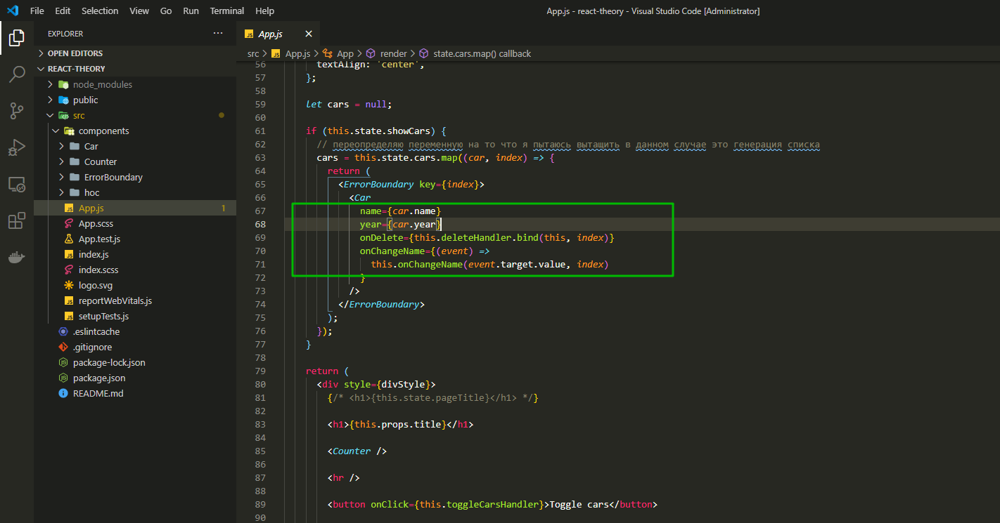
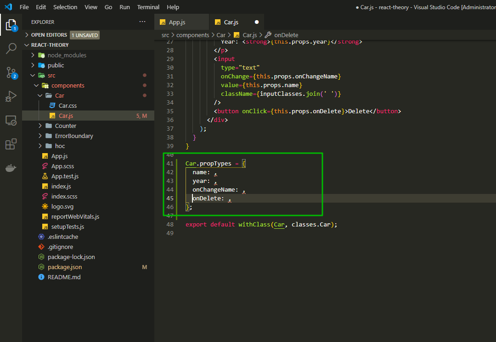
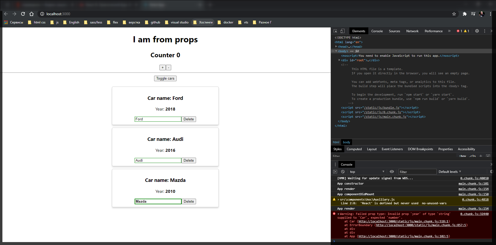
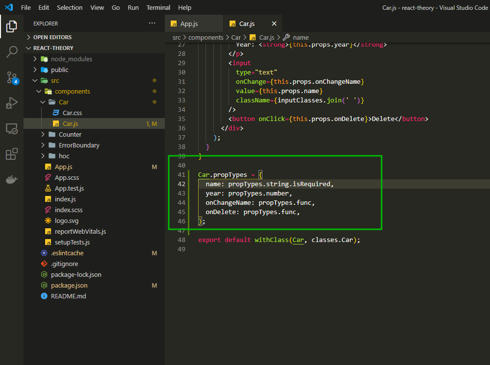

# Валидация параметров с propTypes

Теперь давайте рассмотрим возможность валидации входящих параметров в компонент.

Посмотрим на компонент **App.js** где мы с вами рендерим список машин и передаем туда определенные функции

```js
// src/App.js
import React, { Component } from 'react';
import './App.scss';
import Car from './components/Car/Car';
import ErrorBoundary from './components/ErrorBoundary/ErrorBoundary';
import Counter from './components/Counter/Counter';

class App extends Component {
  constructor(props) {
    console.log('App constructor');
    super(props);
    this.state = {
      cars: [
        { name: 'Ford', year: 2018 },
        // { name: 'Audi', year: 2016 },
        // { name: 'Mazda', year: 2010 },
      ],
      pageTitle: 'React component',
      showCars: false,
    };
  }

  toggleCarsHandler = () => {
    this.setState({
      showCars: !this.state.showCars,
    });
  };

  onChangeName(name, index) {
    console.log(name, index);
    const car = this.state.cars[index];
    car.name = name;
    const cars = [...this.state.cars];
    cars[index] = car;
    this.setState({ cars });
  }

  deleteHandler(index) {
    const cars = this.state.cars.concat();
    cars.splice(index, 1);
    this.setState({ cars });
  }

  componentWillUnmount() {
    console.log('App componentWillUnmount');
  }

  componentDidMount() {
    console.log('App componentDidMount');
  }

  render() {
    console.log('App render');

    const divStyle = {
      textAlign: 'center',
    };

    let cars = null;

    if (this.state.showCars) {
      // переопределяю переменную на то что я пытаюсь вытащить в данном случае это генерация списка
      cars = this.state.cars.map((car, index) => {
        return (
          <ErrorBoundary key={index}>
            <Car
              name={car.name}
              year={car.year}
              onDelete={this.deleteHandler.bind(this, index)}
              onChangeName={(event) =>
                this.onChangeName(event.target.value, index)
              }
            />
          </ErrorBoundary>
        );
      });
    }

    return (
      <div style={divStyle}>
        {/* <h1>{this.state.pageTitle}</h1> */}

        <h1>{this.props.title}</h1>

        <Counter />

        <hr />

        <button onClick={this.toggleCarsHandler}>Toggle cars</button>

        <div
          style={{
            width: 400,
            margin: 'auto',
            paddingTop: '20px',
          }}
        >
          {cars}
        </div>
      </div>
    );
  }
}

export default App;
```



У нас есть параметр **name**, **year**, **onDelete** и функция **onChange**.

Когда вы работаете один то вы впринципе не сталкиваетесь с такими проблемами что вы можете не угадать тип ожидаемый в компоненте.

Но если вы работаете в команде с другими разработчиками, если у вас достаточно большой проект или большое количество опций, то в любом валидация параметров не будет лишней особенно если она может повлиять на работоспособность вашего приложения. Например если у вас происходять определенные калькуляции с переменной и входящим параметром и вы ожидаете именно число, но при этом на входе вы получили строку, то у вас может сломаться ваше приложение.

И поэтому создана специальная валидация типов которая позволяет как раз таки делать проверку для того что бы ваш код был более точный т.е. такой некоторый аналог **TypeScript** только уже как дополнительная фича.

Для этого придется установить новый пакет.

[https://ru.reactjs.org/docs/typechecking-with-proptypes.html](https://ru.reactjs.org/docs/typechecking-with-proptypes.html)

```shell
npm install --save prop-types
```

Далее импортирую данный пакет в компонент **Car.js** ... **import propTypes from 'prop-types';**

Перед экспортом обращаюсь к переменной **Car**. и определяю новое свойство **propTypes**. Это специальное свойство за которым будет смотреть **React**.

```jsx
//src/components.Car.js
import React from 'react';
import propTypes from 'prop-types';
import classes from './Car.css';
import withClass from '../hoc/withClass';

class Car extends React.Component {
  render() {
    const inputClasses = ['input'];

    if (this.props.name !== '') {
      inputClasses.push('green');
    } else {
      inputClasses.push('red');
    }

    if (this.props.name.length > 4) {
      inputClasses.push('bold');
    } else {
      inputClasses.push('bold_red'); // это я уже добавляю свой класс он вообще else не использует
    }

    return (
      <div className="Car">
        <h3>Сar name: {this.props.name}</h3>
        <p>
          Year: <strong>{this.props.year}</strong>
        </p>
        <input
          type="text"
          onChange={this.props.onChangeName}
          value={this.props.name}
          className={inputClasses.join(' ')}
        />
        <button onClick={this.props.onDelete}>Delete</button>
      </div>
    );
  }
}

Car.propTypes = {};

export default withClass(Car, classes.Car);
```

И теперь здесь **Car.propTypes = {};** мы должны перечислить как ключи название тех полей которые мы ожидаем т.е. например мы ожидаем **name**, **year**, **onChangeName**, **onDelete**.



Далее мы будем как раз таки с помощью библиотеки валидировать данные значения. Допустим если мы ожидаем в name строку то мы пишем **PropTypes.string** и главное что бы вы не вызывали данную функцию. Для года **year: propTypes.number**. Для функции есть специальный тип **func** т.е. **onChangeName: propTypes.func** и то же самое для **onDelete**.

```jsx
//src/components.Car.js
import React from 'react';
import propTypes from 'prop-types';
import classes from './Car.css';
import withClass from '../hoc/withClass';

class Car extends React.Component {
  render() {
    const inputClasses = ['input'];

    if (this.props.name !== '') {
      inputClasses.push('green');
    } else {
      inputClasses.push('red');
    }

    if (this.props.name.length > 4) {
      inputClasses.push('bold');
    } else {
      inputClasses.push('bold_red'); // это я уже добавляю свой класс он вообще else не использует
    }

    return (
      <div className="Car">
        <h3>Сar name: {this.props.name}</h3>
        <p>
          Year: <strong>{this.props.year}</strong>
        </p>
        <input
          type="text"
          onChange={this.props.onChangeName}
          value={this.props.name}
          className={inputClasses.join(' ')}
        />
        <button onClick={this.props.onDelete}>Delete</button>
      </div>
    );
  }
}

Car.propTypes = {
  name: propTypes.string,
  year: propTypes.number,
  onChangeName: propTypes.func,
  onDelete: propTypes.func,
};

export default withClass(Car, classes.Car);
```

И посмотрим на приложение. И у какой-нибудь машины меняю год на строковый формат.

```jsx
// src/App.js
import React, { Component } from 'react';
import './App.scss';
import Car from './components/Car/Car';
import ErrorBoundary from './components/ErrorBoundary/ErrorBoundary';
import Counter from './components/Counter/Counter';

class App extends Component {
  constructor(props) {
    console.log('App constructor');
    super(props);
    this.state = {
      cars: [
        { name: 'Ford', year: 2018 },
        { name: 'Audi', year: '2016' },
        { name: 'Mazda', year: 2010 },
      ],
      pageTitle: 'React component',
      showCars: false,
    };
  }

  toggleCarsHandler = () => {
    this.setState({
      showCars: !this.state.showCars,
    });
  };

  onChangeName(name, index) {
    console.log(name, index);
    const car = this.state.cars[index];
    car.name = name;
    const cars = [...this.state.cars];
    cars[index] = car;
    this.setState({ cars });
  }

  deleteHandler(index) {
    const cars = this.state.cars.concat();
    cars.splice(index, 1);
    this.setState({ cars });
  }

  componentWillUnmount() {
    console.log('App componentWillUnmount');
  }

  componentDidMount() {
    console.log('App componentDidMount');
  }

  render() {
    console.log('App render');

    const divStyle = {
      textAlign: 'center',
    };

    let cars = null;

    if (this.state.showCars) {
      // переопределяю переменную на то что я пытаюсь вытащить в данном случае это генерация списка
      cars = this.state.cars.map((car, index) => {
        return (
          <ErrorBoundary key={index}>
            <Car
              name={car.name}
              year={car.year}
              onDelete={this.deleteHandler.bind(this, index)}
              onChangeName={(event) =>
                this.onChangeName(event.target.value, index)
              }
            />
          </ErrorBoundary>
        );
      });
    }

    return (
      <div style={divStyle}>
        {/* <h1>{this.state.pageTitle}</h1> */}

        <h1>{this.props.title}</h1>

        <Counter />

        <hr />

        <button onClick={this.toggleCarsHandler}>Toggle cars</button>

        <div
          style={{
            width: 400,
            margin: 'auto',
            paddingTop: '20px',
          }}
        >
          {cars}
        </div>
      </div>
    );
  }
}

export default App;
```



Читай все плюшки официальная документация [https://reactjs.org/docs/typechecking-with-proptypes.html](https://reactjs.org/docs/typechecking-with-proptypes.html).

Здесь есть базовая настройка. Рассматриваются все варианты валидации различных вещей.

Единственное что я хотел еще добавить. Допустим в базовой коробке мы можем использовать еще один объект для **PropTypes**. Например если мы точно знаем что нам без **name** например данный компонент не запустить, то мы можем сделать проверку т.е. указать **isRequired**. Если мы его не получим мы так же получим некоторую ошибку в консоли.



```js
//src/components.Car.js
import React from 'react';
import propTypes from 'prop-types';
import classes from './Car.css';
import withClass from '../hoc/withClass';

class Car extends React.Component {
  render() {
    const inputClasses = ['input'];

    if (this.props.name !== '') {
      inputClasses.push('green');
    } else {
      inputClasses.push('red');
    }

    if (this.props.name.length > 4) {
      inputClasses.push('bold');
    } else {
      inputClasses.push('bold_red'); // это я уже добавляю свой класс он вообще else не использует
    }

    return (
      <div className="Car">
        <h3>Сar name: {this.props.name}</h3>
        <p>
          Year: <strong>{this.props.year}</strong>
        </p>
        <input
          type="text"
          onChange={this.props.onChangeName}
          value={this.props.name}
          className={inputClasses.join(' ')}
        />
        <button onClick={this.props.onDelete}>Delete</button>
      </div>
    );
  }
}

Car.propTypes = {
  name: propTypes.string.isRequired,
  year: propTypes.number,
  onChangeName: propTypes.func,
  onDelete: propTypes.func,
};

export default withClass(Car, classes.Car);
```

Так же стоит оговорится что данная проверка доступна только не в функциональных компонентах т.е. в компонентах **statefull** которые определены через ключевое слово **class** и наследеются от **React Component**.
