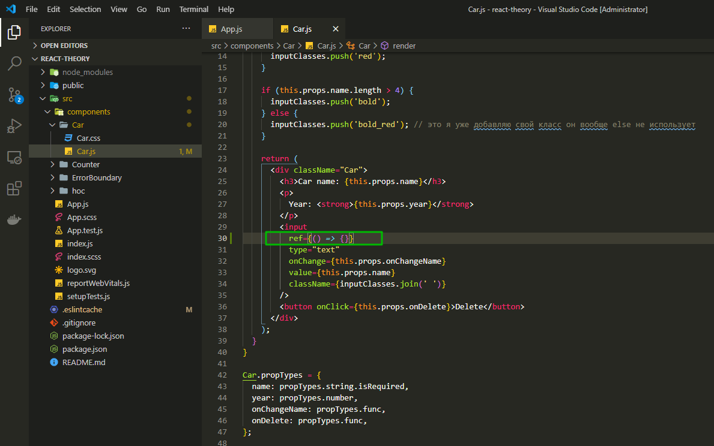
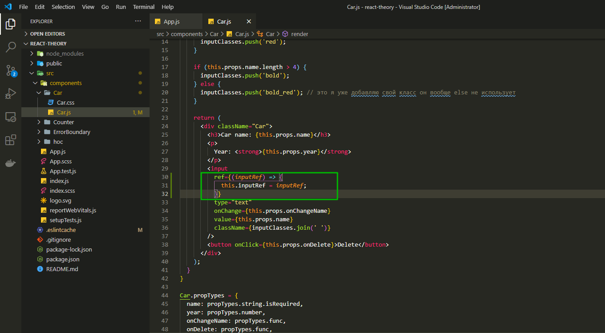
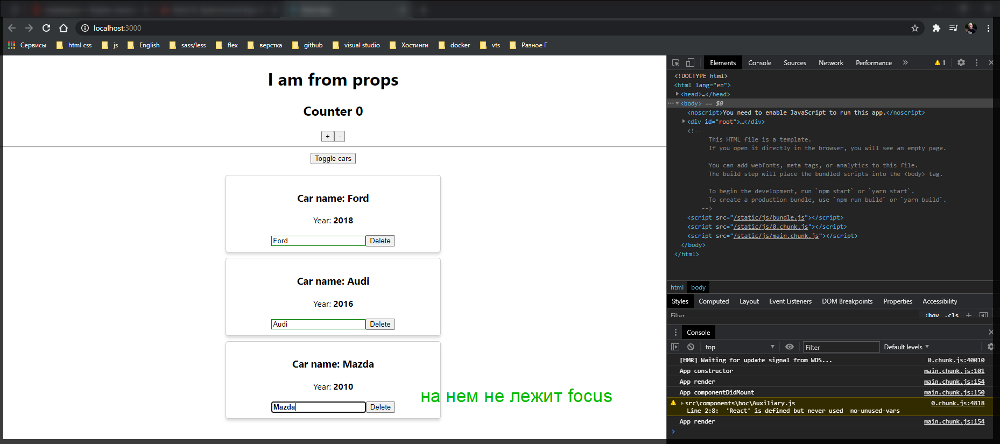
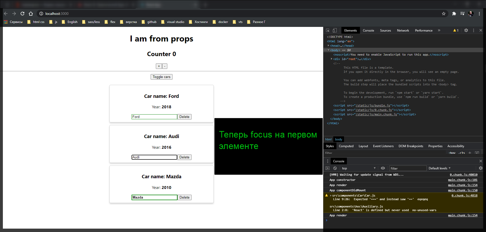
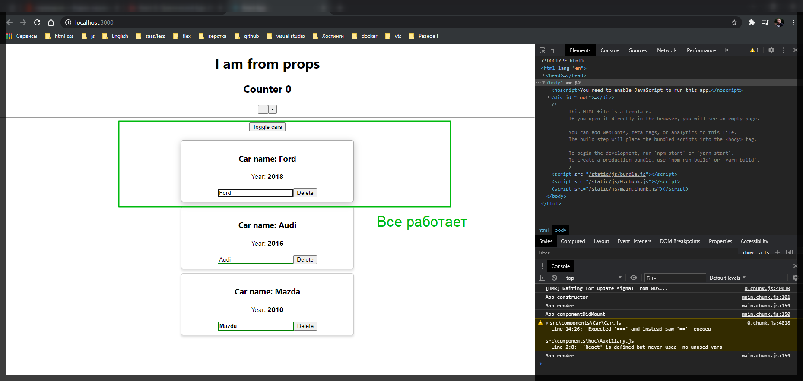

# Референции

Теперь давайте рассмотрим еще одну возможность которая позволяет нам в React получать доступ к нативным **DOM** элементам. Называется эта возможность референции.

Разберемся на простом примере. У нас есть список машин которые мы можем либо показывать, либо скрывать. И у нас есть **input** которые позволяют менять имя машины.

Давайте сделаем так что бы по умолчанию, когда мы открываем **toggle cars** у нас был **focus** на каком-нибудь элементе. По-сути мы можем забрать текущий элемент из **DOM** и навешать на него **focus**.

В компоненте **Car.js** в **input** я могу добавить новый атрибут, который не виден в **html** но при этом понимается **jsx**. Называется он **ref={}** и в нутрь его мы можем передать **callback** функцию.



В качестве параметра в данную функцию мы принимаем некоторый **inputRef**. и я его заношу в переменную **this.inputRef = inputRef**



Делается это для того что бы данная переменая была доступна в наше классе.

```jsx
//src/components.Car.js
import React from 'react';
import propTypes from 'prop-types';
import classes from './Car.css';
import withClass from '../hoc/withClass';

class Car extends React.Component {
  render() {
    const inputClasses = ['input'];

    if (this.props.name !== '') {
      inputClasses.push('green');
    } else {
      inputClasses.push('red');
    }

    if (this.props.name.length > 4) {
      inputClasses.push('bold');
    } else {
      inputClasses.push('bold_red'); // это я уже добавляю свой класс он вообще else не использует
    }

    return (
      <div className="Car">
        <h3>Сar name: {this.props.name}</h3>
        <p>
          Year: <strong>{this.props.year}</strong>
        </p>
        <input
          ref={(inputRef) => {
            this.inputRef = inputRef;
          }}
          type="text"
          onChange={this.props.onChangeName}
          value={this.props.name}
          className={inputClasses.join(' ')}
        />
        <button onClick={this.props.onDelete}>Delete</button>
      </div>
    );
  }
}

Car.propTypes = {
  name: propTypes.string.isRequired,
  year: propTypes.number,
  onChangeName: propTypes.func,
  onDelete: propTypes.func,
};

export default withClass(Car, classes.Car);
```

Теперь как мы можем обращаться с переменной **inputRef**. Мы можем например определить метод **componentDidMount() {}**. И что можем сделать? Мы можем обратиться к нашей референции и вызвать метод **focus** т.е.

```js
componentDidMount() {
    this.inputRef.focus();
  }
```

Весь файл

```jsx
//src/components.Car.js
import React from 'react';
import propTypes from 'prop-types';
import classes from './Car.css';
import withClass from '../hoc/withClass';

class Car extends React.Component {
  componentDidMount() {
    this.inputRef.focus();
  }

  render() {
    const inputClasses = ['input'];

    if (this.props.name !== '') {
      inputClasses.push('green');
    } else {
      inputClasses.push('red');
    }

    if (this.props.name.length > 4) {
      inputClasses.push('bold');
    } else {
      inputClasses.push('bold_red'); // это я уже добавляю свой класс он вообще else не использует
    }

    return (
      <div className="Car">
        <h3>Сar name: {this.props.name}</h3>
        <p>
          Year: <strong>{this.props.year}</strong>
        </p>
        <input
          ref={(inputRef) => {
            this.inputRef = inputRef;
          }}
          type="text"
          onChange={this.props.onChangeName}
          value={this.props.name}
          className={inputClasses.join(' ')}
        />
        <button onClick={this.props.onDelete}>Delete</button>
      </div>
    );
  }
}

Car.propTypes = {
  name: propTypes.string.isRequired,
  year: propTypes.number,
  onChangeName: propTypes.func,
  onDelete: propTypes.func,
};

export default withClass(Car, classes.Car);
```

В **Car.css** удаляю **focus**

```css
.Car {
  margin-bottom: 10px;
  display: block;
  padding: 10px;
  border-radius: 5px;
  transition: border, box-shadow 0.3s;
  border: 1px solid #ccc;
  box-shadow: 0 4px 5px 0 rgba(0, 0, 0, 0.14);
}

.Car:hover {
  border: 1px solid #aaa;
  box-shadow: 0 4px 15px 0 rgba(0, 0, 0, 0.25);
  cursor: pointer;
}

.input {
}

.input:active {
  outline: none;
}

.input.green {
  border: 1px solid green;
}

.input.red {
  border: 1px solid red;
}

.input.bold {
  border: 2px solid green;
  font-weight: bold;
}
```



Теперь как сделать так что бы мы попадали не на последний элемент, а на тот который мы хотим?

Мы можем в **App.js** где мы ренднрим список машин передать параметр **index={index}**.


В **Car.js** так же добавляю свойств **index** в **PropTypes**.

```jsx
//src/components.Car.js
import React from 'react';
import propTypes from 'prop-types';
import classes from './Car.css';
import withClass from '../hoc/withClass';

class Car extends React.Component {
  componentDidMount() {
    this.inputRef.focus();
  }

  render() {
    const inputClasses = ['input'];

    if (this.props.name !== '') {
      inputClasses.push('green');
    } else {
      inputClasses.push('red');
    }

    if (this.props.name.length > 4) {
      inputClasses.push('bold');
    } else {
      inputClasses.push('bold_red'); // это я уже добавляю свой класс он вообще else не использует
    }

    return (
      <div className="Car">
        <h3>Сar name: {this.props.name}</h3>
        <p>
          Year: <strong>{this.props.year}</strong>
        </p>
        <input
          ref={(inputRef) => {
            this.inputRef = inputRef;
          }}
          type="text"
          onChange={this.props.onChangeName}
          value={this.props.name}
          className={inputClasses.join(' ')}
        />
        <button onClick={this.props.onDelete}>Delete</button>
      </div>
    );
  }
}

Car.propTypes = {
  name: propTypes.string.isRequired,
  year: propTypes.number,
  index: propTypes.number,
  onChangeName: propTypes.func,
  onDelete: propTypes.func,
};

export default withClass(Car, classes.Car);
```

После чего я могу обратится к методу **componentDidMount** и написать условие что если **this.props.index === 1** то в таком случае мы будем делать **focus** т.е.

```jsx
//src/components.Car.js
import React from 'react';
import propTypes from 'prop-types';
import classes from './Car.css';
import withClass from '../hoc/withClass';

class Car extends React.Component {
  componentDidMount() {
    if (this.props.index == 1) {
      this.inputRef.focus();
    }
  }

  render() {
    const inputClasses = ['input'];

    if (this.props.name !== '') {
      inputClasses.push('green');
    } else {
      inputClasses.push('red');
    }

    if (this.props.name.length > 4) {
      inputClasses.push('bold');
    } else {
      inputClasses.push('bold_red'); // это я уже добавляю свой класс он вообще else не использует
    }

    return (
      <div className="Car">
        <h3>Сar name: {this.props.name}</h3>
        <p>
          Year: <strong>{this.props.year}</strong>
        </p>
        <input
          ref={(inputRef) => {
            this.inputRef = inputRef;
          }}
          type="text"
          onChange={this.props.onChangeName}
          value={this.props.name}
          className={inputClasses.join(' ')}
        />
        <button onClick={this.props.onDelete}>Delete</button>
      </div>
    );
  }
}

Car.propTypes = {
  name: propTypes.string.isRequired,
  year: propTypes.number,
  index: propTypes.number,
  onChangeName: propTypes.func,
  onDelete: propTypes.func,
};

export default withClass(Car, classes.Car);
```



Раньше таким образом мы делали референции до элементов.

Вообще зачем это вообще нужно? Они могут понадобится для работы с **SVG** элементами с **canvas**, с **HTML5** типа **audio** или **vidio**. И в очень редких случаях, над которым нужно хорошо подумать, например обернуть какой-то плагин. Т.е. плагины в основном требуют какой-то **DOM** элемент, классика это **jQuery**.

И впринципе с помощью референции мы можем получить доступ до определенного объекта и кинуть его в конструктор **jQuery** плагина и получить какой-то функционал. Дважды нужно подумать прежде чем использовать **jQury** вместе с **React**. Но бывают такие плагины которые действительно это требуют.

И почему я говорю что раньше таким образом задавали референции?

```js
componentDidMount() {
    if (this.props.index == 1) {
      this.inputRef.focus();
    }
  }
```

C появлением **React 16** все немного изменилось. Теперь мы можем задавать референции более удобно.

Давайте заведем некоторый **constructor(props){}** который принимает некоторый **props**. Далее в нем определяю метод **super(props){}** что бы у нас все работало, что бы наш базовый компонент отработал с методом конструктора.

```jsx
//src/components.Car.js
import React from 'react';
import propTypes from 'prop-types';
import classes from './Car.css';
import withClass from '../hoc/withClass';

class Car extends React.Component {

  constructor(props){
    super(props){

    }
  }


  componentDidMount() {
    if (this.props.index == 1) {
      this.inputRef.focus();
    }
  }

  render() {
    const inputClasses = ['input'];

    if (this.props.name !== '') {
      inputClasses.push('green');
    } else {
      inputClasses.push('red');
    }

    if (this.props.name.length > 4) {
      inputClasses.push('bold');
    } else {
      inputClasses.push('bold_red'); // это я уже добавляю свой класс он вообще else не использует
    }

    return (
      <div className="Car">
        <h3>Сar name: {this.props.name}</h3>
        <p>
          Year: <strong>{this.props.year}</strong>
        </p>
        <input
          ref={(inputRef) => {
            this.inputRef = inputRef;
          }}
          type="text"
          onChange={this.props.onChangeName}
          value={this.props.name}
          className={inputClasses.join(' ')}
        />
        <button onClick={this.props.onDelete}>Delete</button>
      </div>
    );
  }
}

Car.propTypes = {
  name: propTypes.string.isRequired,
  year: propTypes.number,
  index: propTypes.number,
  onChangeName: propTypes.func,
  onDelete: propTypes.func,
};

export default withClass(Car, classes.Car);
```

И далее я могу в **constructor** создать новую переменную **this.inputRef =** и данная переменная у нас будет определяться черех функцию **React.createRef()**. Т.е. мы вручную создаем некоторую референцию и кладем ее в переменную.

```js
  constructor(props) {
    super(props);
    this.inputRef = React.createRef();
  }
```

Весь файл.

```jsx
//src/components.Car.js
import React from 'react';
import propTypes from 'prop-types';
import classes from './Car.css';
import withClass from '../hoc/withClass';

class Car extends React.Component {
  constructor(props) {
    super(props);
    this.inputRef = React.createRef();
  }

  componentDidMount() {
    if (this.props.index == 1) {
      this.inputRef.focus();
    }
  }

  render() {
    const inputClasses = ['input'];

    if (this.props.name !== '') {
      inputClasses.push('green');
    } else {
      inputClasses.push('red');
    }

    if (this.props.name.length > 4) {
      inputClasses.push('bold');
    } else {
      inputClasses.push('bold_red'); // это я уже добавляю свой класс он вообще else не использует
    }

    return (
      <div className="Car">
        <h3>Сar name: {this.props.name}</h3>
        <p>
          Year: <strong>{this.props.year}</strong>
        </p>
        <input
          ref={(inputRef) => {
            this.inputRef = inputRef;
          }}
          type="text"
          onChange={this.props.onChangeName}
          value={this.props.name}
          className={inputClasses.join(' ')}
        />
        <button onClick={this.props.onDelete}>Delete</button>
      </div>
    );
  }
}

Car.propTypes = {
  name: propTypes.string.isRequired,
  year: propTypes.number,
  index: propTypes.number,
  onChangeName: propTypes.func,
  onDelete: propTypes.func,
};

export default withClass(Car, classes.Car);
```

Теперь для того что бы использовать данную референцию и так же получить доступ к элементу в **input** мы можем избавиться от ранее написанной **callback** и просто обратиться к переменной **this.inputRef**.

```jsx
//src/components.Car.js
import React from 'react';
import propTypes from 'prop-types';
import classes from './Car.css';
import withClass from '../hoc/withClass';

class Car extends React.Component {
  constructor(props) {
    super(props);
    this.inputRef = React.createRef();
  }

  componentDidMount() {
    if (this.props.index == 1) {
      this.inputRef.focus();
    }
  }

  render() {
    const inputClasses = ['input'];

    if (this.props.name !== '') {
      inputClasses.push('green');
    } else {
      inputClasses.push('red');
    }

    if (this.props.name.length > 4) {
      inputClasses.push('bold');
    } else {
      inputClasses.push('bold_red'); // это я уже добавляю свой класс он вообще else не использует
    }

    return (
      <div className="Car">
        <h3>Сar name: {this.props.name}</h3>
        <p>
          Year: <strong>{this.props.year}</strong>
        </p>
        <input
          ref={this.inputRef}
          type="text"
          onChange={this.props.onChangeName}
          value={this.props.name}
          className={inputClasses.join(' ')}
        />
        <button onClick={this.props.onDelete}>Delete</button>
      </div>
    );
  }
}

Car.propTypes = {
  name: propTypes.string.isRequired,
  year: propTypes.number,
  index: propTypes.number,
  onChangeName: propTypes.func,
  onDelete: propTypes.func,
};

export default withClass(Car, classes.Car);
```

Идея заключается в том что если мы вручную создаем референцию, что сечас предлагает нам **React**, то мы больше не передаем **callback** функцию, мы просто передаем уже созданную референцию на нужный нам объект.

и теперь единственно что нужно изменить, если мы используем второй подход. Там где мы обращаемся к нашей референции вызывая мето **focus** дописываю объект **current**

```js
 componentDidMount() {
    if (this.props.index == 1) {
      this.inputRef.current.focus();
    }
  }
```

В данной референции мы получаем некоторый **wrapper** т.е. мы оборачиваем референцию и дальше получаем доступ к различным элементам. Это делается для того что бы мы в дальнейшем могли использовать **React** как в **web**, **desctop** так и на мобильных устройствах нативно. Поэтому все кладеться в объект **current**.

```jsx
//src/components.Car.js
import React from 'react';
import propTypes from 'prop-types';
import classes from './Car.css';
import withClass from '../hoc/withClass';

class Car extends React.Component {
  constructor(props) {
    super(props);
    this.inputRef = React.createRef();
  }

  componentDidMount() {
    if (this.props.index == 0) {
      this.inputRef.current.focus();
    }
  }

  render() {
    const inputClasses = ['input'];

    if (this.props.name !== '') {
      inputClasses.push('green');
    } else {
      inputClasses.push('red');
    }

    if (this.props.name.length > 4) {
      inputClasses.push('bold');
    } else {
      inputClasses.push('bold_red'); // это я уже добавляю свой класс он вообще else не использует
    }

    return (
      <div className="Car">
        <h3>Сar name: {this.props.name}</h3>
        <p>
          Year: <strong>{this.props.year}</strong>
        </p>
        <input
          ref={this.inputRef}
          type="text"
          onChange={this.props.onChangeName}
          value={this.props.name}
          className={inputClasses.join(' ')}
        />
        <button onClick={this.props.onDelete}>Delete</button>
      </div>
    );
  }
}

Car.propTypes = {
  name: propTypes.string.isRequired,
  year: propTypes.number,
  index: propTypes.number,
  onChangeName: propTypes.func,
  onDelete: propTypes.func,
};

export default withClass(Car, classes.Car);
```



Еще очень важный момент что если вы используете локальные референции,например таки образом **this.inputRef.current** то не нужно делать какие-то базовые манипуляции которые вы привыкли делать в **JS**. Например использовать **inline** стили **this.inputRef.current.style.background = 'red'** **Вот так делать не стоит!!!!** Потому что локальный референции они служат только для определенных специфических моментов.
