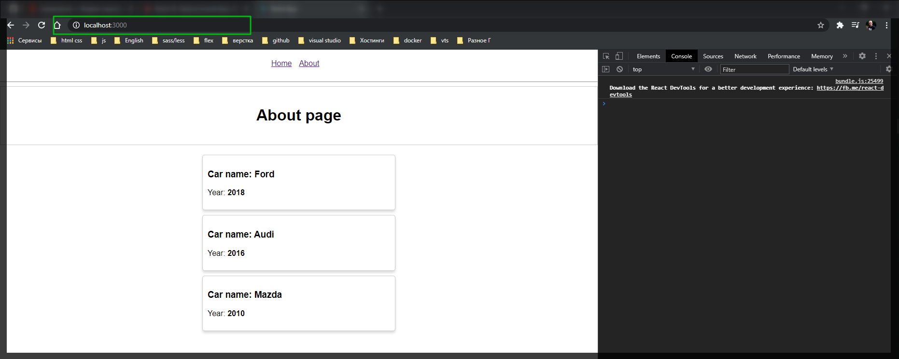
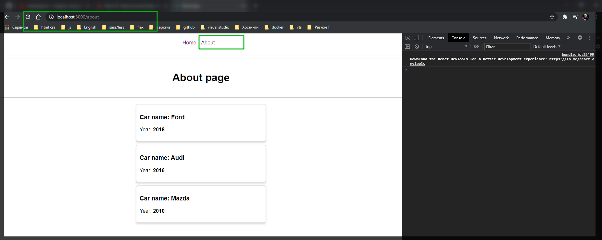

# Установка и настройка.

Делаю какие-то базовые комоненты. После чего устанавливаю пакет **react-router-dom** [https://www.npmjs.com/package/react-router-dom](https://www.npmjs.com/package/react-router-dom)

```shell
npm install --save react-router-dom
```

Базовая подготовка для работы с роутингом. Для этого нам потребуется решить следующую задачу. Нам потребуется обернуть все наше приложение в спекциальный компонент который будет говорить **react** о том что в данном проекте мы используем роутинг.

Данный компонент hoc он добывается из пакета **react-router-dom**. Одно из удачных мест где его можно реализовать это корневой **index.js**. В нем есть компонент **App** который отвечает за все наше приложение.

```jsx
import React from 'react';
import ReactDOM from 'react-dom';
import './index.css';
import App from './App';
import registerServiceWorker from './registerServiceWorker';

ReactDOM.render(<App />, document.getElementById('root'));
registerServiceWorker();
```

Теперь импортирую новый компонент из библиотеки **react-router-dom** и компонент называется **BrouserRouter** который будет говорить нашему приложению о том что мы используем роутинг и что все это нужно обернуть и использовать дополнительные функции.

Теперь для удобства выношу все приложение в переменную **const application = ()**. Это будет переменная состоящаю из **JSX**. Корневым элементом будет **\<BrowserRouter>\</BrowserRouter>** И внутри его кладу наше приложение **App**.
Теперь в рендер передаю данную переменную.

И так приложение не сломалось. мы можем кликать на ссылки, но пока ничего не происходит.




