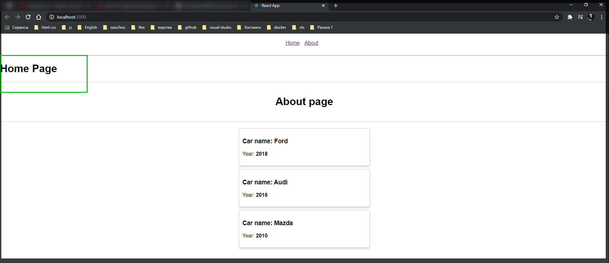

# Регистрация роутов

Посмотрим на компонент **App**.

```jsx
import React, { Component } from 'react';
import './App.scss';
import About from './About/About';
import Cars from './Cars/Cars';

class App extends Component {
  render() {
    return (
      <div>
        <nav className="nav">
          <ul>
            <li>
              <a href="/">Home</a>
            </li>
            <li>
              <a href="/about">About</a>
            </li>
          </ul>
        </nav>

        <hr />
        <About />

        <Cars />
      </div>
    );
  }
}

export default App;
```

Есть список из обычных ссылок. Они не работают пока. Хоть они и ведут на другие страницы. При переходе по ссылке мы переходим по ссылке, но так как у нас сервер который поднимает локально **React** работает как **single page application**, то он все обратно переадресовывает на **index.html** и поэтому мы просто получаем этот роут причем с перезагрузкой страницы. И по факту ничего не меняется так как выдается один и тот же файл.

У нас есть два компонента **\<About />** и **\<Cars />** которые хотелось бы перенести в отдельные страницы. И Допустим в качестве домашней страницы мы будем выводить какой-то другой компонент. Или можно поставить какой-то из существующих по **default**.

Для того что бы зарегистрировать новые роуты в **react** нам потребуется воспользоваться специальным компонентом который нам так же предоставляет **react-router-dom**. Это **import { Route } from 'react-router-dom';** С помощью компонента **Route** мы можем регистрировать различные роуты **react** приложения.

Пока что временно проинициализирую **\<Route />** и посмотрим как я могу его конфигурировать. А конфигурирую я его с помощью различных опций.

Первая обязательная опция называется **path={}** т.е. путь на который должен откликаться даный роут. Например мы можем передавать какое-то строковое значение. Мы хотим зарегистрировать какой-то роут для домашней страницы т.е. где путь совпадает со слэшем.

```jsx
import React, { Component } from 'react';
import './App.scss';
import { Route } from 'react-router-dom';
import About from './About/About';
import Cars from './Cars/Cars';

class App extends Component {
  render() {
    return (
      <div>
        <nav className="nav">
          <ul>
            <li>
              <a href="/">Home</a>
            </li>
            <li>
              <a href="/about">About</a>
            </li>
          </ul>
        </nav>

        <hr />
        <Route path="/" />

        <About />

        <Cars />
      </div>
    );
  }
}

export default App;
```

Теперь что мы можем делать дальше с этим **\<Route path="/" />** роутом? По сути у нас есть две возможности. Указать что он должен рендерить конкретно. Например с помощью атрибута **render={}** куда мы передаем некоторую **callback** функцию и можем что-то возвращать, например **JSX**.

```jsx
import React, { Component } from 'react';
import './App.scss';
import { Route } from 'react-router-dom';
import About from './About/About';
import Cars from './Cars/Cars';

class App extends Component {
  render() {
    return (
      <div>
        <nav className="nav">
          <ul>
            <li>
              <a href="/">Home</a>
            </li>
            <li>
              <a href="/about">About</a>
            </li>
          </ul>
        </nav>

        <hr />

        <Route
          path="/"
          render={() => {
            <h1>Home Page</h1>;
          }}
        />

        <About />

        <Cars />
      </div>
    );
  }
}

export default App;
```




Теперь как видите мы получаем некоторый заголовок. Мы его получаем потому что у нас **rout** совпадает с тем который мы зарегистрировали.

Теперь что интересно, если я перейду по другому роуту, то ничего не изменится.


Потому что данный роут у нас так же не зарегистрирован. Так происходит потому что **react-router** нужно сказать напряму. Если мы хотим точное совпадение пути то в таком случае нам нужно передавать дополнительный параметр. Потому что в данном случае путь который мы зарегистрировали для данного роута, он так же входит в состав того **url** адреса который сейчас забит в адресной строке.


И для того что бы исправить небольшую данную не точность мы можем передавать параметр **exact**. Даким образом мы говорим что данный роут нужно рендерить только в том случае если у нас адрес польностью совпадает с тем что мы зарегистрировали впути.

```jsx
import React, { Component } from 'react';
import './App.scss';
import { Route } from 'react-router-dom';
import About from './About/About';
import Cars from './Cars/Cars';

class App extends Component {
  render() {
    return (
      <div>
        <nav className="nav">
          <ul>
            <li>
              <a href="/">Home</a>
            </li>
            <li>
              <a href="/about">About</a>
            </li>
          </ul>
        </nav>

        <hr />

        <Route path="/" exact render={() => <h1>Home Page</h1>} />

        <About />

        <Cars />
      </div>
    );
  }
}

export default App;
```

Теперь если мы посмотрим то у нас нет ничего лишнего относящегося к домашней страницы.


При этом если я перейду на домашнюю страницу.


