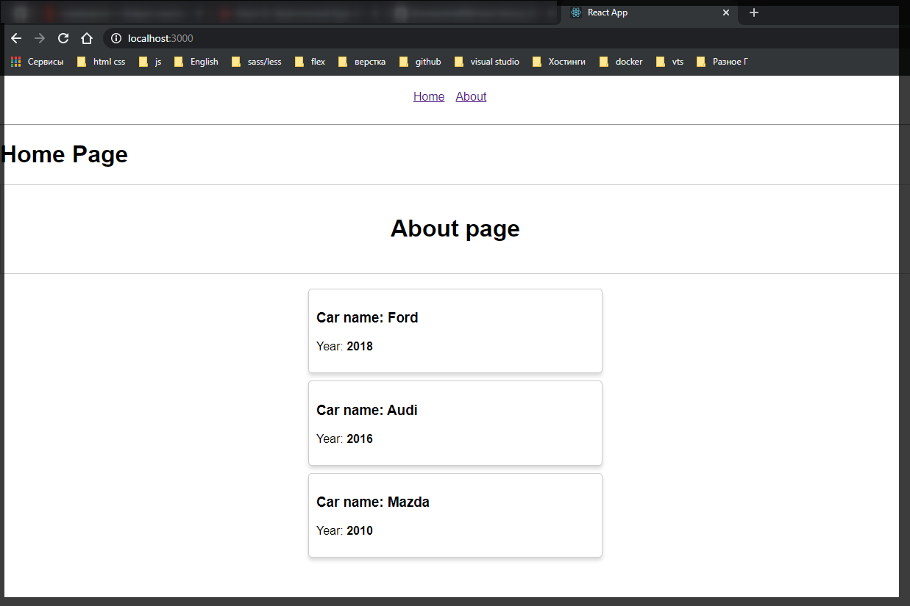
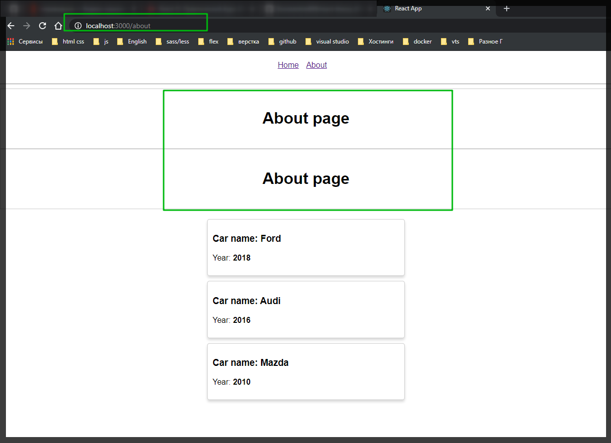
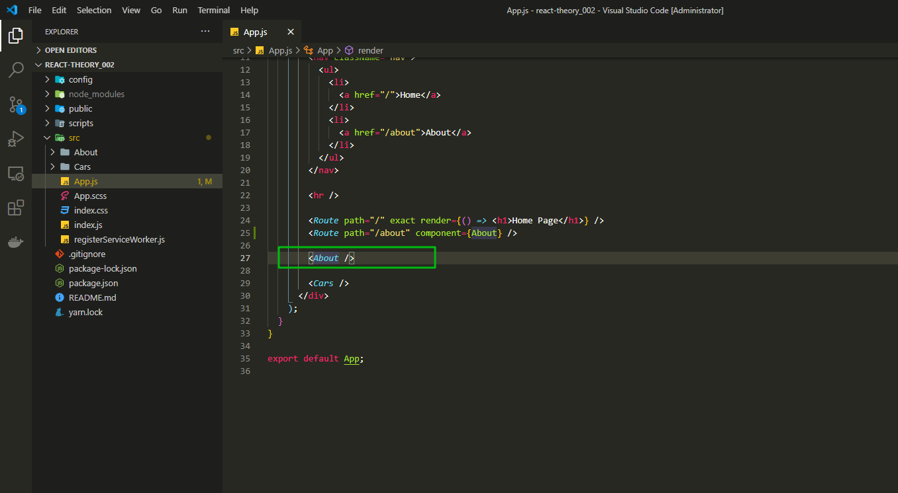
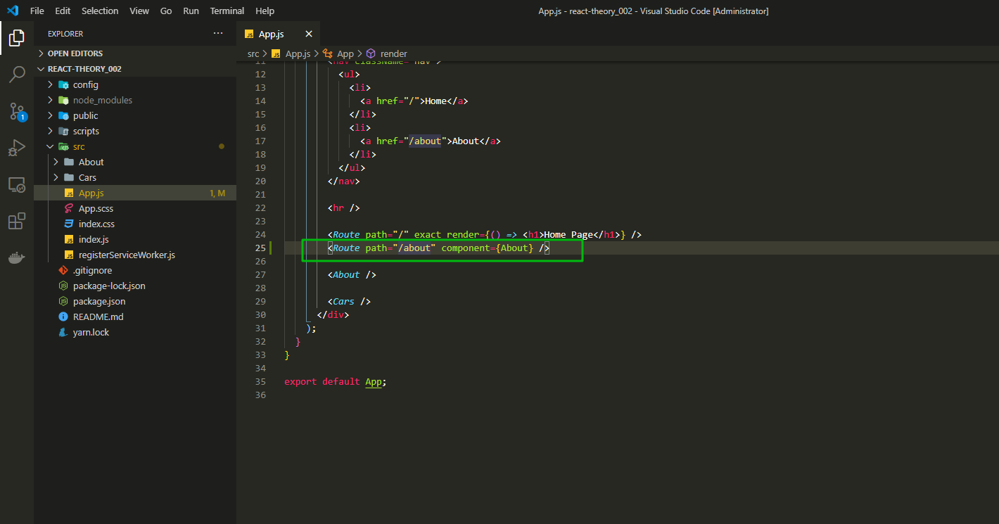
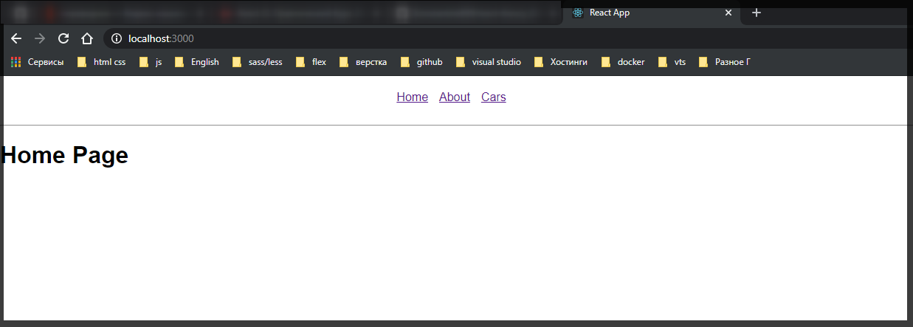
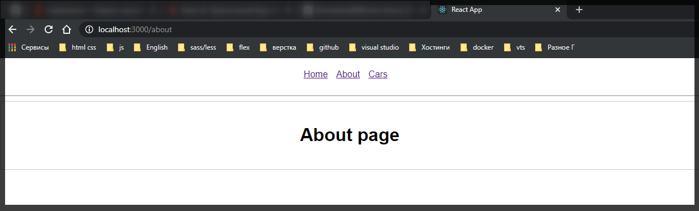
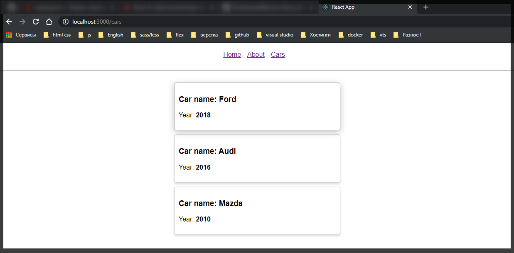

# Роутинг и компоненты

Теперь поговорим как мы сможем зарегистрировать не отдельный роут а целый компонент для своих специальных роутов.

Создадим две отдельные страницы для **About** и для **Cars**. Для этого так же проинициализирую новый компонент роута **\<Route path="/about" />**. Далее для того что бы зарегистрировать какой-то компонент мы можем также вызвать метод **render={()=>}** и в **callback** вернуть нужный нам компонент. Либо мы можем сделать проще. Просто указать параметр который называется **component={About}** куда я могу передать например страницу About не как **JSX** а как обычный компонент **\<Route path="/about" component={About} />**.

```jsx
import React, { Component } from 'react';
import './App.scss';
import { Route } from 'react-router-dom';
import About from './About/About';
import Cars from './Cars/Cars';

class App extends Component {
  render() {
    return (
      <div>
        <nav className="nav">
          <ul>
            <li>
              <a href="/">Home</a>
            </li>
            <li>
              <a href="/about">About</a>
            </li>
          </ul>
        </nav>

        <hr />

        <Route path="/" exact render={() => <h1>Home Page</h1>} />
        <Route path="/about" component={About} />

        <About />

        <Cars />
      </div>
    );
  }
}

export default App;
```

На домашней странице ничего не изменилось



А на роуте **about** компонент выводится два раза



Первый вовод происходит потому что мы его выводим в **App** компоненте



А второй получается потому что он среагировал на нужный нам роут.



Теперь сделаю тоже самое для списка всех машин. И уберу вывод компонентов. И добавлю ссылку.

```jsx
import React, { Component } from 'react';
import './App.scss';
import { Route } from 'react-router-dom';
import About from './About/About';
import Cars from './Cars/Cars';

class App extends Component {
  render() {
    return (
      <div>
        <nav className="nav">
          <ul>
            <li>
              <a href="/">Home</a>
            </li>
            <li>
              <a href="/about">About</a>
            </li>
            <li>
              <a href="/cars">Cars</a>
            </li>
          </ul>
        </nav>

        <hr />

        <Route path="/" exact render={() => <h1>Home Page</h1>} />
        <Route path="/about" component={About} />
        <Route path="/cars" component={Cars} />
      </div>
    );
  }
}

export default App;
```







Не смотря на то что у нас идет перезагрузка страницы мы получаем нужный нам компонент и он отрисовывается грамотно.
