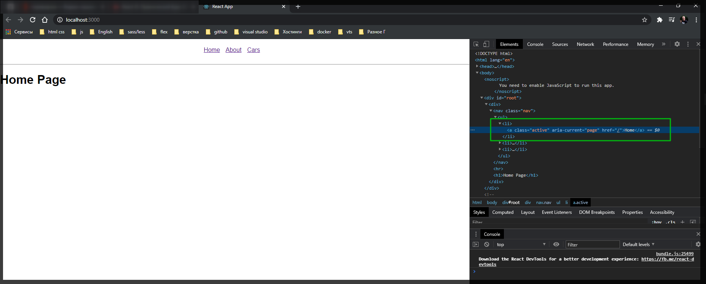
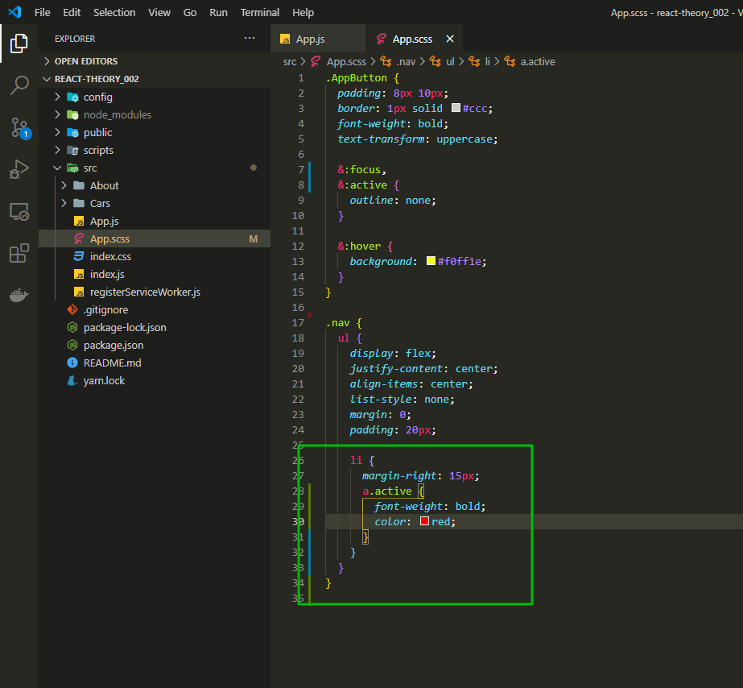
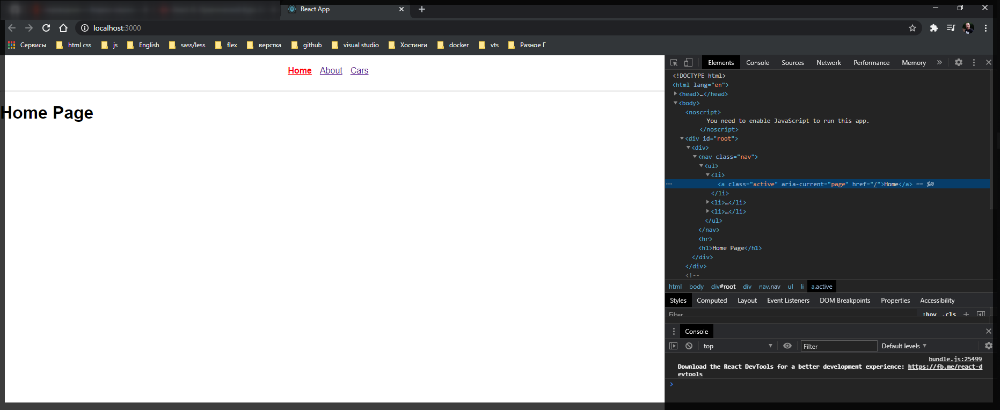
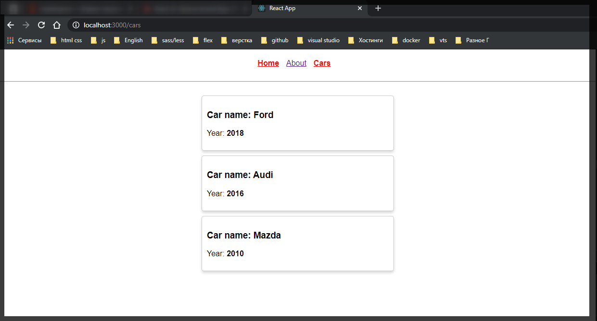
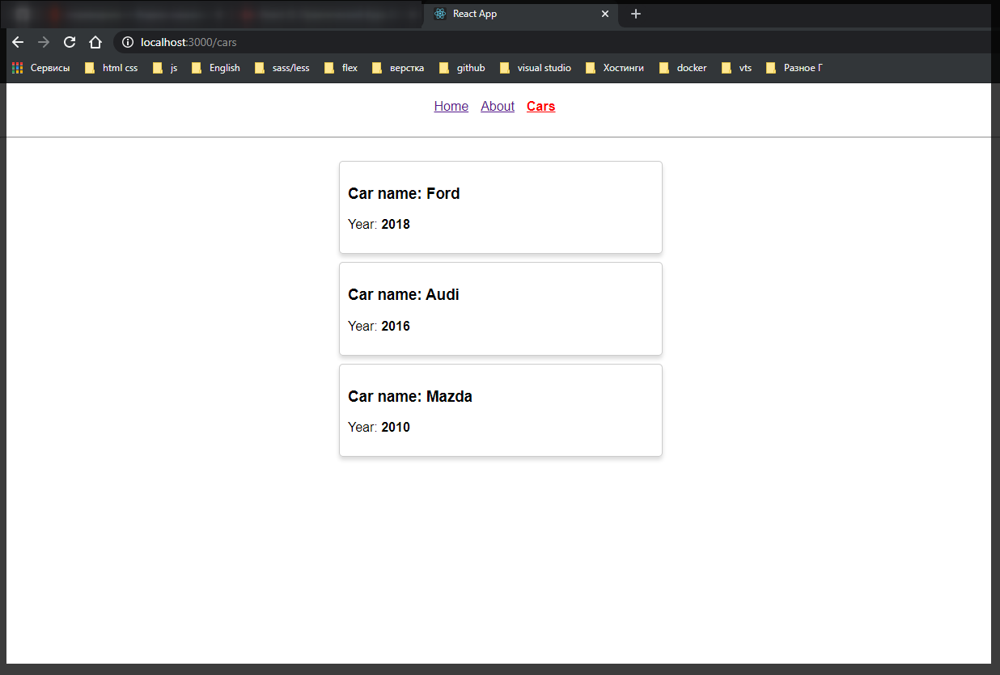
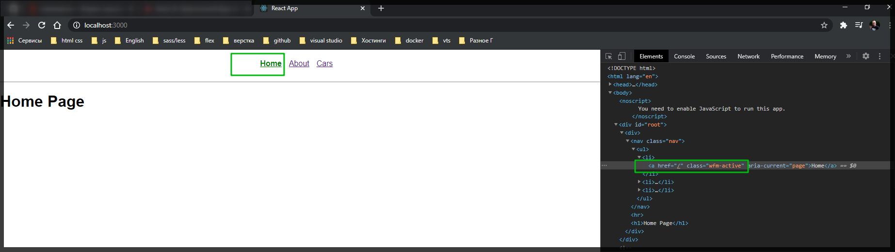
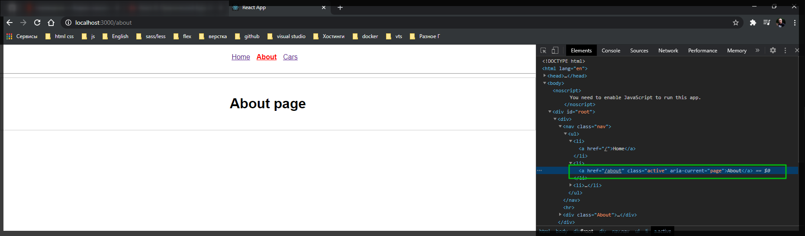
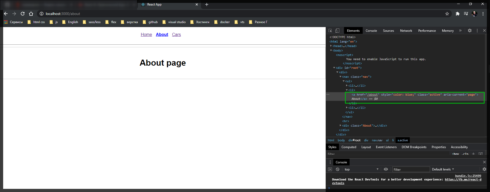
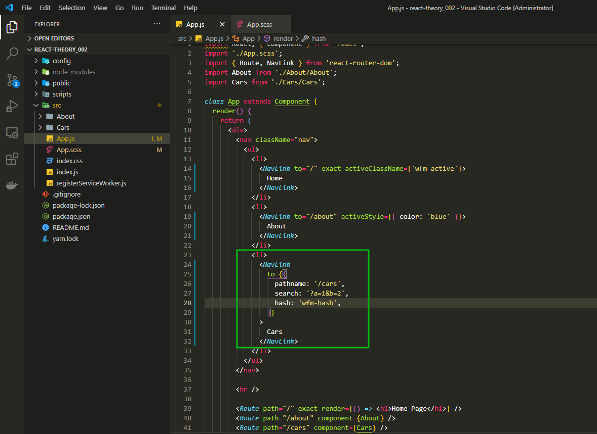
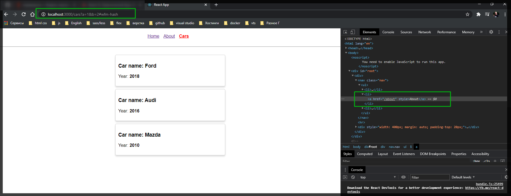

# Параметры ссылки

Рассмотрим параметры которые можно передавать внутрь компонента **NavLink** для того что бы более комфортно конфигурировать данный элемент и добавлять к нему определенные свойства.

Рассмотрим пример активной ссылки. Если происпектировать ссылку то можно заметить что компонент **NavLink** он добавляет специальный **class="active"** потому что данная ссылка является активной.



С помощью данного класса я могу стилизовать кнопку.



```scss
.AppButton {
  padding: 8px 10px;
  border: 1px solid #ccc;
  font-weight: bold;
  text-transform: uppercase;

  &:focus,
  &:active {
    outline: none;
  }

  &:hover {
    background: #f0ff1e;
  }
}

.nav {
  ul {
    display: flex;
    justify-content: center;
    align-items: center;
    list-style: none;
    margin: 0;
    padding: 20px;

    li {
      margin-right: 15px;
      a.active {
        font-weight: bold;
        color: red;
      }
    }
  }
}
```



Однако если мы перейдем на другую страницу то увидим проблему.



Сейчас у нас есть две активных ссылки. Хотя у нас показывается страница **Cars**.

На самом деле здесь работает правило то которое мы проходили ранее т.е. путь для домашней страницы у нас является корневым. И по сути путь который мы сейчас видим в адресной строке он так же в себе включает путь до страницы **home**. По-этому мы можем добавить специальный параметр в **App.js** в **NavLink** параметр **exact**. Т.е. данная ссылка будет делаться активной в том случае если пути полностью совпадают.

```jsx
import React, { Component } from 'react';
import './App.scss';
import { Route, NavLink } from 'react-router-dom';
import About from './About/About';
import Cars from './Cars/Cars';

class App extends Component {
  render() {
    return (
      <div>
        <nav className="nav">
          <ul>
            <li>
              <NavLink to="/" exact>
                Home
              </NavLink>
            </li>
            <li>
              <NavLink to="/about">About</NavLink>
            </li>
            <li>
              <NavLink to="/cars">Cars</NavLink>
            </li>
          </ul>
        </nav>

        <hr />

        <Route path="/" exact render={() => <h1>Home Page</h1>} />
        <Route path="/about" component={About} />
        <Route path="/cars" component={Cars} />
      </div>
    );
  }
}

export default App;
```



> Т.е. мое понимание. При проверке выполняется условие что если событие клика, в которое принимает значение роута, эквивалентно или равно переменной в которую входит значение роута, происходит, то данной ссылке присваивается класс active.

> Однако я не могу понять почему он данное значение вешает на корневой роут, а сверка происходит и с другими роутами.

Так же бывают случаи что мы не хотим использовать стандартное значение класса **active**. И допустим мы хотим добавлять свой какой-то другой класс. Допустим который предлагает нам тот или другой **framework**. Для этого мы можем так же сконфигурировать данную ссылку добавив параметр **activeClassName={}** где в строковом формате указываю нащвание класса.

```jsx
import React, { Component } from 'react';
import './App.scss';
import { Route, NavLink } from 'react-router-dom';
import About from './About/About';
import Cars from './Cars/Cars';

class App extends Component {
  render() {
    return (
      <div>
        <nav className="nav">
          <ul>
            <li>
              <NavLink to="/" exact activeClassName={'wfm-active'}>
                Home
              </NavLink>
            </li>
            <li>
              <NavLink to="/about">About</NavLink>
            </li>
            <li>
              <NavLink to="/cars">Cars</NavLink>
            </li>
          </ul>
        </nav>

        <hr />

        <Route path="/" exact render={() => <h1>Home Page</h1>} />
        <Route path="/about" component={About} />
        <Route path="/cars" component={Cars} />
      </div>
    );
  }
}

export default App;
```

```scss
.AppButton {
  padding: 8px 10px;
  border: 1px solid #ccc;
  font-weight: bold;
  text-transform: uppercase;

  &:focus,
  &:active {
    outline: none;
  }

  &:hover {
    background: #f0ff1e;
  }
}

.nav {
  ul {
    display: flex;
    justify-content: center;
    align-items: center;
    list-style: none;
    margin: 0;
    padding: 20px;

    li {
      margin-right: 15px;
      a.active {
        font-weight: bold;
        color: red;
      }
      a.wfm-active {
        font-weight: bold;
        color: green;
      }
    }
  }
}
```





Так же мы можем добавлять специальную стилистику для выбранной нами ссылки. Для этого есть параметр **activeStyle={{}}** и сюда мы можем передавать **js** объект **activeStyle={{ color: 'blue' }}**.

```jsx
import React, { Component } from 'react';
import './App.scss';
import { Route, NavLink } from 'react-router-dom';
import About from './About/About';
import Cars from './Cars/Cars';

class App extends Component {
  render() {
    return (
      <div>
        <nav className="nav">
          <ul>
            <li>
              <NavLink to="/" exact activeClassName={'wfm-active'}>
                Home
              </NavLink>
            </li>
            <li>
              <NavLink to="/about" activeStyle={{ color: 'blue' }}>
                About
              </NavLink>
            </li>
            <li>
              <NavLink to="/cars">Cars</NavLink>
            </li>
          </ul>
        </nav>

        <hr />

        <Route path="/" exact render={() => <h1>Home Page</h1>} />
        <Route path="/about" component={About} />
        <Route path="/cars" component={Cars} />
      </div>
    );
  }
}

export default App;
```



Т.е. мы затираем значения по **default** и назаначаем новые стили. Т.к. у **inline** стилей преоритет выше то применяются они.

Следующий параметр который есть у **NavLink** он непосредственно относится к пути который мы указываем.
В параметр to мы можем передавать объект **to={{}}**. И для того что бы указать путь мы указываем параметр **pathname: '/cars'**. Так же мы можем указывать еще два параметра. Первый **search: '?'** и сюда мы можем указывать какие-то параметры которые должны идти после **?** т.е. **get** параметры например **serch: '?a=1&b=2'**. И так же мы можем указывать параметры **hash** для того что бы например скролить до определенного элемента.



```jsx
import React, { Component } from 'react';
import './App.scss';
import { Route, NavLink } from 'react-router-dom';
import About from './About/About';
import Cars from './Cars/Cars';

class App extends Component {
  render() {
    return (
      <div>
        <nav className="nav">
          <ul>
            <li>
              <NavLink to="/" exact activeClassName={'wfm-active'}>
                Home
              </NavLink>
            </li>
            <li>
              <NavLink to="/about" activeStyle={{ color: 'blue' }}>
                About
              </NavLink>
            </li>
            <li>
              <NavLink
                to={{
                  pathname: '/cars',
                  search: '?a=1&b=2',
                  hash: 'wfm-hash',
                }}
              >
                Cars
              </NavLink>
            </li>
          </ul>
        </nav>

        <hr />

        <Route path="/" exact render={() => <h1>Home Page</h1>} />
        <Route path="/about" component={About} />
        <Route path="/cars" component={Cars} />
      </div>
    );
  }
}

export default App;
```



У нас есть определенный набор **get** параметров плюс у нас так же имеется **hash**. Таким образом мы можем конфигурировать **url** адрес как мы захотим.
