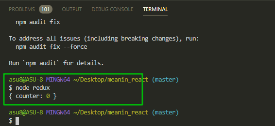
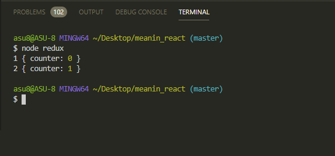
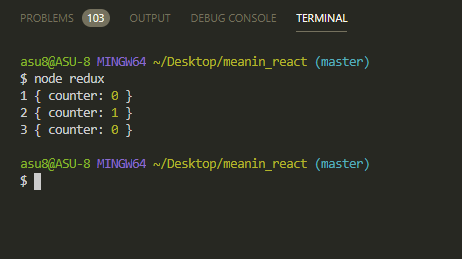
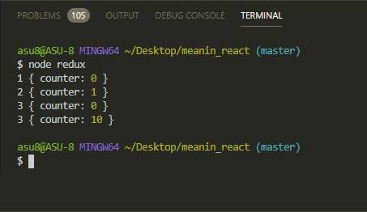
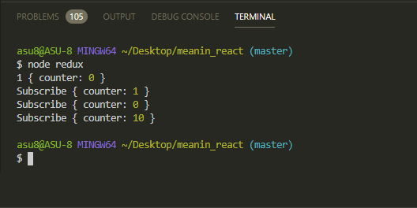

# Как работает Redux

**Redux** по своей сути ни как не связан с **react**. Это просто некоторая идеология по которой мы формируем модель данных на **frontend**.

Для этого нам потребуется сделать некоторые действия. Для начало в терминале устанавливаю библиотеку.

```shell
npm install --save-dev redux
```

Теперь создаю отдельный файл, с любым названием **redux.js**. И в данном файле просто потренируюсь. Так как мы с вами работает на платформе **node.js** и это ни как не относится к приложению, то при инпорте библиотеки использую **require**.

```jsx
const redux = require('redux');
```

И теперь по сути у меня есть библиотека с минимальным набором функций которую мы можем использовать при работе с redux приложениями.

Нам нужно разобраться какие основные части входят в **redux**

```jsx
const redux = require('redux');

//Reduser

//Store

//Actions
```

Из этих составляющих вещей должен состоять весь **redux**.

Рассмотрим как мы можем реализовать целую систему работающую на **redux**.

1. Для начало необходимо создать некоторый **stare** т.е. то место где я буду хранить все данные. Потому что **Redux** пропогандирует такую вещь где весь **state** который описывается, например в **react** компоненте. Он описывается для всего приложения в целом т.е. в одном **js** объекте содержится все состояние всего приложения которое называется **Store**.

Создаю const store = redux.createStore()

```jsx
const redux = require('redux');

//Reduser

//Store
const store = redux.createStore();

//Actions
```

Теперь в данную функцию **createStore()** мы должны передать некоторую сущность которая называется **reduser**. Что такое reduser в данном случае. **Reduser** это на самом деле обычная **JS** функция которая делает некоторые преобразования.

Создаю функцию **const reduser = () =>{}** которая принимает в себя некоторые параметры. Первым параметром данная функция принимает в себя некоторый **state** т.е. тот объект который описывает состояние всего нашего приложения.

Например в нашем случае мы можем создать некоторый начальный **state**. Например

```jsx
const redux = require('redux');

const initialState = {};

//Reduser
const reducer = (state) => {};

//Store
const store = redux.createStore();

//Actions
```

**initialState** это объект описывающий все наше приложение. Допустим у нас есть параметр **counter** который равняется нулю. Так вот параметр **state**, в функции **reduser**, равняется начальному состоянию которое прописано в объекте **initialState**.

```jsx
const redux = require('redux');

const initialState = {
  counter: 0,
};

//Reduser
const reducer = (state) => {};

//Store
const store = redux.createStore();

//Actions
```

Для первого запуска, если **state** еще не определен, то он у нас по умолчанию равняется начальному состоянию **state = initialState**. И вторым параметром в **reduser** принимаю некоторый **action**

```jsx
const redux = require('redux');

const initialState = {
  counter: 0,
};

//Reduser
const reducer = (state = initialState, action) => {};

//Store
const store = redux.createStore();

//Actions
```

Данный объект **action** по-сути следует одному правилу. У него есть одно обязательное поле которое называется **type**. По другому правилу **reduser** мы должны возвращать новый **state** из данной функции **reduser**. Пока что просто верну **state**, и пока не буду концентрироватся на **action**.

```jsx
const redux = require('redux');

const initialState = {
  counter: 0,
};

//Reduser
const reducer = (state = initialState, action) => {
  return state;
};

//Store
const store = redux.createStore();

//Actions
```

И теперь есть простая функция **reduser** которая пока что в себя ничего не принимает, потому что мы в нее ничего на передаем, но при этом она возвращает наш **state** которая в нашем случае будет равняться данной константе **const initialState**.

Далее данную функцию **reduser** я должен передать в функция **createStore()**

```jsx
const redux = require('redux');

const initialState = {
  counter: 0,
};

//Reduser
const reducer = (state = initialState, action) => {
  return state;
};

//Store
const store = redux.createStore(reducer);

//Actions
```

Обязательно пишу вот так **const store = redux.createStore(reducer);** и не вызываю функцию **reducer**.

Теперь у меня есть некоторый **store** с которым я могу работать. Что мы можем делать с данным стором? Например мы можем получить некоторое состояние которое сейчас есть в **store**. В консоли я могу написать **store** и далее у каждого **store** есть функция **getState()** которая позволяет нам получить текущее состояние **store**.

```jsx
const redux = require('redux');

const initialState = {
  counter: 0,
};

//Reduser
const reducer = (state = initialState, action) => {
  return state;
};

//Store
const store = redux.createStore(reducer);
console.log(store.getState());

//Actions
```

Для того что бы запустить данный файл я могу просто написать **node** и название файла

```shell
node redux
```



По сути в **store** т.е. объект который содержить все состояние приложения сейчас содержится объект **counter:0**.

Но пока что мы ничего не можем изменить.

И как раз таки что бы как-то менять состояние нашего **store** мы должны реализовать следующую сущность которая называется **Actions**.

Следаем так что счетчик может увеличиваться или уменьшатся на какое-то значение.

Для этого я могу создать const **addCounter = {}** который будет обычным **js** объектом.

```jsx
const redux = require('redux');

const initialState = {
  counter: 0,
};

//Reduser
const reducer = (state = initialState, action) => {
  return state;
};

//Store
const store = redux.createStore(reducer);
console.log(store.getState());

//Actions

const addCounter = {};
```

Как я говорил у **action** есть одно обязательное правило. В данном **action** должно быть определено поле **type** которая по своей сути является просто какой-то строкой

```jsx
const redux = require('redux');

const initialState = {
  counter: 0,
};

//Reduser
const reducer = (state = initialState, action) => {
  return state;
};

//Store
const store = redux.createStore(reducer);
console.log(store.getState());

//Actions

const addCounter = {
  type: 'ADD',
};
```

и это **type: 'ADD'** и есть у нас **Action**.

Теперь для того что бы каким-то образом обработать данный **action** мы видим что мы его получаем вторым параметром в функции **reduser**.

И для чего нам как раз таки нужен **type**? Поле **type** нам нужно для того что бы определить какое именно действие мы сейчас совершаем т.е. мы это определяем именно по данной строке **type: 'ADD'**.

Обычно это делается через конструкцию **switch** **case** но мы воспользуемся **if**. В параметрах условия **if** прописываю **action.type === 'ADD'**, то в таком члучае мы должны выполнить определенные действие. Например я хочу вернуть новое состояние, т.е. я **return{}** это важно, где поле **counter** я должен увеличить на 1 в зависимости от предыдущего состояния. Т.е. **counter: state.counter + 1**.

```jsx
const redux = require('redux');

const initialState = {
  counter: 0,
};

//Reduser
const reducer = (state = initialState, action) => {
  if (action.type === 'ADD') {
    return {
      counter: state.counter + 1,
    };
  }
  return state;
};

//Store
const store = redux.createStore(reducer);
console.log(store.getState());

//Actions

const addCounter = {
  type: 'ADD',
};
```

Теперь у меня есть **Action**. У нас описано действие которое мы должны предпринять. Однако объект **addCounter** еще ни как не используется. И нам его нужно как-то применить.

Для этого я могу обратиться к **store** и сделать вызов данного действия. Делается это с помощью метода **dispatch** в который мы передаем непосредственно сам **action**.

Я обращаюсь к **stare** и у него есть метод **dispatch()** куда мы просто передаем некоторый **action** т.е. в нашем случае это **addCounter**.

```jsx
const redux = require('redux');

const initialState = {
  counter: 0,
};

//Reduser
const reducer = (state = initialState, action) => {
  if (action.type === 'ADD') {
    return {
      counter: state.counter + 1,
    };
  }
  return state;
};

//Store
const store = redux.createStore(reducer);
console.log('1', store.getState());

//Actions

const addCounter = {
  type: 'ADD',
};

store.dispatch(addCounter);
console.log('2', store.getState());
```

```shell
node redux
```



Сейчес у меня есть два вывода в консоль где у меня есть первое состояние **state** **counter: 0** , и потом у меня есть состояние **counter : 1**.

Еще раз пробежимся по шагам и посмотрим как это получилось. Я содал некоторый **store** куда переда функцию **reduser** которая изменяет данный **store**.

В функции **reduser** мы описаль начальное состояние **state = initialState** котарое берется из данной костанты

```jsx
const initialState = {
  counter: 0,
};
```

и мы говорим если у нас выпадает некоторый **action** с помощью функции **dispatch**, то тогда мы будем проветять **action.type**. Если **action.type** совпадает с тем что мы умеем обрабатывать **'ADD'** то тогда мы будем модифицировать наш **state** т.е. на основе предыдущего состояния **counter: state.counter + 1**. И в ответе мы возвращаем новый **state** где так же содержится поле **counter**, но оно уже изменяется в зависимости от **action** который мы **dispatch**.

Теперь я могу сделать то же самое и для вычитания.

Обращаюсь к **store.dispatch()** и сюда мы должны передавать некоторый объект в котором так же указываю поле **type: 'SUB'**

```jsx
const redux = require('redux');

const initialState = {
  counter: 0,
};

//Reduser
const reducer = (state = initialState, action) => {
  if (action.type === 'ADD') {
    return {
      counter: state.counter + 1,
    };
  }
  return state;
};

//Store
const store = redux.createStore(reducer);
console.log('1', store.getState());

//Actions

const addCounter = {
  type: 'ADD',
};

store.dispatch(addCounter);
console.log('2', store.getState());

store.dispatch({ type: 'SUB' });
console.log('3', store.getState());
```

И теперь нам так же необходимо этот **type: 'SUB'** отправить в наш **reduser**. И далее пишу еще одно условие.

```jsx
const redux = require('redux');

const initialState = {
  counter: 0,
};

//Reduser
const reducer = (state = initialState, action) => {
  if (action.type === 'ADD') {
    return {
      counter: state.counter + 1,
    };
  }
  if (action.type === 'SUB') {
    return {
      counter: state.counter - 1,
    };
  }
  return state;
};

//Store
const store = redux.createStore(reducer);
console.log('1', store.getState());

//Actions

const addCounter = {
  type: 'ADD',
};

store.dispatch(addCounter);
console.log('2', store.getState());

store.dispatch({ type: 'SUB' });
console.log('3', store.getState());
```

```shell
node redux
```



Теперь разберем еще одну возможность. Часто бывает что мы хотим использовать кастомное значение которое мы передаем. Допустим мы хотим добавить определенное число. К примеру добавляю новый **type: 'ADD_NUMBER'**

```jsx
const redux = require('redux');

const initialState = {
  counter: 0,
};

//Reduser
const reducer = (state = initialState, action) => {
  if (action.type === 'ADD') {
    return {
      counter: state.counter + 1,
    };
  }
  if (action.type === 'SUB') {
    return {
      counter: state.counter - 1,
    };
  }
  return state;
};

//Store
const store = redux.createStore(reducer);
console.log('1', store.getState());

//Actions

const addCounter = {
  type: 'ADD',
};

store.dispatch(addCounter);
console.log('2', store.getState());

store.dispatch({ type: 'SUB' });
console.log('3', store.getState());

store.dispatch({ type: 'ADD_NUMBER' });
console.log('3', store.getState());
```

И теперь в данном **action** т.е. в объекте который мы сформировали мы можем так же задавать определенные поля, например value где передаю то число которое хочу прибавить.

```jsx
const redux = require('redux');

const initialState = {
  counter: 0,
};

//Reduser
const reducer = (state = initialState, action) => {
  if (action.type === 'ADD') {
    return {
      counter: state.counter + 1,
    };
  }
  if (action.type === 'SUB') {
    return {
      counter: state.counter - 1,
    };
  }
  return state;
};

//Store
const store = redux.createStore(reducer);
console.log('1', store.getState());

//Actions

const addCounter = {
  type: 'ADD',
};

store.dispatch(addCounter);
console.log('2', store.getState());

store.dispatch({ type: 'SUB' });
console.log('3', store.getState());

store.dispatch({ type: 'ADD_NUMBER', value: 10 });
console.log('3', store.getState());
```

При написании условия в теле цикла обращаюсь к **state.counter +** и далее нужно прибавить **value**. Данное значение храниться в параметре **action** функции **reducer**. и поэтому **counter: state.counter + action.value**,

```jsx
const redux = require('redux');

const initialState = {
  counter: 0,
};

//Reduser
const reducer = (state = initialState, action) => {
  if (action.type === 'ADD') {
    return {
      counter: state.counter + 1,
    };
  }
  if (action.type === 'SUB') {
    return {
      counter: state.counter - 1,
    };
  }
  if (action.type === 'ADD_NUMBER') {
    return {
      counter: state.counter + action.value,
    };
  }
  return state;
};

//Store
const store = redux.createStore(reducer);
console.log('1', store.getState());

//Actions

const addCounter = {
  type: 'ADD',
};

store.dispatch(addCounter);
console.log('2', store.getState());

store.dispatch({ type: 'SUB' });
console.log('3', store.getState());

store.dispatch({ type: 'ADD_NUMBER', value: 10 });
console.log('3', store.getState());
```



Едиственно что еще есть интересного. Мы можем подписыватся на изменения **store**. Т.е. мы сейчас вручную мануально вызываем все эти **getState**. Но нам хочется узнавать самосоятельно когда что-то обновилось. Мы не знаем что и когда было обнавлено.

Воспользуемся более умной конструкцией которая по сути вседа используется в redux. Где - нибудь на верху. Это обязательно, перед тем как мы будем **dispatch** некоторые **actions**. Мы можем обратится к **store** и подписаться на его изменения т.е. вызвать метод **action.subscribe()**. В данный метод я принимаю некоторый **callback**. В нем вывожу в консоль параметр **store.GetState()**.

```jsx
const redux = require('redux');

const initialState = {
  counter: 0,
};

//Reduser
const reducer = (state = initialState, action) => {
  if (action.type === 'ADD') {
    return {
      counter: state.counter + 1,
    };
  }
  if (action.type === 'SUB') {
    return {
      counter: state.counter - 1,
    };
  }
  if (action.type === 'ADD_NUMBER') {
    return {
      counter: state.counter + action.value,
    };
  }
  return state;
};

//Store
const store = redux.createStore(reducer);
console.log('1', store.getState());

store.subscribe(() => {
  console.log('Subscribe', store.getState());
});

//Actions

const addCounter = {
  type: 'ADD',
};

store.dispatch(addCounter);

store.dispatch({ type: 'SUB' });

store.dispatch({ type: 'ADD_NUMBER', value: 10 });
```

Т.е. сейчас при любои изменении **store** мы будем просто попадать в данную функцию **subscribe** и получать актуальный **state**.

```shell
node redux
```



Т.е. сначало произошло событие **store.dispatch(addCounter);** и потом **store.dispatch({ type: 'SUB' });** и **store.dispatch({ type: 'ADD_NUMBER', value: 10 });**

Вместо **sibscribe** мы будем использовать немного другую функцию, но на данное изменение **store** будут реагировать наши **react** компоненты.
