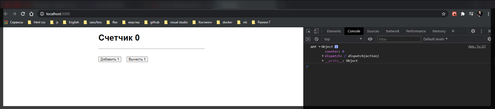
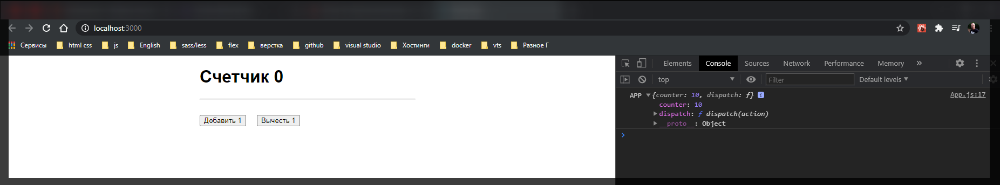
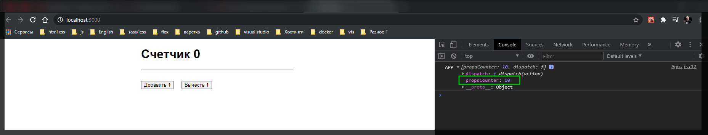
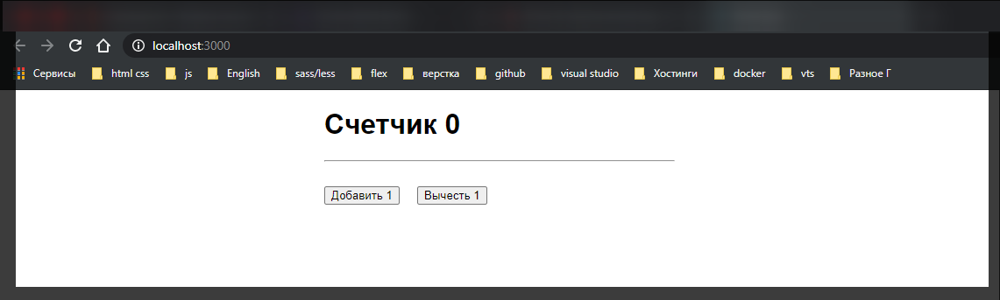
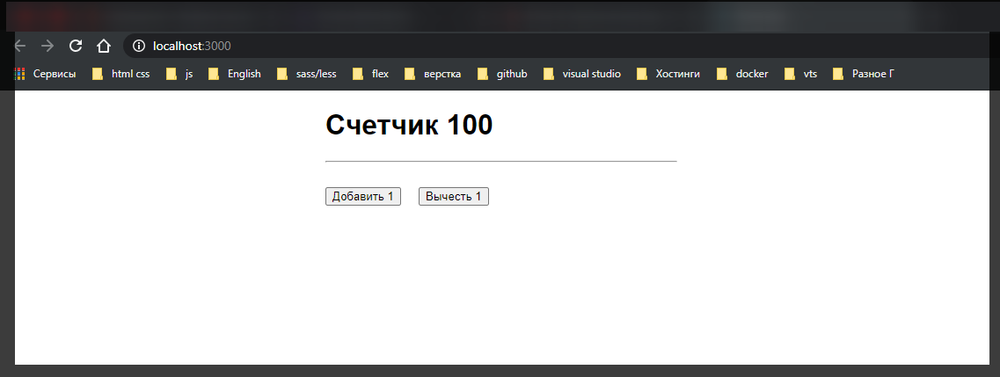

# Подключение компонента

Подключаю **App** компонент к **Redux** к общему **store** и будем забирать состояние не из локального **state**, а уже из **state** всего **Redux**.

Для этого мы можем воспользоваться функцией которая позволяет нам соеденить компонент реакта с **store**. Называется данная функция **connect** и импортируется из бибилиотеки **react-redux**.

```jsx
import React, { Component } from 'react';
import { connect } from 'react-redux';
import './App.scss';

class App extends Component {
  state = {
    counter: 0,
  };

  updateCounter(value) {
    this.setState({
      counter: this.state.counter + value,
    });
  }

  render() {
    return (
      <div className={'App'}>
        <h1>
          Счетчик <strong>{this.state.counter}</strong>
        </h1>

        <hr />

        <div className="Actions">
          <button onClick={() => this.updateCounter(1)}>Добавить 1</button>
          <button onClick={() => this.updateCounter(-1)}>Вычесть 1</button>
        </div>
      </div>
    );
  }
}

export default App;
```

И работает **connect** так же как и **HOC** т.е. компоненты высокого порядка.

Перехожу в самый низ компонента **App.js** и там где мы экспортируем вызываю функцию **connect**. Однако здесь есть одна маленькая особенность. После того как будет вызвана функция **connect()** она нам вренет новую функцию в которую мы должны положить тот компонент с которым мы хотим работать т.е. в нашем случае это **App**.

```jsx
import React, { Component } from 'react';
import { connect } from 'react-redux';
import './App.scss';

class App extends Component {
  state = {
    counter: 0,
  };

  updateCounter(value) {
    this.setState({
      counter: this.state.counter + value,
    });
  }

  render() {
    return (
      <div className={'App'}>
        <h1>
          Счетчик <strong>{this.state.counter}</strong>
        </h1>

        <hr />

        <div className="Actions">
          <button onClick={() => this.updateCounter(1)}>Добавить 1</button>
          <button onClick={() => this.updateCounter(-1)}>Вычесть 1</button>
        </div>
      </div>
    );
  }
}

export default connect()(App);
```

Теперь нам нужно понять какие -параметры мы можем передавать в функцию **connect**. Данная функция принимает в себя два опциональных параметра т.е. две функции. Первая функция которую мы создадим называется **function** **mapStateToProps(){}**. Название мы можем выбрать любое. Данная функция принимает в себя некоторый **state** т.е. общий **state** который характерен для всего нашего приложения. В нашем случае это пока что **initialState** т.е.

```jsx
import React, { Component } from 'react';
import { connect } from 'react-redux';
import './App.scss';

class App extends Component {
  state = {
    counter: 0,
  };

  updateCounter(value) {
    this.setState({
      counter: this.state.counter + value,
    });
  }

  render() {
    return (
      <div className={'App'}>
        <h1>
          Счетчик <strong>{this.state.counter}</strong>
        </h1>

        <hr />

        <div className="Actions">
          <button onClick={() => this.updateCounter(1)}>Добавить 1</button>
          <button onClick={() => this.updateCounter(-1)}>Вычесть 1</button>
        </div>
      </div>
    );
  }
}

function mapStateToProps(state) {}

export default connect()(App);
```

```jsx
//rootReducer.js

const initialState = {
  counter: 0,
};

export default function rootReducer(state = initialState, action) {
  return state;
}
```

И что мы вообще можем делать в функции **mapStateToProps**?

Мы можем вернуть новый **JS** объект **return{}**, где мы изменим и трансформируем какие-то данные из **state** для того что бы они стали обычными параметрами для компонента которые мы соеденяем. Допустим в этой функции мы хотим определить **props**(реквизит) **counter:** который будет равняться переменной **state.counter**

```jsx
import React, { Component } from 'react';
import { connect } from 'react-redux';
import './App.scss';

class App extends Component {
  state = {
    counter: 0,
  };

  updateCounter(value) {
    this.setState({
      counter: this.state.counter + value,
    });
  }

  render() {
    return (
      <div className={'App'}>
        <h1>
          Счетчик <strong>{this.state.counter}</strong>
        </h1>

        <hr />

        <div className="Actions">
          <button onClick={() => this.updateCounter(1)}>Добавить 1</button>
          <button onClick={() => this.updateCounter(-1)}>Вычесть 1</button>
        </div>
      </div>
    );
  }
}

function mapStateToProps(state) {
  return {
    counter: state.counter,
  };
}

export default connect()(App);
```

Теперь данное поле **counter: state.counter**, мы можем использовать в **App** компоненте уже не как **state** а как **props**.

Теперь функцию **mapStateToProps** передаю первым параметром в функцию **connect** не вызывая ее.

```jsx
import React, { Component } from 'react';
import { connect } from 'react-redux';
import './App.scss';

class App extends Component {
  state = {
    counter: 0,
  };

  updateCounter(value) {
    this.setState({
      counter: this.state.counter + value,
    });
  }

  render() {
    return (
      <div className={'App'}>
        <h1>
          Счетчик <strong>{this.state.counter}</strong>
        </h1>

        <hr />

        <div className="Actions">
          <button onClick={() => this.updateCounter(1)}>Добавить 1</button>
          <button onClick={() => this.updateCounter(-1)}>Вычесть 1</button>
        </div>
      </div>
    );
  }
}

function mapStateToProps(state) {
  return {
    counter: state.counter,
  };
}

export default connect(mapStateToProps)(App);
```

Теперь в методе **render** в консоли выведем **'APP', this.props** и посмотрим что у нас здесь находится.

```jsx
import React, { Component } from 'react';
import { connect } from 'react-redux';
import './App.scss';

class App extends Component {
  state = {
    counter: 0,
  };

  updateCounter(value) {
    this.setState({
      counter: this.state.counter + value,
    });
  }

  render() {
    console.log('APP', this.props);
    return (
      <div className={'App'}>
        <h1>
          Счетчик <strong>{this.state.counter}</strong>
        </h1>

        <hr />

        <div className="Actions">
          <button onClick={() => this.updateCounter(1)}>Добавить 1</button>
          <button onClick={() => this.updateCounter(-1)}>Вычесть 1</button>
        </div>
      </div>
    );
  }
}

function mapStateToProps(state) {
  return {
    counter: state.counter,
  };
}

export default connect(mapStateToProps)(App);
```

Обратите внимание на то что по идее у нас в **this.props** ничего не должно быть. Потому что в **index.js** мы просто рендерим **App** и соответственно props больше неоткуда взяться.



Как вы видите выводится значение которое мы и описыывали в **state**. Для того что бы в этом убедится изменю начальное состояние.

```jsx
//rootReducer.js

const initialState = {
  counter: 10,
};

export default function rootReducer(state = initialState, action) {
  return state;
}
```



Так же мы можем посмотреть в функции **mapStateToProps**. Если мы допустим не хотим класть все значение в переменную **counter**, а например в какую-нибудь другую переменную **propsCounter** т.е. название ключа мы можем выбирать какое угодно, главное в значении не ошибится. Мы так же получим данное свойсто уже под другим именем.

```jsx
import React, { Component } from 'react';
import { connect } from 'react-redux';
import './App.scss';

class App extends Component {
  state = {
    counter: 0,
  };

  updateCounter(value) {
    this.setState({
      counter: this.state.counter + value,
    });
  }

  render() {
    console.log('APP', this.props);
    return (
      <div className={'App'}>
        <h1>
          Счетчик <strong>{this.state.counter}</strong>
        </h1>

        <hr />

        <div className="Actions">
          <button onClick={() => this.updateCounter(1)}>Добавить 1</button>
          <button onClick={() => this.updateCounter(-1)}>Вычесть 1</button>
        </div>
      </div>
    );
  }
}

function mapStateToProps(state) {
  return {
    propsCounter: state.counter,
  };
}

export default connect(mapStateToProps)(App);
```



Это означает что мы можем работать с данным свойством и убрать локальный **state**. По этому возвращаю все как было. Так же удаляю локальный **state**, а так же теперь при выводе в **h1** обращаюсь не к **state** а к **props**.

```jsx
import React, { Component } from 'react';
import { connect } from 'react-redux';
import './App.scss';

class App extends Component {
  updateCounter(value) {
    this.setState({
      counter: this.state.counter + value,
    });
  }

  render() {
    return (
      <div className={'App'}>
        <h1>
          Счетчик <strong>{this.props.counter}</strong>
        </h1>

        <hr />

        <div className="Actions">
          <button onClick={() => this.updateCounter(1)}>Добавить 1</button>
          <button onClick={() => this.updateCounter(-1)}>Вычесть 1</button>
        </div>
      </div>
    );
  }
}

function mapStateToProps(state) {
  return {
    counter: state.counter,
  };
}

export default connect(mapStateToProps)(App);
```

```jsx
//rootReducer.js

const initialState = {
  counter: 0,
};

export default function rootReducer(state = initialState, action) {
  return state;
}
```



Проверка.

```jsx
//rootReducer.js

const initialState = {
  counter: 100,
};

export default function rootReducer(state = initialState, action) {
  return state;
}
```



Мы успешно соеденили компонент с **redux**. и теперь нам нужно оживить данные кнопки. Мы получим ошибку т.к. обращаемся к локальному **state** которого нет.
