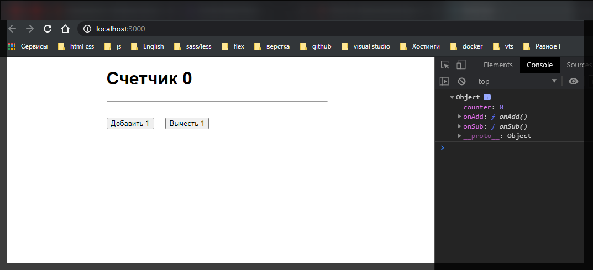
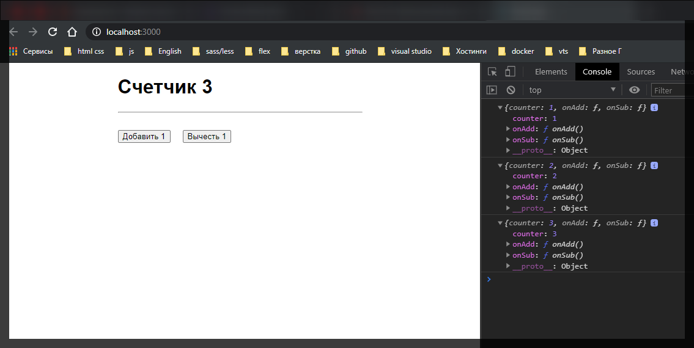

# Изменение State

Теперь нам необходимо через компонент **App** изменять состояние через **rootReducer**. Разберем данную возможность. Для начало мы можем создать еще одну функцию **helper** кототая позволит нам манипулировать состоянием **store**. Обычно такую функцию называют **mapDispatchToProps** и данная функция принимает в себя параметр **dispatch**.

```jsx
import React, { Component } from 'react';
import { connect } from 'react-redux';
import './App.scss';

class App extends Component {
  updateCounter(value) {
    this.setState({
      counter: this.state.counter + value,
    });
  }

  render() {
    return (
      <div className={'App'}>
        <h1>
          Счетчик <strong>{this.props.counter}</strong>
        </h1>

        <hr />

        <div className="Actions">
          <button onClick={() => this.updateCounter(1)}>Добавить 1</button>
          <button onClick={() => this.updateCounter(-1)}>Вычесть 1</button>
        </div>
      </div>
    );
  }
}

function mapStateToProps(state) {
  return {
    counter: state.counter,
  };
}

function mapDispatchToProps(dispatch) {}

export default connect(mapStateToProps)(App);
```

Теперь, что делает данная функция **function mapDispatchToProps(dispatch) {}**, и зачем мы ее вообще создали? Кстати обратите внимание что данные функции создаются после того как мы определили **class**.

Мы можем данную функцию **mapDispatchToProps** так же передать в метод connect вторым параметром. Порядок здесь очень важен!!! т.е. сначало мы передаем функцию **mapStateToProps** а потом мы передаем **mapDispatchToProps**

```jsx
import React, { Component } from 'react';
import { connect } from 'react-redux';
import './App.scss';

class App extends Component {
  updateCounter(value) {
    this.setState({
      counter: this.state.counter + value,
    });
  }

  render() {
    return (
      <div className={'App'}>
        <h1>
          Счетчик <strong>{this.props.counter}</strong>
        </h1>

        <hr />

        <div className="Actions">
          <button onClick={() => this.updateCounter(1)}>Добавить 1</button>
          <button onClick={() => this.updateCounter(-1)}>Вычесть 1</button>
        </div>
      </div>
    );
  }
}

function mapStateToProps(state) {
  return {
    counter: state.counter,
  };
}

function mapDispatchToProps(dispatch) {}

export default connect(mapStateToProps, mapDispatchToProps)(App);
```

Если мы не хотим передавать **mapStateToProps**, а хотим передать **mapDispatchToProps**. То первый параметр мы можем указать как **null** и у нас все будет работать.

```jsx
import React, { Component } from 'react';
import { connect } from 'react-redux';
import './App.scss';

class App extends Component {
  updateCounter(value) {
    this.setState({
      counter: this.state.counter + value,
    });
  }

  render() {
    return (
      <div className={'App'}>
        <h1>
          Счетчик <strong>{this.props.counter}</strong>
        </h1>

        <hr />

        <div className="Actions">
          <button onClick={() => this.updateCounter(1)}>Добавить 1</button>
          <button onClick={() => this.updateCounter(-1)}>Вычесть 1</button>
        </div>
      </div>
    );
  }
}

function mapStateToProps(state) {
  return {
    counter: state.counter,
  };
}

function mapDispatchToProps(dispatch) {}

export default connect(null, mapDispatchToProps)(App);
```

Разберемся зачем нам нужна функция **mapDispatchToProps**? По сути данная функция должна вернуть некоторый объект. И по названию можно догадаться что она делает **mapDispatchToProps**(отправка реквизитов). Данная функция относится у нас к **store**.

Если помните мы разбирали что в **store.dispatch**

```jsx
//reducer.js
const redux = require('redux');

const initialState = {
  counter: 0,
};

//Reduser
const reducer = (state = initialState, action) => {
  if (action.type === 'ADD') {
    return {
      counter: state.counter + 1,
    };
  }
  if (action.type === 'SUB') {
    return {
      counter: state.counter - 1,
    };
  }
  if (action.type === 'ADD_NUMBER') {
    return {
      counter: state.counter + action.value,
    };
  }
  return state;
};

//Store
const store = redux.createStore(reducer);
console.log('1', store.getState());

store.subscribe(() => {
  console.log('Subscribe', store.getState());
});

//Actions

const addCounter = {
  type: 'ADD',
};

store.dispatch(addCounter);

store.dispatch({ type: 'SUB' });

store.dispatch({ type: 'ADD_NUMBER', value: 10 });
```

C помощью **store.dispatch** мы можем **dispatch**(отправлять) новые **actions**(действия).

Соответственно параметр **dispatch**, в функции **mapDispatchToProps**, и есть та самая функция.

Мы можем задавать какие-то кастомные функции как параметры для нашего компонента который мы оборачиваем. Т.е. по сути мы можем задать две функции, например **onAdd:() => dispatch({})** она будет добавлять новый **action**. например в нашем случае новый **action** должен быть **type:'ADD'**.

Добавлю еще один метод **onSub:()=> dispatch({})**

```jsx
import React, { Component } from 'react';
import { connect } from 'react-redux';
import './App.scss';

class App extends Component {
  updateCounter(value) {
    this.setState({
      counter: this.state.counter + value,
    });
  }

  render() {
    return (
      <div className={'App'}>
        <h1>
          Счетчик <strong>{this.props.counter}</strong>
        </h1>

        <hr />

        <div className="Actions">
          <button onClick={() => this.updateCounter(1)}>Добавить 1</button>
          <button onClick={() => this.updateCounter(-1)}>Вычесть 1</button>
        </div>
      </div>
    );
  }
}

function mapStateToProps(state) {
  return {
    counter: state.counter,
  };
}

function mapDispatchToProps(dispatch) {
  return {
    onAdd: () => dispatch({ type: 'ADD' }),
    onSub: () => dispatch({ type: 'SUB' }),
  };
}

export default connect(mapStateToProps, mapDispatchToProps)(App);
```

Теперь в методе **render** в консоли мы можем посмотреть на параметр **this.props**

```jsx
import React, { Component } from 'react';
import { connect } from 'react-redux';
import './App.scss';

class App extends Component {
  updateCounter(value) {
    this.setState({
      counter: this.state.counter + value,
    });
  }

  render() {
    console.log(this.props);
    return (
      <div className={'App'}>
        <h1>
          Счетчик <strong>{this.props.counter}</strong>
        </h1>

        <hr />

        <div className="Actions">
          <button onClick={() => this.updateCounter(1)}>Добавить 1</button>
          <button onClick={() => this.updateCounter(-1)}>Вычесть 1</button>
        </div>
      </div>
    );
  }
}

function mapStateToProps(state) {
  return {
    counter: state.counter,
  };
}

function mapDispatchToProps(dispatch) {
  return {
    onAdd: () => dispatch({ type: 'ADD' }),
    onSub: () => dispatch({ type: 'SUB' }),
  };
}

export default connect(mapStateToProps, mapDispatchToProps)(App);
```



Как мы видим что мы помимо того что получаем объект counter, мы так же получаем две функции **onAdd** и **onSub**.

Теперь допустим при клике на кнопку мы будем добавлять 1-цу. Теперь вместо того что бы вызывать локальную функцию будем вызывать метод **this.props.onAdd**. Т.е. просто передаем как **reference** и не вызываем данную функцию. Тоже самое делаем и на кнопку вычесть. И так же удаляю функцию **updateCounter**.

```jsx
import React, { Component } from 'react';
import { connect } from 'react-redux';
import './App.scss';

class App extends Component {
  render() {
    console.log(this.props);
    return (
      <div className={'App'}>
        <h1>
          Счетчик <strong>{this.props.counter}</strong>
        </h1>

        <hr />

        <div className="Actions">
          <button onClick={this.props.onAdd}>Добавить 1</button>
          <button onClick={this.props.onSub}>Вычесть 1</button>
        </div>
      </div>
    );
  }
}

function mapStateToProps(state) {
  return {
    counter: state.counter,
  };
}

function mapDispatchToProps(dispatch) {
  return {
    onAdd: () => dispatch({ type: 'ADD' }),
    onSub: () => dispatch({ type: 'SUB' }),
  };
}

export default connect(mapStateToProps, mapDispatchToProps)(App);
```

Однако если я буду кликать на кнопки все равно ничего происходить не будет. Не происходит это потому что в **rootReducer** мы не прописали логику для выполнения данных **action**.

```jsx
//rootReducer.js

const initialState = {
  counter: 0,
};

export default function rootReducer(state = initialState, action) {
  switch (action.type) {
    case 'ADD':
      return state;
    case 'SUB':
      return state;
  }

  return state;
}
```

Теперь мы допустим хотим увеличивать счетчик.

Вжное правило **Ruducer** заключается в том что бы мы всегда возвращали новый объект т.е. ни в коем случае не мутировали. Т.е. нельзя написать **return state+**+. **Redux** реагирует на изменения только тогда когда меняется указатьель на объект. Соответственно нам нужно создать новый. И склонировать предыдущее состояние. По этому мы возвращаем новый объект где поле **counter:** будет равняться текущему **state.counter + 1**

```jsx
//rootReducer.js

const initialState = {
  counter: 0,
};

export default function rootReducer(state = initialState, action) {
  switch (action.type) {
    case 'ADD':
      return {
        counter: state.counter + 1,
      };
    case 'SUB':
      return {
        counter: state.counter - 1,
      };
  }

  return state;
}
```



Теперь наш компонент ниченго не знает про состояние нашего **state**. Он просто обращается к некоторым параметрам которые ему передали и просто их выводит на экран. Он ничего не знает про логику нашего приложения. Он просто выполняет некоторые методы при клике на определенные кнопки. И в это как раз таки заключается суть **Redux**. Визуальная составляющая полностью раздедена с логической составляющей.
