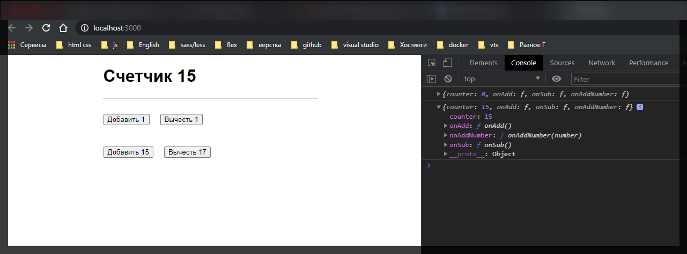
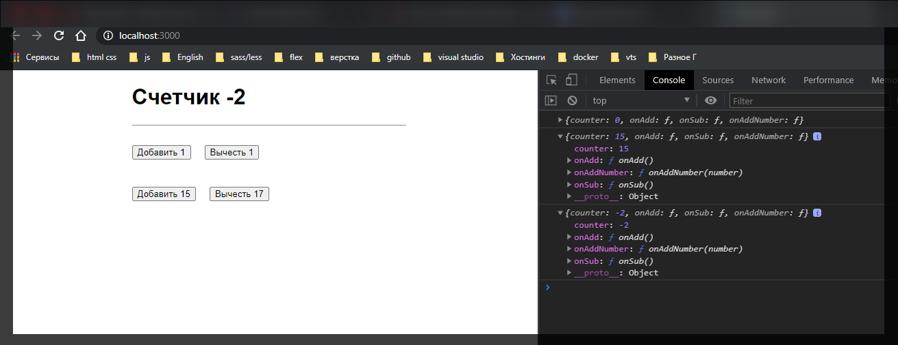

# Передача параметров.

В это уроке потренируемся с работой различных actions. Допустим добавим возможность добавлять какое-то рандомное число для нашего счетчика.

Создадим новый div class Actions.

```jsx
import React, { Component } from 'react';
import { connect } from 'react-redux';
import './App.scss';

class App extends Component {
  render() {
    console.log(this.props);
    return (
      <div className={'App'}>
        <h1>
          Счетчик <strong>{this.props.counter}</strong>
        </h1>

        <hr />

        <div className="Actions">
          <button onClick={this.props.onAdd}>Добавить 1</button>
          <button onClick={this.props.onSub}>Вычесть 1</button>
        </div>
        <div className="Actions">
          <button onClick={this.props.onAdd}>Добавить</button>
          <button onClick={this.props.onSub}>Вычесть</button>
        </div>
      </div>
    );
  }
}

function mapStateToProps(state) {
  return {
    counter: state.counter,
  };
}

function mapDispatchToProps(dispatch) {
  return {
    onAdd: () => dispatch({ type: 'ADD' }),
    onSub: () => dispatch({ type: 'SUB' }),
  };
}

export default connect(mapStateToProps, mapDispatchToProps)(App);
```

По сути нам нужно создать новый метод в функции mapDispatchToProps и назовем его onAddNumber. И данная функция уже будет в себя принимать некоторе число number, то которое мы хотим добавить. и соответственно указываем что будет делать данный number => dispatch({type: 'ADD_NUMBER',}) и в качестве некоторого параметра value или payload(полезная нагрузка) мы будем передавать наше число, и положу это все в объект payload: который будет равняться числу number.

```jsx
import { number } from 'prop-types';
import React, { Component } from 'react';
import { connect } from 'react-redux';
import './App.scss';

class App extends Component {
  render() {
    console.log(this.props);
    return (
      <div className={'App'}>
        <h1>
          Счетчик <strong>{this.props.counter}</strong>
        </h1>

        <hr />

        <div className="Actions">
          <button onClick={this.props.onAdd}>Добавить 1</button>
          <button onClick={this.props.onSub}>Вычесть 1</button>
        </div>
        <div className="Actions">
          <button onClick={this.props.onAdd}>Добавить</button>
          <button onClick={this.props.onSub}>Вычесть</button>
        </div>
      </div>
    );
  }
}

function mapStateToProps(state) {
  return {
    counter: state.counter,
  };
}

function mapDispatchToProps(dispatch) {
  return {
    onAdd: () => dispatch({ type: 'ADD' }),
    onSub: () => dispatch({ type: 'SUB' }),
    onAddNumber: () => dispatch({ type: 'ADD_NUMBER', payload: number }),
  };
}

export default connect(mapStateToProps, mapDispatchToProps)(App);
```

Теперь у нас есть свойство к которому мы можем обращаться. Передаю этот мектод в button.

```jsx
import { number } from 'prop-types';
import React, { Component } from 'react';
import { connect } from 'react-redux';
import './App.scss';

class App extends Component {
  render() {
    console.log(this.props);
    return (
      <div className={'App'}>
        <h1>
          Счетчик <strong>{this.props.counter}</strong>
        </h1>

        <hr />

        <div className="Actions">
          <button onClick={this.props.onAdd}>Добавить 1</button>
          <button onClick={this.props.onSub}>Вычесть 1</button>
        </div>
        <div className="Actions">
          <button onClick={this.props.onAddNumber}>Добавить</button>
          <button onClick={this.props.onSub}>Вычесть</button>
        </div>
      </div>
    );
  }
}

function mapStateToProps(state) {
  return {
    counter: state.counter,
  };
}

function mapDispatchToProps(dispatch) {
  return {
    onAdd: () => dispatch({ type: 'ADD' }),
    onSub: () => dispatch({ type: 'SUB' }),
    onAddNumber: (number) => dispatch({ type: 'ADD_NUMBER', payload: number }),
  };
}

export default connect(mapStateToProps, mapDispatchToProps)(App);
```

Как мы можем передавать число в данную функцию \<button onClick={this.props.onAddNumber}>Добавить</button> если мы ее вызывать вот так \<button onClick={this.props.onAddNumber()}>Добавить</button>.

Но по сути мы уже знакомы с React и мы знаем два способа. Т.е. мы можем bind связать контекст и передать какое-то число \ <button onClick={this.props.onAddNumber.bind(this, 5)}>

Ли бо же если пойти простым путем мы можем обернуть это в се в callback и уже здесь вызвать \<button onClick={() => this.props.onAddNumber()}>Добавить</button> т.е. использовать замыкание.

```jsx
import { number } from 'prop-types';
import React, { Component } from 'react';
import { connect } from 'react-redux';
import './App.scss';

class App extends Component {
  render() {
    console.log(this.props);
    return (
      <div className={'App'}>
        <h1>
          Счетчик <strong>{this.props.counter}</strong>
        </h1>

        <hr />

        <div className="Actions">
          <button onClick={this.props.onAdd}>Добавить 1</button>
          <button onClick={this.props.onSub}>Вычесть 1</button>
        </div>
        <div className="Actions">
          <button onClick={() => this.props.onAddNumber(15)}>
            Добавить 15
          </button>
          <button onClick={() => this.props.onAddNumber(-17)}>
            Вычесть 17
          </button>
        </div>
      </div>
    );
  }
}

function mapStateToProps(state) {
  return {
    counter: state.counter,
  };
}

function mapDispatchToProps(dispatch) {
  return {
    onAdd: () => dispatch({ type: 'ADD' }),
    onSub: () => dispatch({ type: 'SUB' }),
    onAddNumber: (number) => dispatch({ type: 'ADD_NUMBER', payload: number }),
  };
}

export default connect(mapStateToProps, mapDispatchToProps)(App);
```

Теперь необходимо обработать action type: 'ADD_NUMBER', из onAddNumber: () => dispatch({ type: 'ADD_NUMBER', payload: number }).

Идем в rootReducer и добавляем новый case.

```jsx
//rootReducer.js

const initialState = {
  counter: 0,
};

export default function rootReducer(state = initialState, action) {
  switch (action.type) {
    case 'ADD':
      return {
        counter: state.counter + 1,
      };
    case 'SUB':
      return {
        counter: state.counter - 1,
      };
    case 'ADD_NUMBER':
      return { counter: state.counter + action.payload };
    default:
      return state;
  }
}
```




