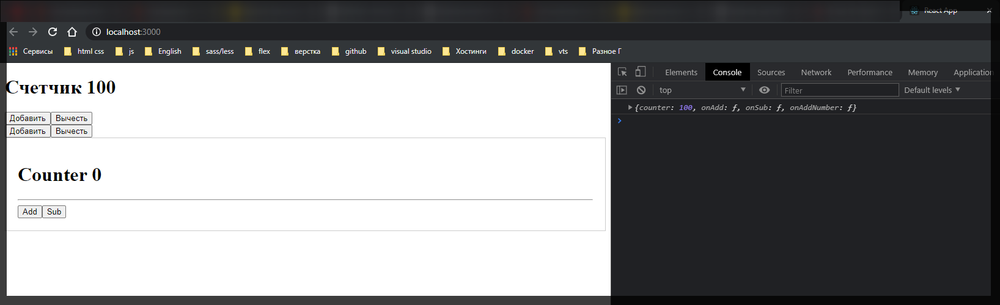
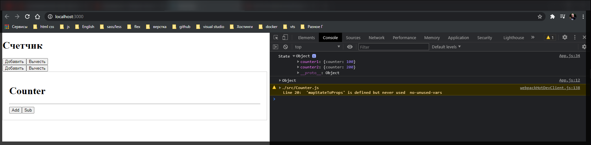
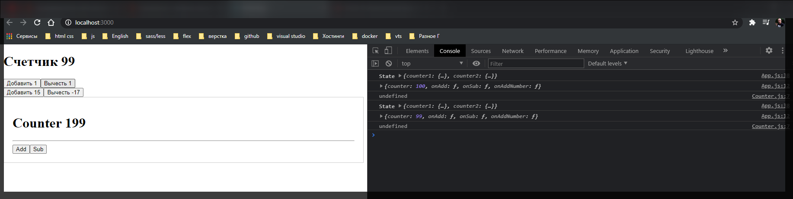
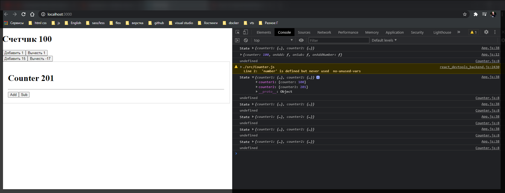

# Объединение редюсеров

Работать с одним редюсером не так уж и удобно. Удобно это когда у нас есть три **actions** и у нас идет работа только с **counter**. Однако если есть приложение где есть множество действий, например 1000 действий, то описывать их все в одной функции не очень удобно. В этом очень легко запутаться.

Очень хотелось бы декомпозировать наш код на определенные сущности. Как раз таки для этого существует специальная функция позволяющая объеденять редюсеры и соответственно дикомпозировать их функционал.

Создаю новый компонент **Counter.js**

```js
import React from 'react';

class Counter extends React.Component {
  render() {
    return <div></div>;
  }
}

export default Counter;
```

Теперь напишу что-нибудь для данного **Counter**. Предположим что он у нас будет отвечать и работать с другим **state**.

```jsx
//Counter.js
import React from 'react';

class Counter extends React.Component {
  render() {
    return (
      <div style={{ padding: 20, border: '1px solid #ccc' }}>
        <h1>Counter 0</h1>
        <hr />
        <div>
          <button>Add</button>
          <button>Sub</button>
        </div>
      </div>
    );
  }
}

export default Counter;
```

Подключаю и вывожу данный компонент

```jsx
import React, { Component } from 'react';
import { connect } from 'react-redux';

import Counter from './Counter';

class App extends Component {
  updateCounter(value) {
    this.setState({ counter: this.state.counter + value });
  }

  render() {
    console.log(this.props);
    return (
      <div>
        <h1>
          Счетчик <strong>{this.props.counter}</strong>
        </h1>
        <div className="Actions">
          <button onClick={this.props.onAdd}>Добавить</button>
          <button onClick={this.props.onSub}>Вычесть</button>
        </div>
        <div className="Actions">
          <button onClick={() => this.props.onAddNumber(15)}>Добавить</button>
          <button onClick={() => this.props.onAddNumber(-17)}>Вычесть</button>
        </div>

        <Counter />
      </div>
    );
  }
}

function mapStateToProps(state) {
  return {
    counter: state.counter,
  };
}

function mapDispatchToProps(dispatch) {
  return {
    onAdd: () => dispatch({ type: 'ADD' }),
    onSub: () => dispatch({ type: 'SUB' }),
    onAddNumber: (number) => dispatch({ type: 'ADD_NUMBER', payload: number }),
  };
}

export default connect(mapStateToProps, mapDispatchToProps)(App);
```



Понятное дело что данный компонент реагирует совершенно на другие вещи и он пока что ни как не связан со **store** хранилищем.

И допустим для него мы хотим завести отдельное поле в **store** и управлять им.

Для этого мы можем декомпозировать наши редюсеры. Для этого в папке redux я создаю папку **reduсers** и в нем создаю два файла **counter1.js** и **counter2.js**.

Теперь из **rootReduсers.js** вырезаю всю логику и параношу ее в **counter1.js**. И немного редактирую.

```js
//redux/reducers/counter1.js
const initialState = {
  counter: 100,
};

export default function counter1(state = initialState, action) {
  switch (action.type) {
    case 'ADD':
      return {
        counter: state.counter + 1,
      };
    case 'SUB':
      return {
        counter: state.counter - 1,
      };
    case 'ADD_NUMBER':
      return {
        counter: state.counter + action.payload,
      };
    default:
      return {
        counter: state.counter,
      };
  }
}
```

И точно такой ше код переношу в **counter2.js** и переименовываю функцию.

```jsx
//redux/reducers/counter2.js
const initialState = {
  counter: 200,
};

export default function counter2(state = initialState, action) {
  switch (action.type) {
    case 'ADD':
      return {
        counter: state.counter + 1,
      };
    case 'SUB':
      return {
        counter: state.counter - 1,
      };
    case 'ADD_NUMBER':
      return {
        counter: state.counter + action.payload,
      };
    default:
      return {
        counter: state.counter,
      };
  }
}
```

Теперь у нас есть две функции **counter1** и **counter2**. И нам каким-то образом нужно их передать в **store** т.е. в **index.js** где мы создаем **const store = createStore(rootReducer);**

```jsx
import React from 'react';
import ReactDOM from 'react-dom';
import rootReducer from './redux/rootReducer';
import { createStore } from 'redux';
import { Provider } from 'react-redux';

import App from './App';

const store = createStore(rootReducer);

const app = (
  <Provider store={store}>
    <App />
  </Provider>
);

ReactDOM.render(app, document.getElementById('root'));
```

Сейчас в **createStore** мы пока что передаем только один редюсер, и мы можем сюда передавать только один редюсер, **rootReducer** у нас уже вообще ничего нет.

По - этому нам нудно как-то создать **rootReducer.js**.

Для начало я сюда подключаю все наши редюсеры которые есть.

```jsx
// redux/rootReducers.js
import counter1 from './reducers/counter1';
import counter2 from './reducers/counter2';
```

И теперь мы отсюда должны экспортировать по **default** некоторый **rootReducer**. Соответственно это у нас будет одна функция которую мы должны поместить в **index.js**.

Для этого в **redux** существует функция которая позволяет объеденить n-ное количество редюсеров. Называется данная функция **combineReducers**

```jsx
// redux/rootReducers.js
import { combineReducers } from 'redux';

import counter1 from './reducers/counter1';
import counter2 from './reducers/counter2';
```

Данная функция **combineReducers** вернет нам новый редюсер который будет состоять из всех вложенных в него редюсеров.

Т.е. **export default combineReducers({})** и в качестве параметров передаю объект.

```js
// redux/rootReducers.js
import { combineReducers } from 'redux';

import counter1 from './reducers/counter1';
import counter2 from './reducers/counter2';

export default combineReducers({});
```

В данном объекте я должен передавать какие-то именованные поля нашего **state**. Именованными полями являются имена функций. Т.е. здесь ключ и значения просто совпадают.

```js
// redux/rootReducers.js
import { combineReducers } from 'redux';

import counter1 from './reducers/counter1';
import counter2 from './reducers/counter2';

export default combineReducers({
  counter1,
  counter2,
});
```

Теперь в **index.js** мы получаем нужную функцию rootReducer и по сути ничего не меняем

```js
import React from 'react';
import ReactDOM from 'react-dom';
import rootReducer from './redux/rootReducer';
import { createStore } from 'redux';
import { Provider } from 'react-redux';

import App from './App';

const store = createStore(rootReducer);

const app = (
  <Provider store={store}>
    <App />
  </Provider>
);

ReactDOM.render(app, document.getElementById('root'));
```

Теперь, пока не забыл, нужно сам сомпонент **Counter.js** соеденить с **redux**. Для этого импортирую функцию **connect** из **react-redux** и все оборачиваю в функцию **connect**.

```jsx
//Counter.js
import React from 'react';
import { connect } from 'react-redux';

class Counter extends React.Component {
  render() {
    return (
      <div style={{ padding: 20, border: '1px solid #ccc' }}>
        <h1>Counter 0</h1>
        <hr />
        <div>
          <button>Add</button>
          <button>Sub</button>
        </div>
      </div>
    );
  }
}

export default connect()(Counter);
```

Так же в данном компоненте создаю функцию **mapStateToProps(state){}** котрая принимает в себя некоторый **state**. Данная функция возвращает **counter: state.** А дальше вопрос чему? Сейчас к этому вернемся

```jsx
//Counter.js
import React from 'react';
import { connect } from 'react-redux';

class Counter extends React.Component {
  render() {
    return (
      <div style={{ padding: 20, border: '1px solid #ccc' }}>
        <h1>Counter {this.props.counter}</h1>
        <hr />
        <div>
          <button>Add</button>
          <button>Sub</button>
        </div>
      </div>
    );
  }
}

function mapStateToProps(state){
  return{ counter: state. }
}

export default connect()(Counter);
```

Но в любом случае уже в **h1** я буду выводить **{this.props.counter}**.

Теперь необходимо понять чему равняется

```js
function mapStateToProps(state){
  return{ counter: state. }
}
```

Птому что сейчас мы изменили наш **reducer** и не понятно что здесь происходит.

Если сейчас посмортреть в браузере и пощелкать по кнопкам, то мы увидим что пока ничего не работает.

Для того что бы понять что из себя представляет **state** в компоненте **App.js** выведу в консоль... **console.log('State', state)**.

```jsx
import React, { Component } from 'react';
import { connect } from 'react-redux';

import Counter from './Counter';

class App extends Component {
  updateCounter(value) {
    this.setState({ counter: this.state.counter + value });
  }

  render() {
    console.log(this.props);
    return (
      <div>
        <h1>
          Счетчик <strong>{this.props.counter}</strong>
        </h1>
        <div className="Actions">
          <button onClick={this.props.onAdd}>Добавить</button>
          <button onClick={this.props.onSub}>Вычесть</button>
        </div>
        <div className="Actions">
          <button onClick={() => this.props.onAddNumber(15)}>Добавить</button>
          <button onClick={() => this.props.onAddNumber(-17)}>Вычесть</button>
        </div>

        <Counter />
      </div>
    );
  }
}

function mapStateToProps(state) {
  console.log('State', state);
  return {
    counter: state.counter,
  };
}

function mapDispatchToProps(dispatch) {
  return {
    onAdd: () => dispatch({ type: 'ADD' }),
    onSub: () => dispatch({ type: 'SUB' }),
    onAddNumber: (number) => dispatch({ type: 'ADD_NUMBER', payload: number }),
  };
}

export default connect(mapStateToProps, mapDispatchToProps)(App);
```



Это объект гду у нас есть два поля каждое из которых описывает свое собственно состояние. Теперь в функции **mapStateToProps** я могу обращаться к **state.counter1** и вызывать у него поле **counter** т.е. то которое я описываю в редюсере **counter1.js**.

```jsx
import React, { Component } from 'react';
import { connect } from 'react-redux';

import Counter from './Counter';

class App extends Component {
  updateCounter(value) {
    this.setState({ counter: this.state.counter + value });
  }

  render() {
    console.log(this.props);
    return (
      <div>
        <h1>
          Счетчик <strong>{this.props.counter}</strong>
        </h1>
        <div className="Actions">
          <button onClick={this.props.onAdd}>Добавить</button>
          <button onClick={this.props.onSub}>Вычесть</button>
        </div>
        <div className="Actions">
          <button onClick={() => this.props.onAddNumber(15)}>Добавить</button>
          <button onClick={() => this.props.onAddNumber(-17)}>Вычесть</button>
        </div>

        <Counter />
      </div>
    );
  }
}

function mapStateToProps(state) {
  console.log('State', state);
  return {
    counter: state.counter1.counter,
  };
}

function mapDispatchToProps(dispatch) {
  return {
    onAdd: () => dispatch({ type: 'ADD' }),
    onSub: () => dispatch({ type: 'SUB' }),
    onAddNumber: (number) => dispatch({ type: 'ADD_NUMBER', payload: number }),
  };
}

export default connect(mapStateToProps, mapDispatchToProps)(App);
```

Теперь проделываю все тоже самое только с компонентом **Counter.js** И передаю функцию **mapStateToProps** в **connect**

```jsx
//Counter.js
import React from 'react';
import { connect } from 'react-redux';

class Counter extends React.Component {
  render() {
    return (
      <div style={{ padding: 20, border: '1px solid #ccc' }}>
        <h1>Counter {this.props.counter}</h1>
        <hr />
        <div>
          <button>Add</button>
          <button>Sub</button>
        </div>
      </div>
    );
  }
}

function mapStateToProps(state) {
  return { counter: state.counter2.counter2 };
}

export default connect(mapStateToProps)(Counter);
```

И так у меня была загвоздка. Не выводилось состяние **counter2**. Правильный файл **counter2.js**

```jsx
//redux/reducers/counter2.js
const initialState = {
  counter2: 200,
};

export default function counter22(state = initialState, action) {
  switch (action.type) {
    case 'ADD':
      return {
        counter2: state.counter2 + 1,
      };
    case 'SUB':
      return {
        counter2: state.counter2 - 1,
      };
    case 'ADD_NUMBER':
      return {
        counter2: state.counter2 + action.payload,
      };
    default:
      return {
        counter2: state.counter2,
      };
  }
}
```

Однако появилась следующая проблема. При нажатии любых кнопок из компонента первого счетчика состояния меняются в обоих редюсерах. А кнопки из компонента **Counter.js** и вовсе не работают....



Происходит это потому что мы с вами **dispatch**(отрпавляем) одни и те же **action** которые так же реагируются в редюсере **counter2.js** т.е. **"ADD"**.

Для примера в **counter2.js** реализую только одну функцию **"ADD"**. В данную функцию я буду передавать некоторый **action.payload** т.е. для того что бы у нас была только одна функция. т.е.

```js
//redux/reducers/counter2.js
const initialState = {
  counter2: 200,
};

export default function counter22(state = initialState, action) {
  switch (action.type) {
    case 'ADD2':
      return {
        counter2: state.counter2 + action.payload,
      };
    default:
      return {
        counter2: state.counter2,
      };
  }
}
```

Теперь в **counter2** у меня есть один **action** который я могу **dispatch**. Поэтому я теперь могу в компоненте **Counter.js** могу создать функцию **mapDispatchToProps** которая принимает в седя параметр **dispatch**. И данная функция будет возвращать **onChange** (Название может быть любым). Данная функция принимает в себя некоторе число **number** и она будет **dispatch** новый **type** c названием **ADD2**. И в качестве **payload** мы передаем некоторое число **number**. И так же **mapDispatchToProps** нужно передать в **connect** для того что бы у нас все работало.

И теперь при клике на кнопку **Add** мы будем вызывать функцию **onClick={()=> this.props.onChange(1) }**. А для того что бы вычесть буду передавать **-1**.

```jsx
//Counter.js
import { number } from 'prop-types';
import React from 'react';
import { connect } from 'react-redux';

class Counter extends React.Component {
  render() {
    console.log(this.props.counter2);
    return (
      <div style={{ padding: 20, border: '1px solid #ccc' }}>
        <h1>Counter {this.props.counter}</h1>

        <hr />
        <div>
          <button onClick={() => this.props.onChange(1)}>Add</button>
          <button onClick={() => this.props.onChange(-1)}>Sub</button>
        </div>
      </div>
    );
  }
}

function mapStateToProps(state) {
  return { counter: state.counter2.counter2 };
}

function mapDispatchToProps(dispatch) {
  return {
    onChange: (number) => dispatch({ type: 'ADD2', payload: number }),
  };
}

export default connect(mapStateToProps, mapDispatchToProps)(Counter);
```



Теперь я получил два разных состояния для двух счетчиков и они работают не зависимо друг от друга.
