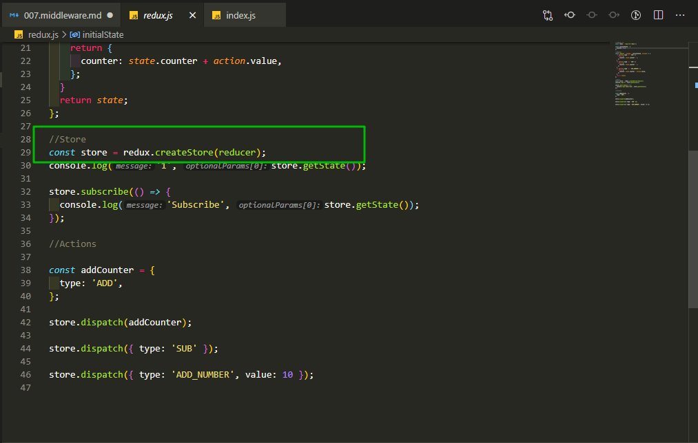
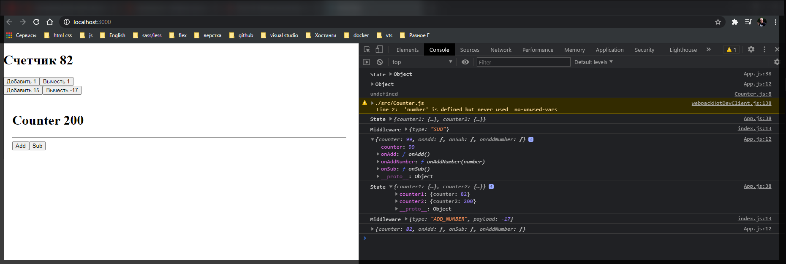
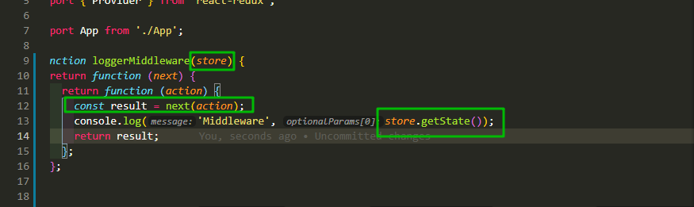
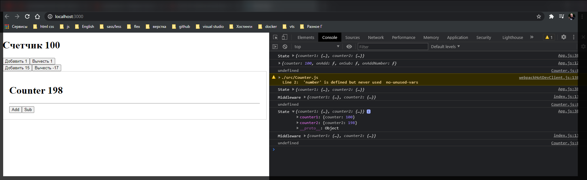
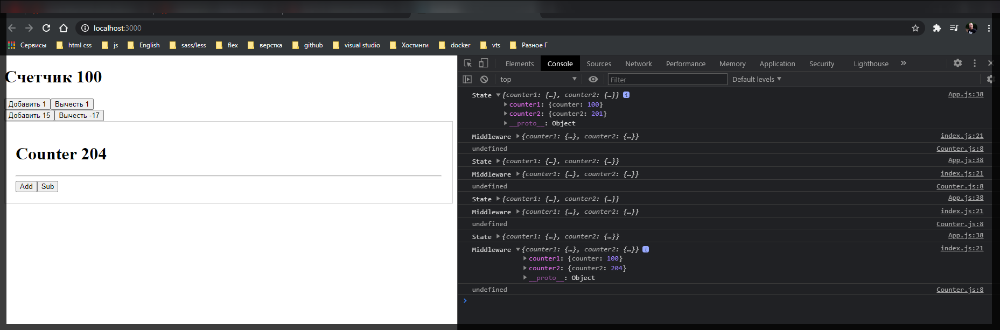

# Middleware

**Middleware** - по своей сути это некоторые функции которые добавляют определенный функционал чему-то. В нашем случае это **Redux**.

И разберем напримере простого **logger**. Допустим мы хотим создать функцию которая при изменении **store** в **redux** будет это все выводить в консоль за нас.

По - этому в файле **index.js** создадим новую функцию которую назову **loggerMiddleware**

```jsx
import React from 'react';
import ReactDOM from 'react-dom';
import rootReducer from './redux/rootReducer';
import { createStore } from 'redux';
import { Provider } from 'react-redux';

import App from './App';

function loggetMiddleware(store) {}

const store = createStore(rootReducer);

const app = (
  <Provider store={store}>
    <App />
  </Provider>
);

ReactDOM.render(app, document.getElementById('root'));
```

Как вобще устроена данная функция? Она по сути принимает в себя как параметр какой-то store с которым мы сможем работать. Т.е. тот **store** который мы разбирали в файле **redux.js**



Данная функция должна нам вернуть новую функцию т.е. используя замыкание которая в свою очередь принимает параметр **next**. **next** является функцией которую мы должны вызвать тогда когда мы будем писать код своего **middleware**. Данная функция должна вернуть еще одну функцию и на этот раз третья функция принимает в себя параметр **action** т.е. тот объект куда мы указываем специальный **type**.

```jsx
import React from 'react';
import ReactDOM from 'react-dom';
import rootReducer from './redux/rootReducer';
import { createStore } from 'redux';
import { Provider } from 'react-redux';

import App from './App';

function loggetMiddleware(store) {
  return function (next) {
    return function (action) {};
  };
}

const store = createStore(rootReducer);

const app = (
  <Provider store={store}>
    <App />
  </Provider>
);

ReactDOM.render(app, document.getElementById('root'));
```

И третья функция должна вернуть некоторый результат. Мы должны вернуть некоторый результат после того как мы применим наш **action** после **dispatch**.

Я могу создать некоторый **result =** и сюда соответственно положим функция **next(action)** в котору передаю **action** т.е. просто продолжим цепочку выполнения всех **dispatch** в **store**. После чего возвращаю переменную **result**. Обязаны мы это сделать. В противном случае наш **store** не будет меняться.

```jsx
import React from 'react';
import ReactDOM from 'react-dom';
import rootReducer from './redux/rootReducer';
import { createStore } from 'redux';
import { Provider } from 'react-redux';

import App from './App';

function loggetMiddleware(store) {
  return function (next) {
    return function (action) {
      const result = next(action);

      return result;
    };
  };
}

const store = createStore(rootReducer);

const app = (
  <Provider store={store}>
    <App />
  </Provider>
);

ReactDOM.render(app, document.getElementById('root'));
```

Теперь что интересно я могу манипулировать данным результатом как угодно.

```jsx
import React from 'react';
import ReactDOM from 'react-dom';
import rootReducer from './redux/rootReducer';
import { createStore } from 'redux';
import { Provider } from 'react-redux';

import App from './App';

function loggetMiddleware(store) {
  return function (next) {
    return function (action) {
      const result = next(action);
      console.log('Middleware', result);
      return result;
    };
  };
}

const store = createStore(rootReducer);

const app = (
  <Provider store={store}>
    <App />
  </Provider>
);

ReactDOM.render(app, document.getElementById('root'));
```

Теперь как применять данный **middleware**?

Для этого в бибилиотеке **redux** существует еще одна функция которая **applyMiddleware**. Импортирую ее и после этого я ее должен передать вторым параметром в функцию **createStore**. Далее в переданную вторым параметром **applyMiddleware** в ее переметры передаю все созданные **middleware**.

```jsx
import React from 'react';
import ReactDOM from 'react-dom';
import rootReducer from './redux/rootReducer';
import { createStore, applyMiddleware } from 'redux';
import { Provider } from 'react-redux';

import App from './App';

function loggerMiddleware(store) {
  return function (next) {
    return function (action) {
      const result = next(action);
      console.log('Middleware', result);
      return result;
    };
  };
}

const store = createStore(rootReducer, applyMiddleware(loggerMiddleware));

const app = (
  <Provider store={store}>
    <App />
  </Provider>
);

ReactDOM.render(app, document.getElementById('root'));
```

И переданный **middleware**, в нашем случае **loggerMiddleware**, вызывать не нужно!!



Я почему - то получаю **action** а не состояние текущего **store**.



Получаю результат и возвращаю его **const result = next(action);** Но состояние **store** мы можем получить только из переменной **store**. По-этому я должен обращаться не к **result** а к **store**. и его функции **getState()**.

```jsx
import React from 'react';
import ReactDOM from 'react-dom';
import rootReducer from './redux/rootReducer';
import { createStore, applyMiddleware } from 'redux';
import { Provider } from 'react-redux';

import App from './App';

function loggerMiddleware(store) {
  return function (next) {
    return function (action) {
      const result = next(action);
      console.log('Middleware', store.getState());
      return result;
    };
  };
}

const store = createStore(rootReducer, applyMiddleware(loggerMiddleware));

const app = (
  <Provider store={store}>
    <App />
  </Provider>
);

ReactDOM.render(app, document.getElementById('root'));
```



На самом деле данный **middleware** можно написать проще использую **ES6**.

```jsx
import React from 'react';
import ReactDOM from 'react-dom';
import rootReducer from './redux/rootReducer';
import { createStore, applyMiddleware } from 'redux';
import { Provider } from 'react-redux';

import App from './App';

// function loggerMiddleware(store) {
//   return function (next) {
//     return function (action) {
//       const result = next(action);
//       console.log('Middleware', store.getState());
//       return result;
//     };
//   };
// }

const loggerMiddleware = (store) => (next) => (action) => {
  const result = next(action);
  console.log('Middleware', store.getState());
  return result;
};

const store = createStore(rootReducer, applyMiddleware(loggerMiddleware));

const app = (
  <Provider store={store}>
    <App />
  </Provider>
);

ReactDOM.render(app, document.getElementById('root'));
```

Смотрите это не выглядит как тройная вложенная функция. А пишется все в одну строку.



Именно таким образом устроены все эти функции **middleware**. И как раз таки те пакеты которые мы с вами будем подключать для работы приложения онибудут соответствовать данному принципу.
