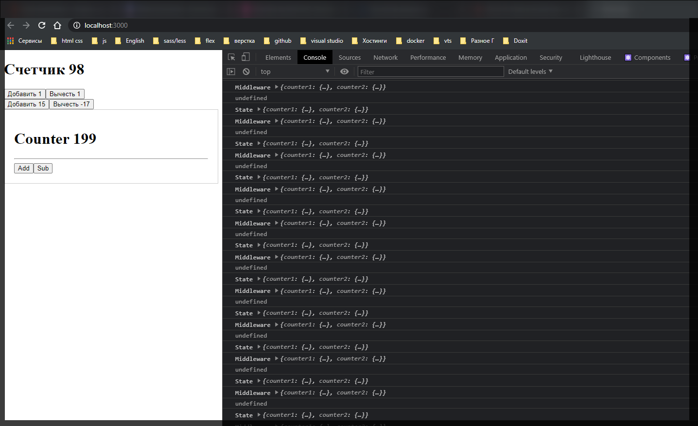

# Action Creator

Для этого рассмотрим компонент **App.js** где у нас **dispatch**(передается) три разных **actions**(действия) т.е. **type: 'ADD'**, **type: 'SUB'** и **type: 'ADD_NUMBER'**, **payload: number**.

```jsx
import React, { Component } from 'react';
import { connect } from 'react-redux';

import Counter from './Counter';

class App extends Component {
  updateCounter(value) {
    this.setState({ counter: this.state.counter + value });
  }

  render() {
    console.log(this.props);
    return (
      <div>
        <h1>
          Счетчик <strong>{this.props.counter}</strong>
        </h1>
        <div className="Actions">
          <button onClick={this.props.onAdd}>Добавить 1</button>
          <button onClick={this.props.onSub}>Вычесть 1</button>
        </div>
        <div className="Actions">
          <button onClick={() => this.props.onAddNumber(15)}>
            Добавить 15
          </button>
          <button onClick={() => this.props.onAddNumber(-17)}>
            Вычесть -17
          </button>
        </div>

        <Counter />
      </div>
    );
  }
}

function mapStateToProps(state) {
  console.log('State', state);
  return {
    counter: state.counter1.counter,
  };
}

function mapDispatchToProps(dispatch) {
  return {
    onAdd: () => dispatch({ type: 'ADD' }),
    onSub: () => dispatch({ type: 'SUB' }),
    onAddNumber: (number) => dispatch({ type: 'ADD_NUMBER', payload: number }),
  };
}

export default connect(mapStateToProps, mapDispatchToProps)(App);
```

В папке **redux** создаю новую папку **actions** и в ней новый файл **action.js**.

Здесь нам потребуется создать специальные сущности **action** **reator**, но для начало нам необходимо создать еще один файл который будет называться **actionTypes.js**. И в данном файле мы обычно создаем те **action** **type** которые существуют для нашего приложения.

Что я имею ввиду?

Обычно в файле **actionTypes.js** создаю **const** которая будет содержать в себе те **action** **type** которые есть у нас в приложении т.е. в нашем случае мы создаем **ADD**, **SUB**, **ADD_NUMBER**

```jsx
//redux/actions/actionsTypes.js

const ADD = 'ADD';
const SUB = 'SUB';
const ADD_NUMBER = 'ADD_NUMBER';
```

и у нас есть так же еще один **action** **cjunter2.js** Который называется **ADD2**. Данный **type** так же помещаем в **typeTypes.js**.

```js
//redux/actions/actionsTypes.js

const ADD = 'ADD';
const SUB = 'SUB';
const ADD_NUMBER = 'ADD_NUMBER';
const ADD2 = 'ADD2';
```

Суть этих **action** **type** заключается в том что бы они были с уникальными названиями и не пересекались друг с другом. Нам так же понадобится из экспортировать из данного файла.

```jsx
//redux/actions/actionsTypes.js

export const ADD = 'ADD';
export const SUB = 'SUB';
export const ADD_NUMBER = 'ADD_NUMBER';
export const ADD2 = 'ADD2';
```

Теперь давайте вернемся к нашим action. По сути **actions** это то что мы тут и делали в **App.js**.

```jsx
import React, { Component } from 'react';
import { connect } from 'react-redux';

import Counter from './Counter';

class App extends Component {
  updateCounter(value) {
    this.setState({ counter: this.state.counter + value });
  }

  render() {
    console.log(this.props);
    return (
      <div>
        <h1>
          Счетчик <strong>{this.props.counter}</strong>
        </h1>
        <div className="Actions">
          <button onClick={this.props.onAdd}>Добавить 1</button>
          <button onClick={this.props.onSub}>Вычесть 1</button>
        </div>
        <div className="Actions">
          <button onClick={() => this.props.onAddNumber(15)}>
            Добавить 15
          </button>
          <button onClick={() => this.props.onAddNumber(-17)}>
            Вычесть -17
          </button>
        </div>

        <Counter />
      </div>
    );
  }
}

function mapStateToProps(state) {
  console.log('State', state);
  return {
    counter: state.counter1.counter,
  };
}

function mapDispatchToProps(dispatch) {
  return {
    onAdd: () => dispatch({ type: 'ADD' }),
    onSub: () => dispatch({ type: 'SUB' }),
    onAddNumber: (number) => dispatch({ type: 'ADD_NUMBER', payload: number }),
  };
}

export default connect(mapStateToProps, mapDispatchToProps)(App);
```

Только здесь мы **dispatch** **action**, а теперь нас интерисуют **action** **creator**. **action** **creator** по сути это функции которые выдают нам определенный **action**. Например если мы хотим использовать **action** **creator** для добавления какого значения к **counter** мы можем в **actions.js** создать новую функцию например **add** котороая должна вернуть объект как раз таки **action** который будет **type: ADD**

```jsx
//redux/actions/actions.js
import { ADD } from './actionTypes';

export function add() {
  return {
    type: ADD,
  };
}
```

Теперь тоже самое сделаю для остальных функций.

```jsx
//redux/actions/actions.js
import { ADD, SUB, ADD_NUMBER, ADD2 } from './actionTypes';

export function add() {
  return {
    type: ADD,
  };
}

export function sub() {
  return {
    type: SUB,
  };
}

export function addNumber() {
  return {
    type: ADD_NUMBER,
  };
}

export function add2() {
  return {
    type: ADD2,
  };
}
```

Так же стоит учесть что функция **addNumber** и функция **add2** принимают в себя некоторые параметры

```jsx
//redux/actions/actions.js
import { ADD, SUB, ADD_NUMBER, ADD2 } from './actionTypes';

export function add() {
  return {
    type: ADD,
  };
}

export function sub() {
  return {
    type: SUB,
  };
}

export function addNumber(number) {
  return {
    type: ADD_NUMBER,
    payload: number,
  };
}

export function add2(number) {
  return {
    type: ADD2,
    payload: number,
  };
}
```

Теперь мы создали **action** **creator** которые мы пока что ни как не используем.

Для начало мы не зря все выносили в константы. Теперь я должен все заменить в редюсерах. Т.е. в редюсерах мы используем обычные строки

```jsx
//redux/actions/actions.js
import { ADD, SUB, ADD_NUMBER, ADD2 } from './actionTypes';

export function add() {
  return {
    type: ADD,
  };
}

export function sub() {
  return {
    type: SUB,
  };
}

export function addNumber(number) {
  return {
    type: ADD_NUMBER,
    payload: number,
  };
}

export function add2(number) {
  return {
    type: ADD2,
    payload: number,
  };
}
```

А теперь здесь я буду пользоваться константами.

```jsx
//redux/reducers/counter1.js

import { ADD, SUB, ADD_NUMBER } from '../actions/actionTypes';

const initialState = {
  counter: 100,
};

export default function counter1(state = initialState, action) {
  switch (action.type) {
    case ADD:
      return {
        counter: state.counter + 1,
      };
    case SUB:
      return {
        counter: state.counter - 1,
      };
    case ADD_NUMBER:
      return {
        counter: state.counter + action.payload,
      };
    default:
      return {
        counter: state.counter,
      };
  }
}
```

Прелесть теперь заключается в том что мы можем **action** **types** менять в одном месте и нам не нужно задумываться о том какие там будут в **reduser** в **action**. Мы просто меняем в одном месте константу и по коду больше ничего не делаем.

```jsx
//redux/reducers/counter2.js

import { ADD2 } from '../actions/actionTypes';

const initialState = {
  counter2: 200,
};

export default function counter22(state = initialState, action) {
  switch (action.type) {
    case ADD2:
      return {
        counter2: state.counter2 + action.payload,
      };
    default:
      return {
        counter2: state.counter2,
      };
  }
}
```

И что мы теперь можем сделать с нашими **action** **creator**? Допустим если посмотреть на **App.js** то здесь мы можем уже воспользоваться нашими **action** **creator**. Например вместо** type: 'ADD'** мы будем вызывать функцию **add()** которую мы импортируем из наших **action**. И теперь нам не важно что происходит в данной функции, какие type они **dispatch**.

```jsx
import React, { Component } from 'react';
import { connect } from 'react-redux';

import Counter from './Counter';
import { add, sub, addNumber } from './redux/actions/actions';

class App extends Component {
  updateCounter(value) {
    this.setState({ counter: this.state.counter + value });
  }

  render() {
    console.log(this.props);
    return (
      <div>
        <h1>
          Счетчик <strong>{this.props.counter}</strong>
        </h1>
        <div className="Actions">
          <button onClick={this.props.onAdd}>Добавить 1</button>
          <button onClick={this.props.onSub}>Вычесть 1</button>
        </div>
        <div className="Actions">
          <button onClick={() => this.props.onAddNumber(15)}>
            Добавить 15
          </button>
          <button onClick={() => this.props.onAddNumber(-17)}>
            Вычесть -17
          </button>
        </div>

        <Counter />
      </div>
    );
  }
}

function mapStateToProps(state) {
  console.log('State', state);
  return {
    counter: state.counter1.counter,
  };
}

function mapDispatchToProps(dispatch) {
  return {
    onAdd: () => dispatch(add()),
    onSub: () => dispatch(sub()),
    onAddNumber: (number) => dispatch(addNumber(number)),
  };
}

export default connect(mapStateToProps, mapDispatchToProps)(App);
```

И тоже самое для второго счетчика

```jsx
//Counter.js
import { add2 } from './redux/actions/actions';
import React from 'react';
import { connect } from 'react-redux';

class Counter extends React.Component {
  render() {
    console.log(this.props.counter2);
    return (
      <div style={{ padding: 20, border: '1px solid #ccc' }}>
        <h1>Counter {this.props.counter}</h1>

        <hr />
        <div>
          <button onClick={() => this.props.onChange(1)}>Add</button>
          <button onClick={() => this.props.onChange(-1)}>Sub</button>
        </div>
      </div>
    );
  }
}

function mapStateToProps(state) {
  return { counter: state.counter2.counter2 };
}

function mapDispatchToProps(dispatch) {
  return {
    onChange: (number) => dispatch(add2(number)),
  };
}

export default connect(mapStateToProps, mapDispatchToProps)(Counter);
```



**Action** **creator** - это функция которая создает нам новый **action**.
