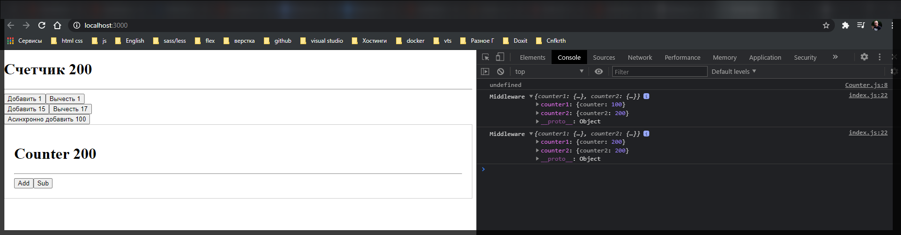

# Асинхронное изменение state

Разберемся как мы можем **dispatch** какие-то асинхронные действия используя **redux**. Потому что все что сейчас мы делаем это работаем с синхронными событиями.

Для этого самым популярным решением является библиотеке **redux** **thunk**

[https://github.com/reduxjs/redux-thunk](https://github.com/reduxjs/redux-thunk)

```shell
npm install redux-thunk
```

**redux** **thunk** по своей сути является **middleware**. Импортирую. После чего переменную **reduxThunk** втавляю вторым параметром **aplyMiddleware**.

```jsx
import React from 'react';
import ReactDOM from 'react-dom';
import rootReducer from './redux/rootReducer';
import { createStore, applyMiddleware } from 'redux';
import { Provider } from 'react-redux';
import reduxThunk from 'redux-thunk';

import App from './App';

// function loggerMiddleware(store) {
//   return function (next) {
//     return function (action) {
//       const result = next(action);
//       console.log('Middleware', store.getState());
//       return result;
//     };
//   };
// }

const loggerMiddleware = (store) => (next) => (action) => {
  const result = next(action);
  console.log('Middleware', store.getState());
  return result;
};

const store = createStore(
  rootReducer,
  applyMiddleware(loggerMiddleware, reduxThunk)
);

const app = (
  <Provider store={store}>
    <App />
  </Provider>
);

ReactDOM.render(app, document.getElementById('root'));
```

Что нам теперь позволяет делать данная библиотека?

Добавим новую кнопку которая будет добавлять асинхронный код.

```jsx
//App.js
import React, { Component } from 'react';
import { connect } from 'react-redux';

import Counter from './Counter';
import { add, sub, addNumber } from './redux/actions/actions';

class App extends Component {
  updateCounter(value) {
    this.setState({ counter: this.state.counter + value });
  }

  render() {
    console.log(this.props);
    return (
      <div>
        <h1>
          Счетчик <strong>{this.props.counter}</strong>
        </h1>
        <div className="Actions">
          <button onClick={this.props.onAdd}>Добавить 1</button>
          <button onClick={this.props.onSub}>Вычесть 1</button>
        </div>
        <div className="Actions">
          <button onClick={() => this.props.onAddNumber(15)}>
            Добавить 15
          </button>
          <button onClick={() => this.props.onAddNumber(-17)}>
            Вычесть -17
          </button>
          <button onClick={() => this.props.onAddNumber()}>
            Асинхронно добавить 100
          </button>
        </div>

        <Counter />
      </div>
    );
  }
}

function mapStateToProps(state) {
  console.log('State', state);
  return {
    counter: state.counter1.counter,
  };
}

function mapDispatchToProps(dispatch) {
  return {
    onAdd: () => dispatch(add()),
    onSub: () => dispatch(sub()),
    onAddNumber: (number) => dispatch(addNumber(number)),
  };
}

export default connect(mapStateToProps, mapDispatchToProps)(App);
```

Теперь нам потребуется добавить какое-то новое свойство которое будет **dispatch** новое событие. Допустим мы назовем его **onAsyncAdd: number => dispatch()**, принимаем параметр **number** и **dispatch** отправляем новый **action** действие.

```jsx
//App.js
import { number } from 'prop-types';
import React, { Component } from 'react';
import { connect } from 'react-redux';

import Counter from './Counter';
import { add, sub, addNumber } from './redux/actions/actions';

class App extends Component {
  updateCounter(value) {
    this.setState({ counter: this.state.counter + value });
  }

  render() {
    console.log(this.props);
    return (
      <div>
        <h1>
          Счетчик <strong>{this.props.counter}</strong>
        </h1>
        <div className="Actions">
          <button onClick={this.props.onAdd}>Добавить 1</button>
          <button onClick={this.props.onSub}>Вычесть 1</button>
        </div>
        <div className="Actions">
          <button onClick={() => this.props.onAddNumber(15)}>
            Добавить 15
          </button>
          <button onClick={() => this.props.onAddNumber(-17)}>
            Вычесть -17
          </button>
          <button onClick={() => this.props.onAddNumber(100)}>
            Асинхронно добавить 100
          </button>
        </div>

        <Counter />
      </div>
    );
  }
}

function mapStateToProps(state) {
  console.log('State', state);
  return {
    counter: state.counter1.counter,
  };
}

function mapDispatchToProps(dispatch) {
  return {
    onAdd: () => dispatch(add()),
    onSub: () => dispatch(sub()),
    onAddNumber: (number) => dispatch(addNumber(number)),
    onAsyncAdd: (number) => dispatch(),
  };
}

export default connect(mapStateToProps, mapDispatchToProps)(App);
```

Теперь нам нужно придумать какой-то **action** **creator** для **onAsyncAdd**.

Создаю функцию **export function asyncAdd(number) {}**

```jsx
//redux/actions/actions.js
import { ADD, SUB, ADD_NUMBER, ADD2 } from './actionTypes';

export function add() {
  return {
    type: ADD,
  };
}

export function sub() {
  return {
    type: SUB,
  };
}

export function addNumber(number) {
  return {
    type: ADD_NUMBER,
    payload: number,
  };
}

export function asyncAdd(number) {}

export function add2(number) {
  return {
    type: ADD2,
    payload: number,
  };
}
```

Теперь мы можем с помощью библиотеки **redux** **thunk** мы можем возвращать не объект а функцию. Возвращаем новую функцию которая в свою очередь принимает параметр **dispatch**.

```jsx
//redux/actions/actions.js
import { ADD, SUB, ADD_NUMBER, ADD2 } from './actionTypes';

export function add() {
  return {
    type: ADD,
  };
}

export function sub() {
  return {
    type: SUB,
  };
}

export function addNumber(number) {
  return {
    type: ADD_NUMBER,
    payload: number,
  };
}

export function asyncAdd(number) {
  return (dispatch = {});
}

export function add2(number) {
  return {
    type: ADD2,
    payload: number,
  };
}
```

И теперь здесь я могу запускать некоторый асинхронный код. Например все это обернуть в **setTimeout**

```jsx
//redux/actions/actions.js
import { ADD, SUB, ADD_NUMBER, ADD2 } from './actionTypes';

export function add() {
  return {
    type: ADD,
  };
}

export function sub() {
  return {
    type: SUB,
  };
}

export function addNumber(number) {
  return {
    type: ADD_NUMBER,
    payload: number,
  };
}

export function asyncAdd(number) {
  return (dispatch = {
    setTimeout(()=>{

    }, 3000)
  });
}

export function add2(number) {
  return {
    type: ADD2,
    payload: number,
  };
}
```

Теперь я могу обратится к **dispatch()** и сюда передать какой-то **action creator**.

```jsx
//redux/actions/actions.js
import { ADD, SUB, ADD_NUMBER, ADD2 } from './actionTypes';

export function add() {
  return {
    type: ADD,
  };
}

export function sub() {
  return {
    type: SUB,
  };
}

export function addNumber(number) {
  return {
    type: ADD_NUMBER,
    payload: number,
  };
}

export function asyncAdd(number) {
  return (dispatch) => {
    setTimeout(() => {
      dispatch();
    }, 3000);
  };
}

export function add2(number) {
  return {
    type: ADD2,
    payload: number,
  };
}
```

Например в нашем случае у нас уже есть готовый **action** **creator** который делает то что нам нужно. Передаю **addNumber(number)** и передаю то число которое попло в данную функцию.

```jsx
//redux/actions/actions.js
import { ADD, SUB, ADD_NUMBER, ADD2 } from './actionTypes';

export function add() {
  return {
    type: ADD,
  };
}

export function sub() {
  return {
    type: SUB,
  };
}

export function addNumber(number) {
  return {
    type: ADD_NUMBER,
    payload: number,
  };
}

export function asyncAdd(number) {
  return (dispatch) => {
    setTimeout(() => {
      dispatch(addNumber(number));
    }, 3000);
  };
}

export function add2(number) {
  return {
    type: ADD2,
    payload: number,
  };
}
```

И теперь по сути в **App.js** мы можем просто импортировать данную функцию **asyncAdd** из **actions**. И вызвать в **onAsyncAdd** передав в параметры **number**.

```jsx
//App.js
import { number } from 'prop-types';
import React, { Component } from 'react';
import { connect } from 'react-redux';

import Counter from './Counter';
import { add, sub, addNumber, asyncAdd } from './redux/actions/actions';

class App extends Component {
  updateCounter(value) {
    this.setState({ counter: this.state.counter + value });
  }

  render() {
    console.log(this.props);
    return (
      <div>
        <h1>
          Счетчик <strong>{this.props.counter}</strong>
        </h1>
        <div className="Actions">
          <button onClick={this.props.onAdd}>Добавить 1</button>
          <button onClick={this.props.onSub}>Вычесть 1</button>
        </div>
        <div className="Actions">
          <button onClick={() => this.props.onAddNumber(15)}>
            Добавить 15
          </button>
          <button onClick={() => this.props.onAddNumber(-17)}>
            Вычесть -17
          </button>
          <button onClick={() => this.props.onAddNumber(100)}>
            Асинхронно добавить 100
          </button>
        </div>

        <Counter />
      </div>
    );
  }
}

function mapStateToProps(state) {
  console.log('State', state);
  return {
    counter: state.counter1.counter,
  };
}

function mapDispatchToProps(dispatch) {
  return {
    onAdd: () => dispatch(add()),
    onSub: () => dispatch(sub()),
    onAddNumber: (number) => dispatch(addNumber(number)),
    onAsyncAdd: (number) => dispatch(asyncAdd(number)),
  };
}

export default connect(mapStateToProps, mapDispatchToProps)(App);
```

Кароче у меня не отрабатывало из-за не привильной разметки в **App.js**. Вот правильная.

```jsx
import React, { Component } from 'react';
import { connect } from 'react-redux';

import Counter from './Counter';
import { add, sub, addNumber, asyncAdd } from './redux/actions/actions';

class App extends Component {
  render() {
    return (
      <div className={'App'}>
        <h1>
          Счетчик <strong>{this.props.counter}</strong>
        </h1>

        <hr />

        <div className="Actions">
          <button onClick={this.props.onAdd}>Добавить 1</button>
          <button onClick={this.props.onSub}>Вычесть 1</button>
        </div>

        <div className="Actions">
          <button onClick={() => this.props.onAddNumber(15)}>
            Добавить 15
          </button>
          <button onClick={() => this.props.onAddNumber(-17)}>
            Вычесть 17
          </button>
        </div>

        <div className="Actions">
          <button onClick={() => this.props.onAsyncAdd(100)}>
            Асинхронно добавить 100
          </button>
        </div>

        <Counter />
      </div>
    );
  }
}

function mapStateToProps(state) {
  return {
    counter: state.counter1.counter,
  };
}

function mapDispatchToProps(dispatch) {
  return {
    onAdd: () => dispatch(add()),
    onSub: () => dispatch(sub()),
    onAddNumber: (number) => dispatch(addNumber(number)),
    onAsyncAdd: (number) => dispatch(asyncAdd(number)),
  };
}

export default connect(mapStateToProps, mapDispatchToProps)(App);
```



Отрабатывае два состояния. Первое при нажатии на кнопку. Второе по истечении трех секунд.
